# Patrón Outbox

## 📋 Descripción

El **patrón Outbox** garantiza la entrega confiable de eventos de dominio mediante el almacenamiento de eventos en la misma transacción de base de datos que los cambios de estado. Esto asegura consistencia entre el estado de la aplicación y la publicación de eventos.

## 🎯 Propósito

- **Consistencia garantizada**: Asegura que los eventos se publiquen cuando la transacción se confirma
- **Prevención de pérdida de eventos**: Evita que los eventos se pierdan por fallos del sistema
- **Entrega confiable**: Permite reintentos automáticos en caso de fallos temporales
- **Orden de eventos**: Mantiene el orden cronológico de los eventos
- **Idempotencia**: Permite procesamiento seguro de eventos duplicados

## ✅ Cuándo Usar

- **Sistemas distribuidos**: Cuando necesitas coordinar múltiples servicios
- **Event sourcing**: Para garantizar que todos los eventos se persistan
- **Microservicios**: Para comunicación confiable entre servicios
- **Sistemas críticos**: Donde la pérdida de eventos es inaceptable
- **Integración de sistemas**: Para sincronización confiable de datos
- **Arquitecturas CQRS**: Para separar comandos y eventos de forma consistente

## ❌ Cuándo NO Usar

- **Sistemas simples**: Cuando la publicación directa es suficiente
- **Baja latencia crítica**: Añade overhead de procesamiento
- **Eventos no críticos**: Para notificaciones que pueden perderse
- **Sistemas monolíticos simples**: Cuando no hay necesidad de eventos distribuidos

## 🏗️ Estructura

```mermaid
sequenceDiagram
    participant App as Aplicación
    participant DB as Base de Datos
    participant Outbox as Tabla Outbox
    participant Processor as Procesador
    participant Bus as Message Bus
    
    App->>DB: 1. Iniciar transacción
    App->>DB: 2. Guardar cambios de estado
    App->>Outbox: 3. Guardar eventos (misma transacción)
    App->>DB: 4. Confirmar transacción
    
    loop Procesamiento en segundo plano
        Processor->>Outbox: 5. Leer eventos no procesados
        Processor->>Bus: 6. Publicar evento
        Bus-->>Processor: 7. Confirmación
        Processor->>Outbox: 8. Marcar como procesado
    end
```



## 💡 Implementación Básica

```csharp
// Evento de dominio
public class OrderCreatedEvent : IDomainEvent
{
    public Guid Id { get; set; }
    public DateTime OccurredAt { get; set; }
    public string EventType => "OrderCreated";
    public Guid OrderId { get; set; }
    public decimal TotalAmount { get; set; }
}

// Entrada del Outbox
public class OutboxEvent
{
    public Guid Id { get; set; }
    public string EventType { get; set; }
    public string EventData { get; set; }
    public DateTime CreatedAt { get; set; }
    public bool IsProcessed { get; set; }
    public DateTime? ProcessedAt { get; set; }
    public int RetryCount { get; set; }
}

// Servicio Outbox
public class OutboxService
{
    public async Task SaveDomainEventAsync(IDomainEvent domainEvent)
    {
        var outboxEvent = new OutboxEvent
        {
            EventType = domainEvent.EventType,
            EventData = JsonSerializer.Serialize(domainEvent),
            CreatedAt = domainEvent.OccurredAt
        };
        
        await _repository.SaveEventAsync(outboxEvent);
    }
    
    public async Task ProcessPendingEventsAsync()
    {
        var events = await _repository.GetUnprocessedEventsAsync();
        
        foreach (var evt in events)
        {
            try
            {
                var domainEvent = DeserializeEvent(evt);
                await _eventPublisher.PublishAsync(domainEvent);
                await _repository.MarkAsProcessedAsync(evt.Id);
            }
            catch (Exception ex)
            {
                await _repository.IncrementRetryCountAsync(evt.Id);
            }
        }
    }
}
```

## 📊 Ejemplo del Mundo Real: Sistema de E-commerce

### Escenario
Un sistema de e-commerce que debe notificar a múltiples servicios cuando se crea una orden: inventario, pagos, notificaciones y auditoría.

### Componentes Principales

#### 1. **Servicio de Órdenes**
```csharp
public class OrderService
{
    public async Task<Guid> CreateOrderAsync(CreateOrderRequest request)
    {
        using var transaction = await _unitOfWork.BeginTransactionAsync();
        
        try
        {
            // 1. Crear orden
            var order = new Order(request.CustomerId, request.Items);
            await _orderRepository.SaveAsync(order);
            
            // 2. Guardar eventos en Outbox (misma transacción)
            foreach (var domainEvent in order.DomainEvents)
            {
                await _outboxService.SaveDomainEventAsync(domainEvent);
            }
            
            // 3. Confirmar transacción
            await transaction.CommitAsync();
            
            return order.Id;
        }
        catch
        {
            await transaction.RollbackAsync();
            throw;
        }
    }
}
```

#### 2. **Procesador en Segundo Plano**
```csharp
public class OutboxBackgroundProcessor : BackgroundService
{
    protected override async Task ExecuteAsync(CancellationToken stoppingToken)
    {
        while (!stoppingToken.IsCancellationRequested)
        {
            try
            {
                await _outboxService.ProcessPendingEventsAsync();
                await Task.Delay(TimeSpan.FromSeconds(5), stoppingToken);
            }
            catch (Exception ex)
            {
                _logger.LogError(ex, "Error procesando eventos del Outbox");
            }
        }
    }
}
```

#### 3. **Repositorio de Outbox**
```csharp
public class OutboxRepository : IOutboxRepository
{
    public async Task<IEnumerable<OutboxEvent>> GetUnprocessedEventsAsync(int batchSize = 100)
    {
        return await _context.OutboxEvents
            .Where(e => !e.IsProcessed && e.RetryCount < 3)
            .OrderBy(e => e.CreatedAt)
            .Take(batchSize)
            .ToListAsync();
    }
    
    public async Task MarkAsProcessedAsync(Guid eventId)
    {
        var evt = await _context.OutboxEvents.FindAsync(eventId);
        if (evt != null)
        {
            evt.IsProcessed = true;
            evt.ProcessedAt = DateTime.UtcNow;
            await _context.SaveChangesAsync();
        }
    }
}
```

## 🔧 Variaciones del Patrón

### 1. **Outbox con Particionado**
```csharp
public class PartitionedOutboxService
{
    public async Task SaveEventAsync(IDomainEvent domainEvent)
    {
        var partition = CalculatePartition(domainEvent.AggregateId);
        var tableName = $"OutboxEvents_Partition_{partition}";
        
        await SaveToPartition(tableName, domainEvent);
    }
    
    private int CalculatePartition(string aggregateId)
    {
        return Math.Abs(aggregateId.GetHashCode()) % _partitionCount;
    }
}
```

### 2. **Outbox con Relay Pattern**
```csharp
public class OutboxRelay
{
    public async Task RelayEventsAsync()
    {
        var events = await _outboxRepository.GetUnprocessedEventsAsync();
        
        var tasks = events.Select(async evt =>
        {
            try
            {
                await _messageRelay.ForwardAsync(evt);
                await _outboxRepository.MarkAsProcessedAsync(evt.Id);
            }
            catch (Exception ex)
            {
                await HandleFailure(evt, ex);
            }
        });
        
        await Task.WhenAll(tasks);
    }
}
```

### 3. **Outbox con Saga Pattern**
```csharp
public class SagaOutboxIntegration
{
    public async Task ProcessSagaEventAsync(SagaEvent sagaEvent)
    {
        var outboxEvent = new OutboxEvent
        {
            EventType = sagaEvent.EventType,
            EventData = JsonSerializer.Serialize(sagaEvent),
            SagaId = sagaEvent.SagaId,
            SagaStep = sagaEvent.StepNumber
        };
        
        await _outboxRepository.SaveEventAsync(outboxEvent);
    }
}
```

## ⚡ Consideraciones de Rendimiento

### Optimizaciones de Base de Datos
```csharp
public class OptimizedOutboxRepository
{
    // Índices recomendados:
    // CREATE INDEX IX_OutboxEvents_IsProcessed_CreatedAt 
    // ON OutboxEvents (IsProcessed, CreatedAt) WHERE IsProcessed = 0
    
    public async Task<IEnumerable<OutboxEvent>> GetUnprocessedEventsBatchAsync()
    {
        // Usar CTE para procesamiento eficiente
        var sql = @"
            WITH NextBatch AS (
                SELECT TOP 100 Id
                FROM OutboxEvents 
                WHERE IsProcessed = 0 AND RetryCount < 3
                ORDER BY CreatedAt
            )
            UPDATE OutboxEvents 
            SET ProcessingStartedAt = GETUTCDATE()
            OUTPUT inserted.*
            FROM OutboxEvents o
            INNER JOIN NextBatch nb ON o.Id = nb.Id";
            
        return await _context.OutboxEvents.FromSqlRaw(sql).ToListAsync();
    }
}
```

### Procesamiento en Lotes
```csharp
public class BatchOutboxProcessor
{
    public async Task ProcessBatchAsync(int batchSize = 100)
    {
        var events = await _repository.GetUnprocessedEventsAsync(batchSize);
        
        // Agrupar por tipo para procesamiento eficiente
        var eventGroups = events.GroupBy(e => e.EventType);
        
        var tasks = eventGroups.Select(group => 
            ProcessEventGroup(group.Key, group.ToList()));
            
        await Task.WhenAll(tasks);
    }
}
```

## 🧪 Testing

### Test de Consistencia
```csharp
[Test]
public async Task CreateOrder_ShouldSaveOrderAndOutboxEvent_InSameTransaction()
{
    // Arrange
    var orderRequest = new CreateOrderRequest { /* ... */ };
    
    // Act
    await _orderService.CreateOrderAsync(orderRequest);
    
    // Assert
    var order = await _orderRepository.GetByIdAsync(/* orderId */);
    var outboxEvents = await _outboxRepository.GetEventsByAggregateIdAsync(order.Id.ToString());
    
    Assert.That(order, Is.Not.Null);
    Assert.That(outboxEvents, Has.Count.EqualTo(1));
    Assert.That(outboxEvents.First().EventType, Is.EqualTo("OrderCreated"));
}
```

### Test de Procesamiento de Eventos
```csharp
[Test]
public async Task ProcessPendingEvents_ShouldPublishAndMarkAsProcessed()
{
    // Arrange
    var domainEvent = new OrderCreatedEvent { /* ... */ };
    await _outboxService.SaveDomainEventAsync(domainEvent);
    
    // Act
    await _outboxService.ProcessPendingEventsAsync();
    
    // Assert
    _mockEventPublisher.Verify(p => p.PublishAsync(It.IsAny<OrderCreatedEvent>()), Times.Once);
    
    var events = await _outboxRepository.GetUnprocessedEventsAsync();
    Assert.That(events, Is.Empty);
}
```

### Test de Resiliencia
```csharp
[Test]
public async Task ProcessPendingEvents_WhenPublishingFails_ShouldRetry()
{
    // Arrange
    _mockEventPublisher.Setup(p => p.PublishAsync(It.IsAny<IDomainEvent>()))
                       .ThrowsAsync(new Exception("Temporal failure"));
                       
    var domainEvent = new OrderCreatedEvent { /* ... */ };
    await _outboxService.SaveDomainEventAsync(domainEvent);
    
    // Act
    await _outboxService.ProcessPendingEventsAsync();
    
    // Assert
    var events = await _outboxRepository.GetUnprocessedEventsAsync();
    Assert.That(events.First().RetryCount, Is.EqualTo(1));
}
```

## 📊 Métricas y Monitoreo

```csharp
public class OutboxMetrics
{
    private readonly IMetrics _metrics;
    
    public void RecordEventSaved(string eventType)
    {
        _metrics.Counter("outbox.events.saved")
               .WithTag("event_type", eventType)
               .Increment();
    }
    
    public void RecordEventProcessed(string eventType, TimeSpan processingTime)
    {
        _metrics.Counter("outbox.events.processed")
               .WithTag("event_type", eventType)
               .Increment();
               
        _metrics.Timer("outbox.processing.duration")
               .WithTag("event_type", eventType)
               .Record(processingTime);
    }
    
    public void RecordEventFailed(string eventType, int retryCount)
    {
        _metrics.Counter("outbox.events.failed")
               .WithTag("event_type", eventType)
               .WithTag("retry_count", retryCount.ToString())
               .Increment();
    }
    
    public void RecordOutboxLag(TimeSpan lag)
    {
        _metrics.Gauge("outbox.processing.lag_seconds")
               .Set(lag.TotalSeconds);
    }
}
```

## 🔗 Patrones Relacionados

- **[Event Sourcing](../EventSourcing/)**: Complementa el Outbox para sistemas basados en eventos
- **[CQRS](../CQRS/)**: Outbox es útil para separar comandos y eventos
- **[Saga](../../BehavioralPatterns/ChainOfResponsibility/)**: Para procesos de negocio distribuidos
- **[Unit of Work](../UnitOfWork/)**: Coordina transacciones con el Outbox
- **[Publisher-Subscriber](../../BehavioralPatterns/Observer/)**: Para el patrón de publicación de eventos

## 📚 Recursos Adicionales

- [Microservices.io: Transactional Outbox](https://microservices.io/patterns/data/transactional-outbox.html)
- [Microsoft: Outbox Pattern](https://docs.microsoft.com/en-us/azure/architecture/patterns/outbox)
- [Martin Fowler: Event Sourcing](https://martinfowler.com/eaaDev/EventSourcing.html)
- [Implementing the Outbox Pattern with EF Core](https://www.kamilgrzybek.com/design/outbox-pattern/)

---

> 💡 **Tip**: El patrón Outbox es esencial para garantizar consistencia en sistemas distribuidos. Combínalo con procesamiento idempotente y métricas de monitoreo para obtener máxima confiabilidad en la entrega de eventos.
