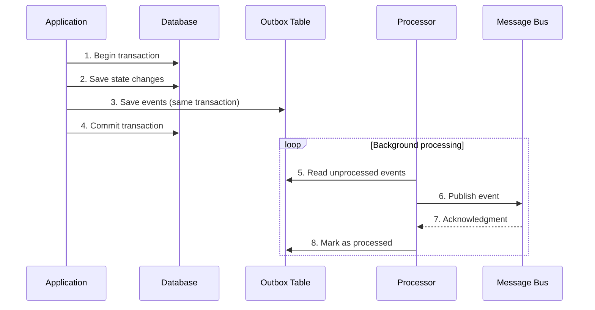

# Outbox Pattern

## 📋 Description

The **Outbox Pattern** ensures reliable delivery of domain events by storing events in the same database transaction as state changes. This guarantees consistency between application state and event publication.

## 🎯 Purpose

- **Guaranteed consistency**: Ensures events are published when transactions commit
- **Event loss prevention**: Prevents events from being lost due to system failures
- **Reliable delivery**: Enables automatic retries in case of temporary failures
- **Event ordering**: Maintains chronological order of events
- **Idempotency**: Allows safe processing of duplicate events

## ✅ When to Use

- **Distributed systems**: When you need to coordinate multiple services
- **Event sourcing**: To guarantee all events are persisted
- **Microservices**: For reliable communication between services
- **Critical systems**: Where event loss is unacceptable
- **System integration**: For reliable data synchronization
- **CQRS architectures**: To separate commands and events consistently

## ❌ When NOT to Use

- **Simple systems**: When direct publishing is sufficient
- **Critical low latency**: Adds processing overhead
- **Non-critical events**: For notifications that can be lost
- **Simple monolithic systems**: When distributed events aren't needed

## 🏗️ Structure



## 💡 Basic Implementation

```csharp
// Domain event
public class OrderCreatedEvent : IDomainEvent
{
    public Guid Id { get; set; }
    public DateTime OccurredAt { get; set; }
    public string EventType => "OrderCreated";
    public Guid OrderId { get; set; }
    public decimal TotalAmount { get; set; }
}

// Outbox entry
public class OutboxEvent
{
    public Guid Id { get; set; }
    public string EventType { get; set; }
    public string EventData { get; set; }
    public DateTime CreatedAt { get; set; }
    public bool IsProcessed { get; set; }
    public DateTime? ProcessedAt { get; set; }
    public int RetryCount { get; set; }
}

// Outbox service
public class OutboxService
{
    public async Task SaveDomainEventAsync(IDomainEvent domainEvent)
    {
        var outboxEvent = new OutboxEvent
        {
            EventType = domainEvent.EventType,
            EventData = JsonSerializer.Serialize(domainEvent),
            CreatedAt = domainEvent.OccurredAt
        };
        
        await _repository.SaveEventAsync(outboxEvent);
    }
    
    public async Task ProcessPendingEventsAsync()
    {
        var events = await _repository.GetUnprocessedEventsAsync();
        
        foreach (var evt in events)
        {
            try
            {
                var domainEvent = DeserializeEvent(evt);
                await _eventPublisher.PublishAsync(domainEvent);
                await _repository.MarkAsProcessedAsync(evt.Id);
            }
            catch (Exception ex)
            {
                await _repository.IncrementRetryCountAsync(evt.Id);
            }
        }
    }
}
```

## 📊 Real-World Example: E-commerce System

### Scenario

An e-commerce system that must notify multiple services when an order is created: inventory, payments, notifications, and auditing.

### Main Components

#### 1. **Order Service**

```csharp
public class OrderService
{
    public async Task<Guid> CreateOrderAsync(CreateOrderRequest request)
    {
        using var transaction = await _unitOfWork.BeginTransactionAsync();
        
        try
        {
            // 1. Create order
            var order = new Order(request.CustomerId, request.Items);
            await _orderRepository.SaveAsync(order);
            
            // 2. Save events in Outbox (same transaction)
            foreach (var domainEvent in order.DomainEvents)
            {
                await _outboxService.SaveDomainEventAsync(domainEvent);
            }
            
            // 3. Commit transaction
            await transaction.CommitAsync();
            
            return order.Id;
        }
        catch
        {
            await transaction.RollbackAsync();
            throw;
        }
    }
}
```

#### 2. **Background Processor**

```csharp
public class OutboxBackgroundProcessor : BackgroundService
{
    protected override async Task ExecuteAsync(CancellationToken stoppingToken)
    {
        while (!stoppingToken.IsCancellationRequested)
        {
            try
            {
                await _outboxService.ProcessPendingEventsAsync();
                await Task.Delay(TimeSpan.FromSeconds(5), stoppingToken);
            }
            catch (Exception ex)
            {
                _logger.LogError(ex, "Error processing Outbox events");
            }
        }
    }
}
```

#### 3. **Outbox Repository**

```csharp
public class OutboxRepository : IOutboxRepository
{
    public async Task<IEnumerable<OutboxEvent>> GetUnprocessedEventsAsync(int batchSize = 100)
    {
        return await _context.OutboxEvents
            .Where(e => !e.IsProcessed && e.RetryCount < 3)
            .OrderBy(e => e.CreatedAt)
            .Take(batchSize)
            .ToListAsync();
    }
    
    public async Task MarkAsProcessedAsync(Guid eventId)
    {
        var evt = await _context.OutboxEvents.FindAsync(eventId);
        if (evt != null)
        {
            evt.IsProcessed = true;
            evt.ProcessedAt = DateTime.UtcNow;
            await _context.SaveChangesAsync();
        }
    }
}
```

## 🔧 Pattern Variations

### 1. **Partitioned Outbox**

```csharp
public class PartitionedOutboxService
{
    public async Task SaveEventAsync(IDomainEvent domainEvent)
    {
        var partition = CalculatePartition(domainEvent.AggregateId);
        var tableName = $"OutboxEvents_Partition_{partition}";
        
        await SaveToPartition(tableName, domainEvent);
    }
    
    private int CalculatePartition(string aggregateId)
    {
        return Math.Abs(aggregateId.GetHashCode()) % _partitionCount;
    }
}
```

### 2. **Outbox with Relay Pattern**

```csharp
public class OutboxRelay
{
    public async Task RelayEventsAsync()
    {
        var events = await _outboxRepository.GetUnprocessedEventsAsync();
        
        var tasks = events.Select(async evt =>
        {
            try
            {
                await _messageRelay.ForwardAsync(evt);
                await _outboxRepository.MarkAsProcessedAsync(evt.Id);
            }
            catch (Exception ex)
            {
                await HandleFailure(evt, ex);
            }
        });
        
        await Task.WhenAll(tasks);
    }
}
```

### 3. **Outbox with Saga Pattern**

```csharp
public class SagaOutboxIntegration
{
    public async Task ProcessSagaEventAsync(SagaEvent sagaEvent)
    {
        var outboxEvent = new OutboxEvent
        {
            EventType = sagaEvent.EventType,
            EventData = JsonSerializer.Serialize(sagaEvent),
            SagaId = sagaEvent.SagaId,
            SagaStep = sagaEvent.StepNumber
        };
        
        await _outboxRepository.SaveEventAsync(outboxEvent);
    }
}
```

## ⚡ Performance Considerations

### Database Optimizations

```csharp
public class OptimizedOutboxRepository
{
    // Recommended indexes:
    // CREATE INDEX IX_OutboxEvents_IsProcessed_CreatedAt 
    // ON OutboxEvents (IsProcessed, CreatedAt) WHERE IsProcessed = 0
    
    public async Task<IEnumerable<OutboxEvent>> GetUnprocessedEventsBatchAsync()
    {
        // Use CTE for efficient processing
        var sql = @"
            WITH NextBatch AS (
                SELECT TOP 100 Id
                FROM OutboxEvents 
                WHERE IsProcessed = 0 AND RetryCount < 3
                ORDER BY CreatedAt
            )
            UPDATE OutboxEvents 
            SET ProcessingStartedAt = GETUTCDATE()
            OUTPUT inserted.*
            FROM OutboxEvents o
            INNER JOIN NextBatch nb ON o.Id = nb.Id";
            
        return await _context.OutboxEvents.FromSqlRaw(sql).ToListAsync();
    }
}
```

### Batch Processing

```csharp
public class BatchOutboxProcessor
{
    public async Task ProcessBatchAsync(int batchSize = 100)
    {
        var events = await _repository.GetUnprocessedEventsAsync(batchSize);
        
        // Group by type for efficient processing
        var eventGroups = events.GroupBy(e => e.EventType);
        
        var tasks = eventGroups.Select(group => 
            ProcessEventGroup(group.Key, group.ToList()));
            
        await Task.WhenAll(tasks);
    }
}
```

## 🧪 Testing

### Consistency Test

```csharp
[Test]
public async Task CreateOrder_ShouldSaveOrderAndOutboxEvent_InSameTransaction()
{
    // Arrange
    var orderRequest = new CreateOrderRequest { /* ... */ };
    
    // Act
    await _orderService.CreateOrderAsync(orderRequest);
    
    // Assert
    var order = await _orderRepository.GetByIdAsync(/* orderId */);
    var outboxEvents = await _outboxRepository.GetEventsByAggregateIdAsync(order.Id.ToString());
    
    Assert.That(order, Is.Not.Null);
    Assert.That(outboxEvents, Has.Count.EqualTo(1));
    Assert.That(outboxEvents.First().EventType, Is.EqualTo("OrderCreated"));
}
```

### Event Processing Test

```csharp
[Test]
public async Task ProcessPendingEvents_ShouldPublishAndMarkAsProcessed()
{
    // Arrange
    var domainEvent = new OrderCreatedEvent { /* ... */ };
    await _outboxService.SaveDomainEventAsync(domainEvent);
    
    // Act
    await _outboxService.ProcessPendingEventsAsync();
    
    // Assert
    _mockEventPublisher.Verify(p => p.PublishAsync(It.IsAny<OrderCreatedEvent>()), Times.Once);
    
    var events = await _outboxRepository.GetUnprocessedEventsAsync();
    Assert.That(events, Is.Empty);
}
```

### Resilience Test

```csharp
[Test]
public async Task ProcessPendingEvents_WhenPublishingFails_ShouldRetry()
{
    // Arrange
    _mockEventPublisher.Setup(p => p.PublishAsync(It.IsAny<IDomainEvent>()))
                       .ThrowsAsync(new Exception("Temporal failure"));
                       
    var domainEvent = new OrderCreatedEvent { /* ... */ };
    await _outboxService.SaveDomainEventAsync(domainEvent);
    
    // Act
    await _outboxService.ProcessPendingEventsAsync();
    
    // Assert
    var events = await _outboxRepository.GetUnprocessedEventsAsync();
    Assert.That(events.First().RetryCount, Is.EqualTo(1));
}
```

## 📊 Metrics and Monitoring

```csharp
public class OutboxMetrics
{
    private readonly IMetrics _metrics;
    
    public void RecordEventSaved(string eventType)
    {
        _metrics.Counter("outbox.events.saved")
               .WithTag("event_type", eventType)
               .Increment();
    }
    
    public void RecordEventProcessed(string eventType, TimeSpan processingTime)
    {
        _metrics.Counter("outbox.events.processed")
               .WithTag("event_type", eventType)
               .Increment();
               
        _metrics.Timer("outbox.processing.duration")
               .WithTag("event_type", eventType)
               .Record(processingTime);
    }
    
    public void RecordEventFailed(string eventType, int retryCount)
    {
        _metrics.Counter("outbox.events.failed")
               .WithTag("event_type", eventType)
               .WithTag("retry_count", retryCount.ToString())
               .Increment();
    }
    
    public void RecordOutboxLag(TimeSpan lag)
    {
        _metrics.Gauge("outbox.processing.lag_seconds")
               .Set(lag.TotalSeconds);
    }
}
```

## 🔗 Related Patterns

- **[Event Sourcing](../EventSourcing/)**: Complements Outbox for event-based systems
- **[CQRS](../CQRS/)**: Outbox is useful for separating commands and events
- **[Saga](../../BehavioralPatterns/ChainOfResponsibility/)**: For distributed business processes
- **[Unit of Work](../UnitOfWork/)**: Coordinates transactions with Outbox
- **[Publisher-Subscriber](../../BehavioralPatterns/Observer/)**: For event publication patterns

## 📚 Additional Resources

- [Microservices.io: Transactional Outbox](https://microservices.io/patterns/data/transactional-outbox.html)
- [Microsoft: Outbox Pattern](https://docs.microsoft.com/en-us/azure/architecture/patterns/outbox)
- [Martin Fowler: Event Sourcing](https://martinfowler.com/eaaDev/EventSourcing.html)
- [Implementing the Outbox Pattern with EF Core](https://www.kamilgrzybek.com/design/outbox-pattern/)

---

> 💡 **Tip**: The Outbox pattern is essential for ensuring consistency in distributed systems. Combine it with idempotent processing and monitoring metrics for maximum reliability in event delivery.
