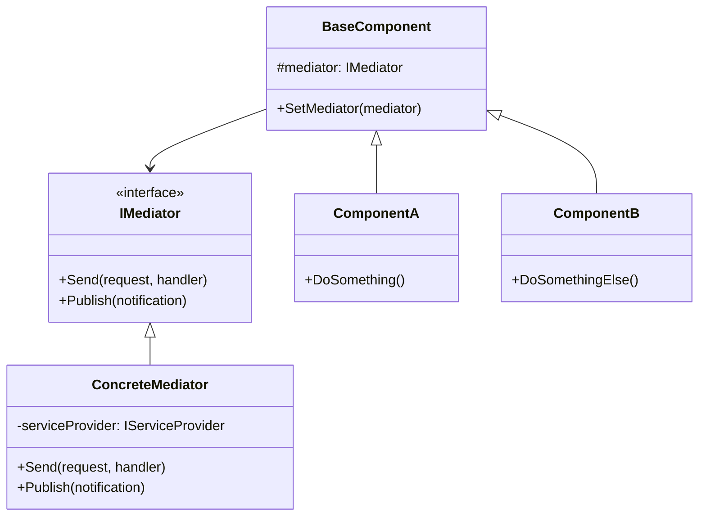

# Patrón Mediator (Mediador)

## 📋 Descripción

El **Patrón Mediator** define un objeto que encapsula cómo interactúa un conjunto de objetos, promoviendo el bajo acoplamiento al evitar que los objetos se refieran entre sí directamente. En lugar de comunicarse directamente, los objetos se comunican a través del mediador.

## 🎯 Propósito

- **Desacoplar objetos**: Eliminar dependencias directas entre componentes
- **Centralizar comunicación**: Concentrar la lógica de interacción en un solo lugar
- **Facilitar mantenimiento**: Cambios en la comunicación solo afectan al mediador
- **Promover reutilización**: Componentes más independientes y reutilizables

## ✅ Cuándo Usar

- **Interfaces complejas**: Cuando muchos componentes necesitan comunicarse
- **Sistemas de ventanas**: Dialogs, formularios con múltiples controles
- **Sistemas de chat**: Múltiples usuarios comunicándose a través de un servidor
- **Arquitecturas CQRS**: Comandos y consultas mediadas
- **Workflows complejos**: Procesos de negocio con múltiples pasos

## ❌ Cuándo NO Usar

- **Comunicación simple**: Solo dos objetos necesitan comunicarse
- **Relaciones estáticas**: Las interacciones nunca cambian
- **Overhead innecesario**: Cuando la simplicidad es más importante
- **Tiempo real crítico**: El mediador puede agregar latencia

## 🏗️ Estructura



## 💡 Implementación Básica

```csharp
// Interfaz del mediador
public interface IMediator
{
    Task<TResponse> Send<TResponse>(IRequest<TResponse> request);
    Task Publish<TNotification>(TNotification notification) 
        where TNotification : INotification;
}

// Interfaces para requests y notifications
public interface IRequest<out TResponse> { }
public interface INotification { }

// Handlers
public interface IRequestHandler<in TRequest, TResponse> 
    where TRequest : IRequest<TResponse>
{
    Task<TResponse> Handle(TRequest request, CancellationToken cancellationToken);
}

public interface INotificationHandler<in TNotification> 
    where TNotification : INotification
{
    Task Handle(TNotification notification, CancellationToken cancellationToken);
}

// Implementación del mediador
public class Mediator : IMediator
{
    private readonly IServiceProvider _serviceProvider;
    
    public Mediator(IServiceProvider serviceProvider)
    {
        _serviceProvider = serviceProvider;
    }
    
    public async Task<TResponse> Send<TResponse>(IRequest<TResponse> request)
    {
        var requestType = request.GetType();
        var handlerType = typeof(IRequestHandler<,>).MakeGenericType(requestType, typeof(TResponse));
        var handler = _serviceProvider.GetService(handlerType);
        
        if (handler == null)
            throw new InvalidOperationException($"No handler found for {requestType.Name}");
        
        var method = handlerType.GetMethod("Handle");
        var result = await (Task<TResponse>)method.Invoke(handler, 
            new object[] { request, CancellationToken.None });
        
        return result;
    }
    
    public async Task Publish<TNotification>(TNotification notification) 
        where TNotification : INotification
    {
        var notificationType = typeof(TNotification);
        var handlerType = typeof(INotificationHandler<>).MakeGenericType(notificationType);
        var handlers = _serviceProvider.GetServices(handlerType);
        
        var tasks = handlers.Select(handler =>
        {
            var method = handlerType.GetMethod("Handle");
            return (Task)method.Invoke(handler, 
                new object[] { notification, CancellationToken.None });
        });
        
        await Task.WhenAll(tasks);
    }
}
```

## 📊 Ejemplo de Uso: Sistema de E-commerce

```csharp
// Request para obtener un producto
public class GetProductQuery : IRequest<Product>
{
    public int ProductId { get; set; }
}

// Handler para la consulta
public class GetProductHandler : IRequestHandler<GetProductQuery, Product>
{
    private readonly IProductRepository _repository;
    
    public GetProductHandler(IProductRepository repository)
    {
        _repository = repository;
    }
    
    public async Task<Product> Handle(GetProductQuery request, CancellationToken cancellationToken)
    {
        return await _repository.GetByIdAsync(request.ProductId);
    }
}

// Command para crear un pedido
public class CreateOrderCommand : IRequest<OrderResult>
{
    public int CustomerId { get; set; }
    public List<OrderItem> Items { get; set; }
    public string ShippingAddress { get; set; }
}

// Handler para el comando
public class CreateOrderHandler : IRequestHandler<CreateOrderCommand, OrderResult>
{
    private readonly IOrderRepository _orderRepository;
    private readonly IInventoryService _inventoryService;
    private readonly IMediator _mediator;
    
    public CreateOrderHandler(
        IOrderRepository orderRepository,
        IInventoryService inventoryService,
        IMediator mediator)
    {
        _orderRepository = orderRepository;
        _inventoryService = inventoryService;
        _mediator = mediator;
    }
    
    public async Task<OrderResult> Handle(CreateOrderCommand request, CancellationToken cancellationToken)
    {
        // Verificar inventario
        var hasStock = await _inventoryService.CheckStockAsync(request.Items);
        if (!hasStock)
        {
            return new OrderResult { Success = false, Message = "Stock insuficiente" };
        }
        
        // Crear pedido
        var order = new Order
        {
            CustomerId = request.CustomerId,
            Items = request.Items,
            ShippingAddress = request.ShippingAddress,
            CreatedAt = DateTime.UtcNow
        };
        
        await _orderRepository.SaveAsync(order);
        
        // Publicar evento
        await _mediator.Publish(new OrderCreatedNotification 
        { 
            OrderId = order.Id,
            CustomerId = order.CustomerId,
            TotalAmount = order.TotalAmount
        });
        
        return new OrderResult { Success = true, OrderId = order.Id };
    }
}

// Notification para pedido creado
public class OrderCreatedNotification : INotification
{
    public int OrderId { get; set; }
    public int CustomerId { get; set; }
    public decimal TotalAmount { get; set; }
}

// Handler para enviar email de confirmación
public class SendOrderConfirmationEmailHandler : INotificationHandler<OrderCreatedNotification>
{
    private readonly IEmailService _emailService;
    private readonly ICustomerRepository _customerRepository;
    
    public async Task Handle(OrderCreatedNotification notification, CancellationToken cancellationToken)
    {
        var customer = await _customerRepository.GetByIdAsync(notification.CustomerId);
        await _emailService.SendOrderConfirmationAsync(customer.Email, notification.OrderId);
    }
}

// Handler para actualizar inventario
public class UpdateInventoryHandler : INotificationHandler<OrderCreatedNotification>
{
    private readonly IInventoryService _inventoryService;
    
    public async Task Handle(OrderCreatedNotification notification, CancellationToken cancellationToken)
    {
        await _inventoryService.ReserveStockAsync(notification.OrderId);
    }
}

// Controller usando el mediador
[ApiController]
[Route("api/[controller]")]
public class OrdersController : ControllerBase
{
    private readonly IMediator _mediator;
    
    public OrdersController(IMediator mediator)
    {
        _mediator = mediator;
    }
    
    [HttpPost]
    public async Task<ActionResult<OrderResult>> CreateOrder([FromBody] CreateOrderCommand command)
    {
        var result = await _mediator.Send(command);
        return result.Success ? Ok(result) : BadRequest(result);
    }
    
    [HttpGet("{id}")]
    public async Task<ActionResult<Product>> GetProduct(int id)
    {
        var product = await _mediator.Send(new GetProductQuery { ProductId = id });
        return product != null ? Ok(product) : NotFound();
    }
}
```

## 🔧 Variaciones del Patrón

### 1. **Mediator con Pipeline Behaviors**

```csharp
public interface IPipelineBehavior<TRequest, TResponse>
    where TRequest : IRequest<TResponse>
{
    Task<TResponse> Handle(TRequest request, RequestHandlerDelegate<TResponse> next, 
        CancellationToken cancellationToken);
}

public class LoggingBehavior<TRequest, TResponse> : IPipelineBehavior<TRequest, TResponse>
    where TRequest : IRequest<TResponse>
{
    private readonly ILogger<LoggingBehavior<TRequest, TResponse>> _logger;
    
    public async Task<TResponse> Handle(TRequest request, RequestHandlerDelegate<TResponse> next, 
        CancellationToken cancellationToken)
    {
        _logger.LogInformation("Handling {RequestType}", typeof(TRequest).Name);
        var stopwatch = Stopwatch.StartNew();
        
        try
        {
            var response = await next();
            stopwatch.Stop();
            _logger.LogInformation("Handled {RequestType} in {ElapsedMs}ms", 
                typeof(TRequest).Name, stopwatch.ElapsedMilliseconds);
            return response;
        }
        catch (Exception ex)
        {
            stopwatch.Stop();
            _logger.LogError(ex, "Error handling {RequestType} after {ElapsedMs}ms", 
                typeof(TRequest).Name, stopwatch.ElapsedMilliseconds);
            throw;
        }
    }
}

public class ValidationBehavior<TRequest, TResponse> : IPipelineBehavior<TRequest, TResponse>
    where TRequest : IRequest<TResponse>
{
    private readonly IEnumerable<IValidator<TRequest>> _validators;
    
    public async Task<TResponse> Handle(TRequest request, RequestHandlerDelegate<TResponse> next, 
        CancellationToken cancellationToken)
    {
        if (_validators.Any())
        {
            var context = new ValidationContext<TRequest>(request);
            var validationResults = await Task.WhenAll(
                _validators.Select(v => v.ValidateAsync(context, cancellationToken)));
            
            var failures = validationResults
                .SelectMany(r => r.Errors)
                .Where(f => f != null)
                .ToList();
            
            if (failures.Count != 0)
                throw new ValidationException(failures);
        }
        
        return await next();
    }
}
```

### 2. **Mediator para Chat en Tiempo Real**

```csharp
public class ChatRoom : IMediator
{
    private readonly Dictionary<string, IChatUser> _users = new();
    private readonly List<ChatMessage> _messageHistory = new();
    
    public void RegisterUser(IChatUser user)
    {
        _users[user.Username] = user;
        BroadcastMessage(new SystemMessage($"{user.Username} se unió al chat"));
    }
    
    public void UnregisterUser(string username)
    {
        if (_users.Remove(username))
        {
            BroadcastMessage(new SystemMessage($"{username} abandonó el chat"));
        }
    }
    
    public async Task SendMessage(string from, string to, string content)
    {
        var message = new ChatMessage
        {
            From = from,
            To = to,
            Content = content,
            Timestamp = DateTime.UtcNow
        };
        
        _messageHistory.Add(message);
        
        if (string.IsNullOrEmpty(to))
        {
            // Mensaje público
            BroadcastMessage(message);
        }
        else
        {
            // Mensaje privado
            if (_users.TryGetValue(to, out var recipient))
            {
                await recipient.ReceiveMessage(message);
            }
            
            if (_users.TryGetValue(from, out var sender))
            {
                await sender.ReceiveMessage(message);
            }
        }
    }
    
    private void BroadcastMessage(IMessage message)
    {
        foreach (var user in _users.Values)
        {
            _ = Task.Run(() => user.ReceiveMessage(message));
        }
    }
}

public interface IChatUser
{
    string Username { get; }
    Task ReceiveMessage(IMessage message);
}

public class ChatUser : IChatUser
{
    private readonly ChatRoom _chatRoom;
    
    public string Username { get; }
    
    public ChatUser(string username, ChatRoom chatRoom)
    {
        Username = username;
        _chatRoom = chatRoom;
        _chatRoom.RegisterUser(this);
    }
    
    public async Task SendPublicMessage(string content)
    {
        await _chatRoom.SendMessage(Username, null, content);
    }
    
    public async Task SendPrivateMessage(string to, string content)
    {
        await _chatRoom.SendMessage(Username, to, content);
    }
    
    public async Task ReceiveMessage(IMessage message)
    {
        Console.WriteLine($"[{Username}] Received: {message}");
        await Task.CompletedTask;
    }
}
```

### 3. **Mediator para UI (WPF/Forms)**

```csharp
public class DialogMediator
{
    private readonly Dictionary<string, IFormComponent> _components = new();
    
    public void RegisterComponent(string name, IFormComponent component)
    {
        _components[name] = component;
        component.SetMediator(this);
    }
    
    public void Notify(string sender, string eventType, object data = null)
    {
        switch (eventType)
        {
            case "CustomerSelected":
                HandleCustomerSelected((Customer)data);
                break;
                
            case "ProductAdded":
                HandleProductAdded((Product)data);
                break;
                
            case "CalculateTotal":
                HandleCalculateTotal();
                break;
        }
    }
    
    private void HandleCustomerSelected(Customer customer)
    {
        if (_components.TryGetValue("CustomerInfo", out var customerInfo))
        {
            customerInfo.UpdateData(customer);
        }
        
        if (_components.TryGetValue("DiscountCalculator", out var discountCalc))
        {
            discountCalc.UpdateData(customer.DiscountLevel);
        }
    }
    
    private void HandleProductAdded(Product product)
    {
        if (_components.TryGetValue("OrderItems", out var orderItems))
        {
            orderItems.UpdateData(product);
        }
        
        HandleCalculateTotal();
    }
    
    private void HandleCalculateTotal()
    {
        // Obtener datos de diferentes componentes
        var items = _components["OrderItems"].GetData<List<OrderItem>>();
        var discount = _components["DiscountCalculator"].GetData<decimal>();
        
        var total = items.Sum(i => i.Price * i.Quantity) * (1 - discount);
        
        if (_components.TryGetValue("TotalDisplay", out var totalDisplay))
        {
            totalDisplay.UpdateData(total);
        }
    }
}

public interface IFormComponent
{
    void SetMediator(DialogMediator mediator);
    void UpdateData(object data);
    T GetData<T>();
}
```

## 🎯 Ejemplo: Sistema de Workflow

```csharp
public class WorkflowEngine
{
    private readonly IMediator _mediator;
    private readonly Dictionary<string, WorkflowDefinition> _workflows = new();
    
    public async Task<WorkflowResult> ExecuteWorkflow(string workflowId, object input)
    {
        if (!_workflows.TryGetValue(workflowId, out var workflow))
        {
            throw new InvalidOperationException($"Workflow {workflowId} not found");
        }
        
        var context = new WorkflowContext
        {
            WorkflowId = workflowId,
            Input = input,
            CurrentStep = 0,
            Data = new Dictionary<string, object>()
        };
        
        foreach (var step in workflow.Steps)
        {
            var stepRequest = new ExecuteWorkflowStepCommand
            {
                StepDefinition = step,
                Context = context
            };
            
            var stepResult = await _mediator.Send(stepRequest);
            
            if (!stepResult.Success)
            {
                return new WorkflowResult 
                { 
                    Success = false, 
                    Error = stepResult.Error,
                    CompletedSteps = context.CurrentStep
                };
            }
            
            context.CurrentStep++;
            context.Data.Merge(stepResult.OutputData);
            
            // Publicar evento de paso completado
            await _mediator.Publish(new WorkflowStepCompletedNotification
            {
                WorkflowId = workflowId,
                StepId = step.Id,
                Context = context
            });
        }
        
        await _mediator.Publish(new WorkflowCompletedNotification
        {
            WorkflowId = workflowId,
            Result = context.Data
        });
        
        return new WorkflowResult { Success = true, Result = context.Data };
    }
}
```

## ⚡ Consideraciones de Rendimiento

- **Resolución de dependencias**: Usar contenedores DI eficientes
- **Caché de tipos**: Cachear reflexión para mejorar rendimiento
- **Asincronía**: Manejar operaciones asíncronas correctamente
- **Memory leaks**: Gestionar suscripciones y eventos adecuadamente

## 🧪 Testing

```csharp
[Test]
public async Task Mediator_ShouldHandleRequestCorrectly()
{
    // Arrange
    var services = new ServiceCollection();
    services.AddScoped<IRequestHandler<GetProductQuery, Product>, GetProductHandler>();
    services.AddScoped<IProductRepository, MockProductRepository>();
    services.AddScoped<IMediator, Mediator>();
    
    var provider = services.BuildServiceProvider();
    var mediator = provider.GetService<IMediator>();
    
    // Act
    var result = await mediator.Send(new GetProductQuery { ProductId = 1 });
    
    // Assert
    Assert.IsNotNull(result);
    Assert.AreEqual(1, result.Id);
}

[Test]
public async Task Mediator_ShouldPublishNotificationToAllHandlers()
{
    // Arrange
    var handler1Called = false;
    var handler2Called = false;
    
    var services = new ServiceCollection();
    services.AddScoped<INotificationHandler<OrderCreatedNotification>>(provider =>
        new MockNotificationHandler(() => handler1Called = true));
    services.AddScoped<INotificationHandler<OrderCreatedNotification>>(provider =>
        new MockNotificationHandler(() => handler2Called = true));
    
    var provider = services.BuildServiceProvider();
    var mediator = new Mediator(provider);
    
    // Act
    await mediator.Publish(new OrderCreatedNotification { OrderId = 1 });
    
    // Assert
    Assert.IsTrue(handler1Called);
    Assert.IsTrue(handler2Called);
}
```

## 📊 Métricas y Monitoreo

```csharp
public class MediatorMetrics
{
    private readonly IMetrics _metrics;
    
    public void RecordRequestHandled(string requestType, TimeSpan duration, bool success)
    {
        _metrics.Counter("mediator.requests_handled")
               .WithTag("request_type", requestType)
               .WithTag("success", success.ToString())
               .Increment();
               
        _metrics.Timer("mediator.request_duration")
               .WithTag("request_type", requestType)
               .Record(duration);
    }
    
    public void RecordNotificationPublished(string notificationType, int handlerCount)
    {
        _metrics.Counter("mediator.notifications_published")
               .WithTag("notification_type", notificationType)
               .Increment();
               
        _metrics.Gauge("mediator.notification_handlers")
               .WithTag("notification_type", notificationType)
               .Set(handlerCount);
    }
}
```

## 🔗 Patrones Relacionados

- **[Command](../Command/)**: Los comandos pueden ser mediados
- **[Observer](../Observer/)**: Mediator centraliza la comunicación del Observer
- **[Facade](../../StructuralPatterns/Facade/)**: Simplifica interfaces como Mediator
- **[Chain of Responsibility](../ChainOfResponsibility/)**: Alternativa para manejar requests

## 📚 Recursos Adicionales

- [MediatR Library](https://github.com/jbogard/MediatR) - Implementación popular para .NET
- [CQRS with MediatR](https://docs.microsoft.com/en-us/dotnet/architecture/microservices/microservice-ddd-cqrs-patterns/microservice-application-layer-implementation-web-api)
- [Microsoft: Mediator Pattern](https://docs.microsoft.com/en-us/azure/architecture/patterns/mediator)

---

> 💡 **Consejo**: El patrón Mediator es excelente para implementar CQRS y separar comandos de consultas, manteniendo el código organizado y testeable.
