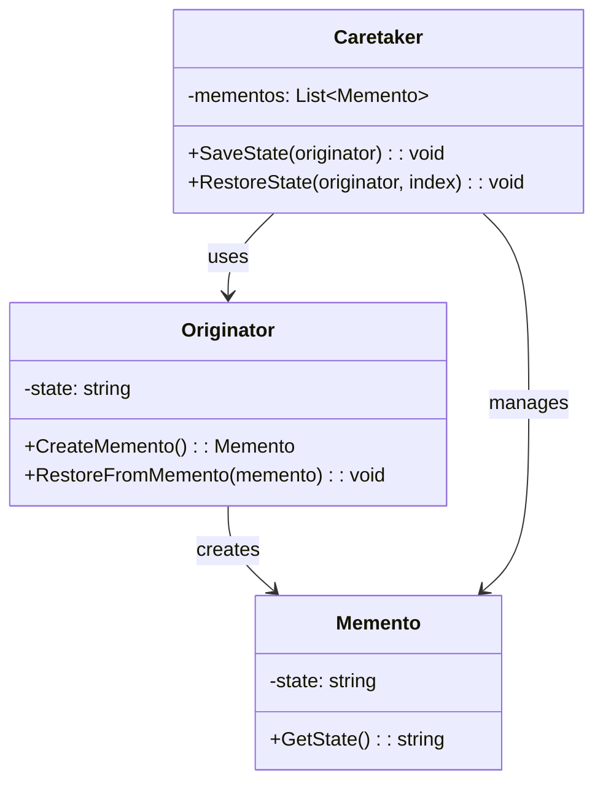

# Memento Pattern

## 📋 Description

The **Memento Pattern** captures and externalizes an object's internal state without violating encapsulation, allowing the object to be restored to this state later.

## 🎯 Purpose

- **State restoration**: Save and restore object states
- **Undo functionality**: Implement undo/redo operations
- **Checkpoints**: Create recovery points
- **Encapsulation preservation**: Don't expose internal object structure

## ✅ When to Use

- **Text editors**: Undo/redo text operations
- **Games**: Save/load game states
- **Transactions**: Create rollback points
- **Workflows**: Checkpoint complex processes

## ❌ When NOT to Use

- **Large objects**: When state size is prohibitive
- **Frequent snapshots**: Memory consumption concerns
- **Simple data**: When direct copying suffices
- **Real-time systems**: When snapshot overhead is too high

## 🏗️ Structure



## 💡 Basic Implementation

```csharp
// Memento class - stores the state
public class DocumentMemento
{
    public string Content { get; }
    public int CursorPosition { get; }
    public DateTime Timestamp { get; }
    
    public DocumentMemento(string content, int cursorPosition)
    {
        Content = content;
        CursorPosition = cursorPosition;
        Timestamp = DateTime.UtcNow;
    }
}

// Originator class - creates and uses mementos
public class Document
{
    public string Content { get; private set; } = string.Empty;
    public int CursorPosition { get; private set; }
    
    public void Write(string text)
    {
        Content = Content.Insert(CursorPosition, text);
        CursorPosition += text.Length;
    }
    
    public void MoveCursor(int position)
    {
        if (position >= 0 && position <= Content.Length)
        {
            CursorPosition = position;
        }
    }
    
    public DocumentMemento CreateMemento()
    {
        return new DocumentMemento(Content, CursorPosition);
    }
    
    public void RestoreFromMemento(DocumentMemento memento)
    {
        Content = memento.Content;
        CursorPosition = memento.CursorPosition;
    }
}

// Caretaker class - manages mementos
public class DocumentHistory
{
    private readonly Stack<DocumentMemento> _undoStack = new();
    private readonly Stack<DocumentMemento> _redoStack = new();
    
    public void SaveState(Document document)
    {
        _undoStack.Push(document.CreateMemento());
        _redoStack.Clear(); // Clear redo stack when new state is saved
    }
    
    public bool CanUndo => _undoStack.Count > 0;
    public bool CanRedo => _redoStack.Count > 0;
    
    public void Undo(Document document)
    {
        if (!CanUndo) return;
        
        // Save current state for redo
        _redoStack.Push(document.CreateMemento());
        
        // Restore previous state
        var memento = _undoStack.Pop();
        document.RestoreFromMemento(memento);
    }
    
    public void Redo(Document document)
    {
        if (!CanRedo) return;
        
        // Save current state for undo
        _undoStack.Push(document.CreateMemento());
        
        // Restore next state
        var memento = _redoStack.Pop();
        document.RestoreFromMemento(memento);
    }
}
```

## 📊 Usage Example: Text Editor

```csharp
public class TextEditor
{
    private readonly Document _document;
    private readonly DocumentHistory _history;
    
    public TextEditor()
    {
        _document = new Document();
        _history = new DocumentHistory();
        
        // Save initial empty state
        _history.SaveState(_document);
    }
    
    public void Type(string text)
    {
        _history.SaveState(_document); // Save state before change
        _document.Write(text);
        Console.WriteLine($"Content: '{_document.Content}'");
    }
    
    public void MoveCursor(int position)
    {
        _document.MoveCursor(position);
        Console.WriteLine($"Cursor moved to position {_document.CursorPosition}");
    }
    
    public void Undo()
    {
        if (_history.CanUndo)
        {
            _history.Undo(_document);
            Console.WriteLine($"Undo - Content: '{_document.Content}'");
        }
        else
        {
            Console.WriteLine("Nothing to undo");
        }
    }
    
    public void Redo()
    {
        if (_history.CanRedo)
        {
            _history.Redo(_document);
            Console.WriteLine($"Redo - Content: '{_document.Content}'");
        }
        else
        {
            Console.WriteLine("Nothing to redo");
        }
    }
    
    public void ShowStatus()
    {
        Console.WriteLine($"Content: '{_document.Content}'");
        Console.WriteLine($"Cursor: {_document.CursorPosition}");
        Console.WriteLine($"Can Undo: {_history.CanUndo}");
        Console.WriteLine($"Can Redo: {_history.CanRedo}");
    }
}
```

## 🔧 Pattern Variations

### 1. **Game State Memento**

```csharp
public class GameState
{
    public int Level { get; set; }
    public int Score { get; set; }
    public int Lives { get; set; }
    public Vector3 PlayerPosition { get; set; }
    public List<string> Inventory { get; set; } = new();
    public Dictionary<string, bool> Achievements { get; set; } = new();
}

public class GameStateMemento
{
    public GameState State { get; }
    public DateTime SaveTime { get; }
    public string SaveName { get; }
    
    public GameStateMemento(GameState state, string saveName)
    {
        // Deep copy the state
        State = JsonSerializer.Deserialize<GameState>(
            JsonSerializer.Serialize(state));
        SaveTime = DateTime.UtcNow;
        SaveName = saveName;
    }
}

public class Game
{
    public GameState CurrentState { get; private set; } = new();
    
    public GameStateMemento CreateSave(string saveName)
    {
        return new GameStateMemento(CurrentState, saveName);
    }
    
    public void LoadSave(GameStateMemento memento)
    {
        CurrentState = JsonSerializer.Deserialize<GameState>(
            JsonSerializer.Serialize(memento.State));
    }
    
    public void LevelUp()
    {
        CurrentState.Level++;
        CurrentState.Score += 1000;
    }
    
    public void TakeDamage()
    {
        CurrentState.Lives--;
    }
}

public class SaveManager
{
    private readonly Dictionary<string, GameStateMemento> _saves = new();
    
    public void SaveGame(Game game, string saveName)
    {
        _saves[saveName] = game.CreateSave(saveName);
        Console.WriteLine($"Game saved as '{saveName}'");
    }
    
    public void LoadGame(Game game, string saveName)
    {
        if (_saves.TryGetValue(saveName, out var save))
        {
            game.LoadSave(save);
            Console.WriteLine($"Game loaded from '{saveName}'");
        }
        else
        {
            Console.WriteLine($"Save '{saveName}' not found");
        }
    }
    
    public List<string> GetSaveNames()
    {
        return _saves.Keys.ToList();
    }
}
```

### 2. **Compressed Memento**

```csharp
public class CompressedMemento
{
    public byte[] CompressedData { get; }
    public DateTime Timestamp { get; }
    
    public CompressedMemento(object state)
    {
        var json = JsonSerializer.Serialize(state);
        var bytes = Encoding.UTF8.GetBytes(json);
        
        using var output = new MemoryStream();
        using (var gzip = new GZipStream(output, CompressionMode.Compress))
        {
            gzip.Write(bytes, 0, bytes.Length);
        }
        
        CompressedData = output.ToArray();
        Timestamp = DateTime.UtcNow;
    }
    
    public T Restore<T>()
    {
        using var input = new MemoryStream(CompressedData);
        using var gzip = new GZipStream(input, CompressionMode.Decompress);
        using var reader = new StreamReader(gzip);
        
        var json = reader.ReadToEnd();
        return JsonSerializer.Deserialize<T>(json);
    }
}
```

### 3. **Incremental Memento**

```csharp
public class IncrementalMemento
{
    public Dictionary<string, object> Changes { get; }
    public DateTime Timestamp { get; }
    
    public IncrementalMemento(Dictionary<string, object> changes)
    {
        Changes = new Dictionary<string, object>(changes);
        Timestamp = DateTime.UtcNow;
    }
}

public class IncrementalOriginator
{
    private readonly Dictionary<string, object> _state = new();
    private readonly Dictionary<string, object> _previousState = new();
    
    public void SetProperty(string name, object value)
    {
        _state[name] = value;
    }
    
    public T GetProperty<T>(string name)
    {
        return _state.TryGetValue(name, out var value) ? (T)value : default(T);
    }
    
    public IncrementalMemento CreateIncrementalMemento()
    {
        var changes = new Dictionary<string, object>();
        
        foreach (var (key, value) in _state)
        {
            if (!_previousState.TryGetValue(key, out var previousValue) || 
                !Equals(value, previousValue))
            {
                changes[key] = value;
            }
        }
        
        // Update previous state
        _previousState.Clear();
        foreach (var (key, value) in _state)
        {
            _previousState[key] = value;
        }
        
        return new IncrementalMemento(changes);
    }
    
    public void RestoreFromIncremental(IncrementalMemento memento)
    {
        foreach (var (key, value) in memento.Changes)
        {
            _state[key] = value;
        }
    }
}
```

## 🎯 Example: Transaction System

```csharp
public class BankAccount
{
    public string AccountNumber { get; private set; }
    public decimal Balance { get; private set; }
    public List<Transaction> Transactions { get; private set; } = new();
    
    public BankAccount(string accountNumber, decimal initialBalance)
    {
        AccountNumber = accountNumber;
        Balance = initialBalance;
    }
    
    public void Deposit(decimal amount)
    {
        Balance += amount;
        Transactions.Add(new Transaction("Deposit", amount, Balance));
    }
    
    public void Withdraw(decimal amount)
    {
        if (amount <= Balance)
        {
            Balance -= amount;
            Transactions.Add(new Transaction("Withdrawal", -amount, Balance));
        }
        else
        {
            throw new InvalidOperationException("Insufficient funds");
        }
    }
    
    public AccountMemento CreateMemento()
    {
        return new AccountMemento(Balance, new List<Transaction>(Transactions));
    }
    
    public void RestoreFromMemento(AccountMemento memento)
    {
        Balance = memento.Balance;
        Transactions = new List<Transaction>(memento.Transactions);
    }
}

public class AccountMemento
{
    public decimal Balance { get; }
    public List<Transaction> Transactions { get; }
    public DateTime CheckpointTime { get; }
    
    public AccountMemento(decimal balance, List<Transaction> transactions)
    {
        Balance = balance;
        Transactions = transactions;
        CheckpointTime = DateTime.UtcNow;
    }
}

public class TransactionManager
{
    private readonly Dictionary<string, Stack<AccountMemento>> _checkpoints = new();
    
    public void CreateCheckpoint(BankAccount account, string checkpointName)
    {
        if (!_checkpoints.ContainsKey(account.AccountNumber))
        {
            _checkpoints[account.AccountNumber] = new Stack<AccountMemento>();
        }
        
        _checkpoints[account.AccountNumber].Push(account.CreateMemento());
        Console.WriteLine($"Checkpoint '{checkpointName}' created for account {account.AccountNumber}");
    }
    
    public void RollbackToLastCheckpoint(BankAccount account)
    {
        if (_checkpoints.TryGetValue(account.AccountNumber, out var checkpoints) && 
            checkpoints.Count > 0)
        {
            var memento = checkpoints.Pop();
            account.RestoreFromMemento(memento);
            Console.WriteLine($"Account {account.AccountNumber} rolled back to checkpoint");
        }
        else
        {
            Console.WriteLine($"No checkpoints available for account {account.AccountNumber}");
        }
    }
}
```

## ⚡ Performance Considerations

- **Memory usage**: Each memento consumes memory
- **Serialization cost**: Creating mementos may be expensive
- **Storage strategy**: Consider compression for large states
- **Cleanup policy**: Remove old mementos to prevent memory leaks

## 🧪 Testing

```csharp
[Test]
public void Memento_ShouldRestoreObjectState()
{
    // Arrange
    var document = new Document();
    document.Write("Hello");
    var memento = document.CreateMemento();
    
    // Act - modify the document
    document.Write(" World");
    
    // Assert - state changed
    Assert.AreEqual("Hello World", document.Content);
    
    // Act - restore from memento
    document.RestoreFromMemento(memento);
    
    // Assert - state restored
    Assert.AreEqual("Hello", document.Content);
}

[Test]
public void UndoRedo_ShouldWorkCorrectly()
{
    // Arrange
    var editor = new TextEditor();
    
    // Act
    editor.Type("Hello");
    editor.Type(" World");
    
    // Undo
    editor.Undo(); // Should remove " World"
    Assert.AreEqual("Hello", editor.Document.Content);
    
    // Redo
    editor.Redo(); // Should restore " World"
    Assert.AreEqual("Hello World", editor.Document.Content);
}
```

## 📊 Metrics and Monitoring

```csharp
public class MementoMetrics
{
    private readonly IMetrics _metrics;
    
    public void RecordMementoCreated(string type, int sizeInBytes)
    {
        _metrics.Counter("memento.created")
               .WithTag("type", type)
               .Increment();
               
        _metrics.Histogram("memento.size_bytes")
               .WithTag("type", type)
               .Record(sizeInBytes);
    }
    
    public void RecordRestorationTime(string type, TimeSpan duration)
    {
        _metrics.Timer("memento.restoration_time")
               .WithTag("type", type)
               .Record(duration);
    }
    
    public void RecordMemoryUsage(long totalBytes)
    {
        _metrics.Gauge("memento.memory_usage_bytes")
               .Set(totalBytes);
    }
}
```

## 🔗 Related Patterns

- **[Command](../../BehavioralPatterns/Command/)**: Often combined for undo/redo functionality
- **[Prototype](../../CreationalPatterns/Prototype/)**: Alternative way to capture state
- **[State](../State/)**: For managing state transitions
- **[Observer](../Observer/)**: For notifying state changes

## 📚 Additional Resources

- [GoF Design Patterns: Memento](https://en.wikipedia.org/wiki/Memento_pattern)
- [Refactoring Guru: Memento Pattern](https://refactoring.guru/design-patterns/memento)
- [Microsoft: Implementing Undo in .NET](https://docs.microsoft.com/en-us/dotnet/desktop/winforms/advanced/implementing-undo-functionality)

---

> 💡 **Tip**: Consider using compression and incremental mementos for large objects to reduce memory consumption while maintaining undo/redo functionality.
