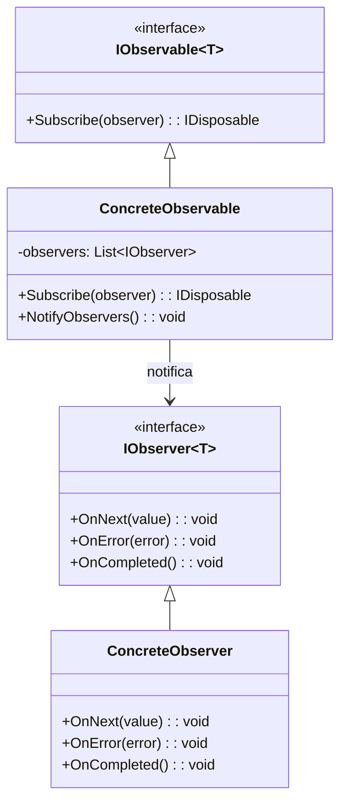

# Patrón Observer (Observador)

## 📋 Descripción

El **Patrón Observer** define una dependencia uno-a-muchos entre objetos de modo que cuando un objeto cambia de estado, todos los objetos dependientes son notificados y actualizados automáticamente. Es fundamental para implementar arquitecturas dirigidas por eventos.

## 🎯 Propósito

- **Bajo acoplamiento**: Mantener independencia entre sujeto y observadores
- **Relaciones dinámicas**: Agregar/remover observadores en tiempo de ejecución
- **Notificación de eventos**: Notificar automáticamente a múltiples objetos de cambios
- **Separación de responsabilidades**: Desacoplar lógica de negocio de lógica de presentación

## ✅ Cuándo Usar

- **Arquitecturas Modelo-Vista**: Cuando las vistas necesitan actualizarse basándose en cambios del modelo
- **Sistemas de eventos**: Eventos GUI, notificaciones del sistema
- **Actualizaciones en tiempo real**: Precios de acciones, feeds de redes sociales
- **Patrones Publish-Subscribe**: Difusión de mensajes
- **Eventos de dominio**: Notificaciones de reglas de negocio

## ❌ Cuándo NO Usar

- **Escenarios simples**: Las llamadas directas a métodos son suficientes
- **Crítico para rendimiento**: Demasiados observadores pueden impactar el rendimiento
- **Dependencias complejas**: Cuando los observadores tienen interdependencias complejas
- **Memory leaks**: Riesgo de observadores no desuscritos apropiadamente

## 🏗️ Estructura



## 💡 Implementación Básica

```csharp
// Interfaz Observable genérica
public interface IObservable<T>
{
    IDisposable Subscribe(IObserver<T> observer);
}

// Interfaz Observer genérica  
public interface IObserver<T>
{
    void OnNext(T value);
    void OnError(Exception error);
    void OnCompleted();
}

// Implementación Subject personalizada
public class Subject<T> : IObservable<T>
{
    private readonly List<IObserver<T>> _observers = new();
    private readonly object _lock = new object();
    
    public IDisposable Subscribe(IObserver<T> observer)
    {
        lock (_lock)
        {
            _observers.Add(observer);
        }
        
        return new Unsubscriber<T>(_observers, observer, _lock);
    }
    
    public void OnNext(T value)
    {
        List<IObserver<T>> observersCopy;
        lock (_lock)
        {
            observersCopy = new List<IObserver<T>>(_observers);
        }
        
        foreach (var observer in observersCopy)
        {
            try
            {
                observer.OnNext(value);
            }
            catch (Exception ex)
            {
                observer.OnError(ex);
            }
        }
    }
    
    public void OnError(Exception error)
    {
        List<IObserver<T>> observersCopy;
        lock (_lock)
        {
            observersCopy = new List<IObserver<T>>(_observers);
        }
        
        foreach (var observer in observersCopy)
        {
            observer.OnError(error);
        }
    }
    
    public void OnCompleted()
    {
        List<IObserver<T>> observersCopy;
        lock (_lock)
        {
            observersCopy = new List<IObserver<T>>(_observers);
            _observers.Clear();
        }
        
        foreach (var observer in observersCopy)
        {
            observer.OnCompleted();
        }
    }
}

// Helper para desuscripción
public class Unsubscriber<T> : IDisposable
{
    private readonly List<IObserver<T>> _observers;
    private readonly IObserver<T> _observer;
    private readonly object _lock;
    
    public Unsubscriber(List<IObserver<T>> observers, IObserver<T> observer, object lockObject)
    {
        _observers = observers;
        _observer = observer;
        _lock = lockObject;
    }
    
    public void Dispose()
    {
        lock (_lock)
        {
            _observers.Remove(_observer);
        }
    }
}
```

## 📊 Ejemplo del Mundo Real: Monitor de Precios de Acciones

```csharp
public class StockPrice
{
    public string Symbol { get; set; }
    public decimal Price { get; set; }
    public decimal Change { get; set; }
    public decimal ChangePercent { get; set; }
    public DateTime Timestamp { get; set; }
}

public class StockPriceService : Subject<StockPrice>
{
    private readonly Dictionary<string, StockPrice> _currentPrices = new();
    private readonly Random _random = new();
    private readonly Timer _timer;
    
    public StockPriceService()
    {
        // Inicializar con algunas acciones
        _currentPrices["AAPL"] = new StockPrice { Symbol = "AAPL", Price = 150.00m };
        _currentPrices["GOOGL"] = new StockPrice { Symbol = "GOOGL", Price = 2800.00m };
        _currentPrices["MSFT"] = new StockPrice { Symbol = "MSFT", Price = 300.00m };
        
        // Iniciar actualizaciones cada 2 segundos
        _timer = new Timer(UpdatePrices, null, TimeSpan.Zero, TimeSpan.FromSeconds(2));
    }
    
    private void UpdatePrices(object state)
    {
        var symbols = _currentPrices.Keys.ToArray();
        var symbol = symbols[_random.Next(symbols.Length)];
        var currentPrice = _currentPrices[symbol];
        
        // Simular cambio de precio (-5% a +5%)
        var changePercent = (_random.NextDouble() - 0.5) * 0.1;
        var newPrice = currentPrice.Price * (1 + (decimal)changePercent);
        var change = newPrice - currentPrice.Price;
        
        var updatedPrice = new StockPrice
        {
            Symbol = symbol,
            Price = Math.Round(newPrice, 2),
            Change = Math.Round(change, 2),
            ChangePercent = Math.Round((decimal)changePercent * 100, 2),
            Timestamp = DateTime.Now
        };
        
        _currentPrices[symbol] = updatedPrice;
        OnNext(updatedPrice);
    }
    
    public void Dispose()
    {
        _timer?.Dispose();
        OnCompleted();
    }
}

// Observer de Pantalla de Consola
public class ConsoleStockDisplay : IObserver<StockPrice>
{
    private readonly string _name;
    
    public ConsoleStockDisplay(string name)
    {
        _name = name;
    }
    
    public void OnNext(StockPrice stock)
    {
        var color = stock.Change >= 0 ? ConsoleColor.Green : ConsoleColor.Red;
        var arrow = stock.Change >= 0 ? "↑" : "↓";
        
        Console.ForegroundColor = color;
        Console.WriteLine($"[{_name}] {stock.Symbol}: ${stock.Price:F2} {arrow} " +
                         $"{stock.Change:+0.00;-0.00} ({stock.ChangePercent:+0.00;-0.00}%) " +
                         $"a las {stock.Timestamp:HH:mm:ss}");
        Console.ResetColor();
    }
    
    public void OnError(Exception error)
    {
        Console.WriteLine($"[{_name}] Error: {error.Message}");
    }
    
    public void OnCompleted()
    {
        Console.WriteLine($"[{_name}] Actualizaciones de acciones completadas.");
    }
}

// Observer de Alertas
public class StockAlertService : IObserver<StockPrice>
{
    private readonly Dictionary<string, decimal> _alertThresholds = new();
    
    public void SetAlert(string symbol, decimal threshold)
    {
        _alertThresholds[symbol] = threshold;
    }
    
    public void OnNext(StockPrice stock)
    {
        if (_alertThresholds.TryGetValue(stock.Symbol, out var threshold))
        {
            if (Math.Abs(stock.ChangePercent) >= threshold)
            {
                Console.WriteLine($"🚨 ALERTA: {stock.Symbol} se movió {stock.ChangePercent:F2}% " +
                                $"(umbral: {threshold:F2}%)");
            }
        }
    }
    
    public void OnError(Exception error) { }
    public void OnCompleted() { }
}

// Uso
var stockService = new StockPriceService();

var consoleDisplay = new ConsoleStockDisplay("Pantalla Principal");
var alertService = new StockAlertService();
alertService.SetAlert("AAPL", 2.0m); // Alertar si AAPL se mueve más del 2%

var subscription1 = stockService.Subscribe(consoleDisplay);
var subscription2 = stockService.Subscribe(alertService);

// Desuscribirse después de un tiempo
await Task.Delay(10000);
subscription1.Dispose();
subscription2.Dispose();
stockService.Dispose();
```

## 🔧 Variaciones del Patrón

### 1. **Observer Basado en Eventos (Eventos de C#)**

```csharp
public class TemperatureSensor
{
    public event EventHandler<TemperatureChangedEventArgs> TemperatureChanged;
    
    private double _temperature;
    
    public double Temperature
    {
        get => _temperature;
        set
        {
            if (Math.Abs(_temperature - value) > 0.1)
            {
                var oldTemp = _temperature;
                _temperature = value;
                OnTemperatureChanged(new TemperatureChangedEventArgs(oldTemp, value));
            }
        }
    }
    
    protected virtual void OnTemperatureChanged(TemperatureChangedEventArgs e)
    {
        TemperatureChanged?.Invoke(this, e);
    }
}

public class TemperatureChangedEventArgs : EventArgs
{
    public double OldTemperature { get; }
    public double NewTemperature { get; }
    public double Change => NewTemperature - OldTemperature;
    
    public TemperatureChangedEventArgs(double oldTemp, double newTemp)
    {
        OldTemperature = oldTemp;
        NewTemperature = newTemp;
    }
}

public class TemperatureDisplay
{
    public TemperatureDisplay(TemperatureSensor sensor)
    {
        sensor.TemperatureChanged += OnTemperatureChanged;
    }
    
    private void OnTemperatureChanged(object sender, TemperatureChangedEventArgs e)
    {
        Console.WriteLine($"Temperatura: {e.NewTemperature:F1}°C " +
                         $"(Cambio: {e.Change:+0.0;-0.0}°C)");
        
        if (e.NewTemperature > 35)
            Console.WriteLine("⚠️ ¡Advertencia de alta temperatura!");
    }
}
```

## ⚡ Consideraciones de Rendimiento

- **Cantidad de observadores**: Muchos observadores pueden ralentizar las notificaciones
- **Manejo de excepciones**: Una excepción de observador no debería romper otros
- **Memory leaks**: Siempre disponer las suscripciones apropiadamente
- **Seguridad de hilos**: Proteger colecciones de observadores en escenarios multi-hilo

## 🧪 Testing

```csharp
[Test]
public void Subject_ShouldNotifyAllObservers()
{
    // Arrange
    var subject = new Subject<string>();
    var observer1 = new TestObserver<string>();
    var observer2 = new TestObserver<string>();
    
    subject.Subscribe(observer1);
    subject.Subscribe(observer2);
    
    // Act
    subject.OnNext("mensaje de prueba");
    
    // Assert
    Assert.AreEqual("mensaje de prueba", observer1.LastValue);
    Assert.AreEqual("mensaje de prueba", observer2.LastValue);
}

[Test]
public void Subject_ShouldRemoveObserverOnDispose()
{
    // Arrange
    var subject = new Subject<string>();
    var observer = new TestObserver<string>();
    var subscription = subject.Subscribe(observer);
    
    // Act
    subscription.Dispose();
    subject.OnNext("mensaje de prueba");
    
    // Assert
    Assert.IsNull(observer.LastValue);
}

public class TestObserver<T> : IObserver<T>
{
    public T LastValue { get; private set; }
    public Exception LastError { get; private set; }
    public bool IsCompleted { get; private set; }
    
    public void OnNext(T value) => LastValue = value;
    public void OnError(Exception error) => LastError = error;
    public void OnCompleted() => IsCompleted = true;
}
```

## 🔗 Patrones Relacionados

- **[Mediator](../Mediator/)**: Comunicación centralizada vs notificación directa de observer
- **[Command](../Command/)**: Los comandos pueden disparar notificaciones de observer
- **[Model-View-Controller](../../ArchitecturalPatterns/MVC/)**: Las vistas observan cambios del modelo
- **[Publish-Subscribe](../../ArchitecturalPatterns/PubSub/)**: Versión distribuida del Observer

## 📚 Recursos Adicionales

- [Reactive Extensions (Rx.NET)](https://github.com/dotnet/reactive)
- [Microsoft: Patrón Observer](https://docs.microsoft.com/en-us/dotnet/standard/events/)
- [Interfaz INotifyPropertyChanged](https://docs.microsoft.com/en-us/dotnet/api/system.componentmodel.inotifypropertychanged)

---

> 💡 **Consejo**: Para escenarios reactivos complejos, considera usar Reactive Extensions (Rx.NET) que proporciona operadores poderosos para componer y transformar secuencias observables.
