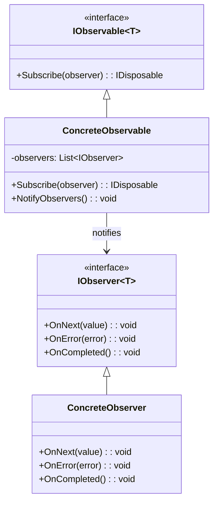

# Observer Pattern

## 📋 Description

The **Observer Pattern** defines a one-to-many dependency between objects so that when one object changes state, all dependent objects are notified and updated automatically. It's fundamental for implementing event-driven architectures.

## 🎯 Purpose

- **Loose coupling**: Maintain independence between subject and observers
- **Dynamic relationships**: Add/remove observers at runtime
- **Event notification**: Automatically notify multiple objects of changes
- **Separation of concerns**: Decouple business logic from presentation logic

## ✅ When to Use

- **Model-View architectures**: When views need to update based on model changes
- **Event systems**: GUI events, system notifications
- **Real-time updates**: Stock prices, social media feeds
- **Publish-Subscribe patterns**: Message broadcasting
- **Domain events**: Business rule notifications

## ❌ When NOT to Use

- **Simple scenarios**: Direct method calls are sufficient
- **Performance critical**: Too many observers can impact performance
- **Complex dependencies**: When observers have complex interdependencies
- **Memory leaks**: Risk of observers not being properly unsubscribed

## 🏗️ Structure



## 💡 Basic Implementation

```csharp
// Generic Observable interface
public interface IObservable<T>
{
    IDisposable Subscribe(IObserver<T> observer);
}

// Generic Observer interface  
public interface IObserver<T>
{
    void OnNext(T value);
    void OnError(Exception error);
    void OnCompleted();
}

// Custom Subject implementation
public class Subject<T> : IObservable<T>
{
    private readonly List<IObserver<T>> _observers = new();
    private readonly object _lock = new object();
    
    public IDisposable Subscribe(IObserver<T> observer)
    {
        lock (_lock)
        {
            _observers.Add(observer);
        }
        
        return new Unsubscriber<T>(_observers, observer, _lock);
    }
    
    public void OnNext(T value)
    {
        List<IObserver<T>> observersCopy;
        lock (_lock)
        {
            observersCopy = new List<IObserver<T>>(_observers);
        }
        
        foreach (var observer in observersCopy)
        {
            try
            {
                observer.OnNext(value);
            }
            catch (Exception ex)
            {
                observer.OnError(ex);
            }
        }
    }
    
    public void OnError(Exception error)
    {
        List<IObserver<T>> observersCopy;
        lock (_lock)
        {
            observersCopy = new List<IObserver<T>>(_observers);
        }
        
        foreach (var observer in observersCopy)
        {
            observer.OnError(error);
        }
    }
    
    public void OnCompleted()
    {
        List<IObserver<T>> observersCopy;
        lock (_lock)
        {
            observersCopy = new List<IObserver<T>>(_observers);
            _observers.Clear();
        }
        
        foreach (var observer in observersCopy)
        {
            observer.OnCompleted();
        }
    }
}

// Unsubscriber helper
public class Unsubscriber<T> : IDisposable
{
    private readonly List<IObserver<T>> _observers;
    private readonly IObserver<T> _observer;
    private readonly object _lock;
    
    public Unsubscriber(List<IObserver<T>> observers, IObserver<T> observer, object lockObject)
    {
        _observers = observers;
        _observer = observer;
        _lock = lockObject;
    }
    
    public void Dispose()
    {
        lock (_lock)
        {
            _observers.Remove(_observer);
        }
    }
}
```

## 📊 Real-World Example: Stock Price Monitor

```csharp
public class StockPrice
{
    public string Symbol { get; set; }
    public decimal Price { get; set; }
    public decimal Change { get; set; }
    public decimal ChangePercent { get; set; }
    public DateTime Timestamp { get; set; }
}

public class StockPriceService : Subject<StockPrice>
{
    private readonly Dictionary<string, StockPrice> _currentPrices = new();
    private readonly Random _random = new();
    private readonly Timer _timer;
    
    public StockPriceService()
    {
        // Initialize with some stocks
        _currentPrices["AAPL"] = new StockPrice { Symbol = "AAPL", Price = 150.00m };
        _currentPrices["GOOGL"] = new StockPrice { Symbol = "GOOGL", Price = 2800.00m };
        _currentPrices["MSFT"] = new StockPrice { Symbol = "MSFT", Price = 300.00m };
        
        // Start price updates every 2 seconds
        _timer = new Timer(UpdatePrices, null, TimeSpan.Zero, TimeSpan.FromSeconds(2));
    }
    
    private void UpdatePrices(object state)
    {
        var symbols = _currentPrices.Keys.ToArray();
        var symbol = symbols[_random.Next(symbols.Length)];
        var currentPrice = _currentPrices[symbol];
        
        // Simulate price change (-5% to +5%)
        var changePercent = (_random.NextDouble() - 0.5) * 0.1;
        var newPrice = currentPrice.Price * (1 + (decimal)changePercent);
        var change = newPrice - currentPrice.Price;
        
        var updatedPrice = new StockPrice
        {
            Symbol = symbol,
            Price = Math.Round(newPrice, 2),
            Change = Math.Round(change, 2),
            ChangePercent = Math.Round((decimal)changePercent * 100, 2),
            Timestamp = DateTime.Now
        };
        
        _currentPrices[symbol] = updatedPrice;
        OnNext(updatedPrice);
    }
    
    public void Dispose()
    {
        _timer?.Dispose();
        OnCompleted();
    }
}

// Console Display Observer
public class ConsoleStockDisplay : IObserver<StockPrice>
{
    private readonly string _name;
    
    public ConsoleStockDisplay(string name)
    {
        _name = name;
    }
    
    public void OnNext(StockPrice stock)
    {
        var color = stock.Change >= 0 ? ConsoleColor.Green : ConsoleColor.Red;
        var arrow = stock.Change >= 0 ? "↑" : "↓";
        
        Console.ForegroundColor = color;
        Console.WriteLine($"[{_name}] {stock.Symbol}: ${stock.Price:F2} {arrow} " +
                         $"{stock.Change:+0.00;-0.00} ({stock.ChangePercent:+0.00;-0.00}%) " +
                         $"at {stock.Timestamp:HH:mm:ss}");
        Console.ResetColor();
    }
    
    public void OnError(Exception error)
    {
        Console.WriteLine($"[{_name}] Error: {error.Message}");
    }
    
    public void OnCompleted()
    {
        Console.WriteLine($"[{_name}] Stock updates completed.");
    }
}

// Alert Observer
public class StockAlertService : IObserver<StockPrice>
{
    private readonly Dictionary<string, decimal> _alertThresholds = new();
    
    public void SetAlert(string symbol, decimal threshold)
    {
        _alertThresholds[symbol] = threshold;
    }
    
    public void OnNext(StockPrice stock)
    {
        if (_alertThresholds.TryGetValue(stock.Symbol, out var threshold))
        {
            if (Math.Abs(stock.ChangePercent) >= threshold)
            {
                Console.WriteLine($"🚨 ALERT: {stock.Symbol} moved {stock.ChangePercent:F2}% " +
                                $"(threshold: {threshold:F2}%)");
            }
        }
    }
    
    public void OnError(Exception error) { }
    public void OnCompleted() { }
}

// Usage
var stockService = new StockPriceService();

var consoleDisplay = new ConsoleStockDisplay("Main Display");
var alertService = new StockAlertService();
alertService.SetAlert("AAPL", 2.0m); // Alert if AAPL moves more than 2%

var subscription1 = stockService.Subscribe(consoleDisplay);
var subscription2 = stockService.Subscribe(alertService);

// Unsubscribe after some time
await Task.Delay(10000);
subscription1.Dispose();
subscription2.Dispose();
stockService.Dispose();
```

## 🔧 Pattern Variations

### 1. **Event-Based Observer (C# Events)**

```csharp
public class TemperatureSensor
{
    public event EventHandler<TemperatureChangedEventArgs> TemperatureChanged;
    
    private double _temperature;
    
    public double Temperature
    {
        get => _temperature;
        set
        {
            if (Math.Abs(_temperature - value) > 0.1)
            {
                var oldTemp = _temperature;
                _temperature = value;
                OnTemperatureChanged(new TemperatureChangedEventArgs(oldTemp, value));
            }
        }
    }
    
    protected virtual void OnTemperatureChanged(TemperatureChangedEventArgs e)
    {
        TemperatureChanged?.Invoke(this, e);
    }
}

public class TemperatureChangedEventArgs : EventArgs
{
    public double OldTemperature { get; }
    public double NewTemperature { get; }
    public double Change => NewTemperature - OldTemperature;
    
    public TemperatureChangedEventArgs(double oldTemp, double newTemp)
    {
        OldTemperature = oldTemp;
        NewTemperature = newTemp;
    }
}

public class TemperatureDisplay
{
    public TemperatureDisplay(TemperatureSensor sensor)
    {
        sensor.TemperatureChanged += OnTemperatureChanged;
    }
    
    private void OnTemperatureChanged(object sender, TemperatureChangedEventArgs e)
    {
        Console.WriteLine($"Temperature: {e.NewTemperature:F1}°C " +
                         $"(Change: {e.Change:+0.0;-0.0}°C)");
        
        if (e.NewTemperature > 35)
            Console.WriteLine("⚠️ High temperature warning!");
    }
}
```

### 2. **Reactive Extensions (Rx.NET)**

```csharp
// Using System.Reactive
public class WeatherStation
{
    private readonly Subject<WeatherData> _weatherSubject = new();
    
    public IObservable<WeatherData> WeatherUpdates => _weatherSubject.AsObservable();
    
    public void PublishWeatherData(WeatherData data)
    {
        _weatherSubject.OnNext(data);
    }
}

public class WeatherData
{
    public double Temperature { get; set; }
    public double Humidity { get; set; }
    public double Pressure { get; set; }
    public DateTime Timestamp { get; set; }
}

// Usage with Rx operators
var weatherStation = new WeatherStation();

// Subscribe to temperature changes > 30°C
weatherStation.WeatherUpdates
    .Where(data => data.Temperature > 30)
    .Subscribe(data => Console.WriteLine($"Hot weather: {data.Temperature}°C"));

// Subscribe to average temperature over 5 readings
weatherStation.WeatherUpdates
    .Buffer(5)
    .Select(readings => readings.Average(r => r.Temperature))
    .Subscribe(avgTemp => Console.WriteLine($"Average temp: {avgTemp:F1}°C"));

// Throttle rapid updates (max one per second)
weatherStation.WeatherUpdates
    .Throttle(TimeSpan.FromSeconds(1))
    .Subscribe(data => Console.WriteLine($"Throttled update: {data.Temperature}°C"));
```

### 3. **Property Change Notification (INotifyPropertyChanged)**

```csharp
public class Person : INotifyPropertyChanged
{
    private string _name;
    private int _age;
    
    public string Name
    {
        get => _name;
        set
        {
            if (_name != value)
            {
                _name = value;
                OnPropertyChanged();
            }
        }
    }
    
    public int Age
    {
        get => _age;
        set
        {
            if (_age != value)
            {
                _age = value;
                OnPropertyChanged();
            }
        }
    }
    
    public event PropertyChangedEventHandler PropertyChanged;
    
    protected virtual void OnPropertyChanged([CallerMemberName] string propertyName = null)
    {
        PropertyChanged?.Invoke(this, new PropertyChangedEventArgs(propertyName));
    }
}

public class PersonView
{
    public PersonView(Person person)
    {
        person.PropertyChanged += OnPersonPropertyChanged;
    }
    
    private void OnPersonPropertyChanged(object sender, PropertyChangedEventArgs e)
    {
        var person = (Person)sender;
        Console.WriteLine($"Property '{e.PropertyName}' changed. " +
                         $"Person: {person.Name}, Age: {person.Age}");
    }
}
```

## ⚡ Performance Considerations

- **Observer count**: Many observers can slow down notifications
- **Exception handling**: One observer exception shouldn't break others
- **Memory leaks**: Always dispose subscriptions properly
- **Thread safety**: Protect observer collections in multi-threaded scenarios

## 🧪 Testing

```csharp
[Test]
public void Subject_ShouldNotifyAllObservers()
{
    // Arrange
    var subject = new Subject<string>();
    var observer1 = new TestObserver<string>();
    var observer2 = new TestObserver<string>();
    
    subject.Subscribe(observer1);
    subject.Subscribe(observer2);
    
    // Act
    subject.OnNext("test message");
    
    // Assert
    Assert.AreEqual("test message", observer1.LastValue);
    Assert.AreEqual("test message", observer2.LastValue);
}

[Test]
public void Subject_ShouldRemoveObserverOnDispose()
{
    // Arrange
    var subject = new Subject<string>();
    var observer = new TestObserver<string>();
    var subscription = subject.Subscribe(observer);
    
    // Act
    subscription.Dispose();
    subject.OnNext("test message");
    
    // Assert
    Assert.IsNull(observer.LastValue);
}

public class TestObserver<T> : IObserver<T>
{
    public T LastValue { get; private set; }
    public Exception LastError { get; private set; }
    public bool IsCompleted { get; private set; }
    
    public void OnNext(T value) => LastValue = value;
    public void OnError(Exception error) => LastError = error;
    public void OnCompleted() => IsCompleted = true;
}
```

## 📊 Metrics and Monitoring

```csharp
public class ObserverMetrics<T> : IObserver<T>
{
    private readonly IObserver<T> _innerObserver;
    private readonly IMetrics _metrics;
    private readonly string _observerName;
    
    public ObserverMetrics(IObserver<T> innerObserver, IMetrics metrics, string observerName)
    {
        _innerObserver = innerObserver;
        _metrics = metrics;
        _observerName = observerName;
    }
    
    public void OnNext(T value)
    {
        var stopwatch = Stopwatch.StartNew();
        try
        {
            _innerObserver.OnNext(value);
            _metrics.Counter("observer.notifications_processed")
                   .WithTag("observer", _observerName)
                   .WithTag("status", "success")
                   .Increment();
        }
        catch (Exception ex)
        {
            _metrics.Counter("observer.notifications_processed")
                   .WithTag("observer", _observerName)
                   .WithTag("status", "error")
                   .Increment();
            _innerObserver.OnError(ex);
        }
        finally
        {
            _metrics.Timer("observer.processing_time")
                   .WithTag("observer", _observerName)
                   .Record(stopwatch.Elapsed);
        }
    }
    
    public void OnError(Exception error) => _innerObserver.OnError(error);
    public void OnCompleted() => _innerObserver.OnCompleted();
}
```

## 🔗 Related Patterns

- **[Mediator](../Mediator/)**: Centralized communication vs direct observer notification
- **[Command](../Command/)**: Commands can trigger observer notifications
- **[Model-View-Controller](../../ArchitecturalPatterns/MVC/)**: Views observe model changes
- **[Publish-Subscribe](../../ArchitecturalPatterns/PubSub/)**: Distributed version of Observer

## 📚 Additional Resources

- [Reactive Extensions (Rx.NET)](https://github.com/dotnet/reactive)
- [Microsoft: Observer Pattern](https://docs.microsoft.com/en-us/dotnet/standard/events/)
- [INotifyPropertyChanged Interface](https://docs.microsoft.com/en-us/dotnet/api/system.componentmodel.inotifypropertychanged)

---

> 💡 **Tip**: For complex reactive scenarios, consider using Reactive Extensions (Rx.NET) which provides powerful operators for composing and transforming observable sequences.
