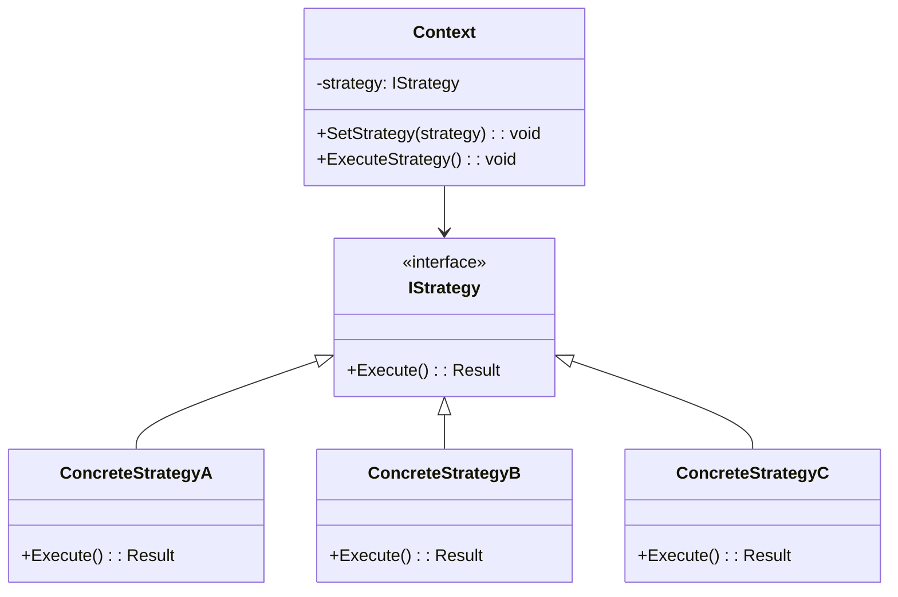

# Patrón Strategy (Estrategia)

## 📋 Descripción

El **Patrón Strategy** define una familia de algoritmos, los encapsula y los hace intercambiables. Strategy permite que el algoritmo varíe independientemente de los clientes que lo usan, promoviendo flexibilidad y selección de algoritmos en tiempo de ejecución.

## 🎯 Propósito

- **Flexibilidad de algoritmos**: Permitir selección de algoritmos en tiempo de ejecución
- **Principio Abierto/Cerrado**: Agregar nuevos algoritmos sin modificar código existente
- **Eliminar condicionales**: Reemplazar grandes declaraciones if/else o switch
- **Encapsular comportamientos**: Mantener algoritmos autocontenidos y testeable

## ✅ Cuándo Usar

- **Múltiples algoritmos**: Cuando tienes varias formas de realizar una tarea
- **Selección en tiempo de ejecución**: Cuando la elección del algoritmo depende de condiciones en tiempo de ejecución
- **Complejidad condicional**: Cuando tienes lógica condicional compleja para diferentes comportamientos
- **Variaciones de políticas**: Diferentes estrategias de precios, reglas de validación, o políticas de negocio
- **Escenarios de testing**: Cuando necesitas inyectar diferentes comportamientos para pruebas

## ❌ Cuándo NO Usar

- **Algoritmo único**: Cuando solo hay una forma de resolver el problema
- **Condicionales simples**: Cuando una declaración if/else simple es suficiente
- **Algoritmos estables**: Cuando los algoritmos rara vez cambian
- **Crítico para rendimiento**: Cuando el despacho de estrategia agrega overhead inaceptable

## 🏗️ Estructura



## 💡 Implementación Moderna: Estrategias de Precios E-commerce

```csharp
// Interfaz Strategy
public interface IEstrategiaPrecios
{
    Task<ResultadoPrecios> CalcularPrecioAsync(ContextoPrecios contexto);
    bool EsAplicable(Cliente cliente, Producto producto);
    string NombreEstrategia { get; }
    int Prioridad { get; }
}

// Contexto de precios con todos los datos necesarios
public class ContextoPrecios
{
    public Cliente Cliente { get; set; }
    public Producto Producto { get; set; }
    public int Cantidad { get; set; }
    public DateTime FechaCompra { get; set; }
    public decimal PrecioBase { get; set; }
    public string CodigoPromo { get; set; }
    public SegmentoCliente SegmentoCliente { get; set; }
    public PeriodoEstacional Temporada { get; set; }
}

public class ResultadoPrecios
{
    public decimal PrecioFinal { get; set; }
    public decimal PrecioOriginal { get; set; }
    public decimal Descuento { get; set; }
    public string RazonDescuento { get; set; }
    public bool EsValido { get; set; }
    public string MensajeError { get; set; }
    public Dictionary<string, object> Metadata { get; set; } = new();
}

// Estrategias concretas
public class EstrategiaPreciosRegular : IEstrategiaPrecios
{
    public string NombreEstrategia => "Precios Regulares";
    public int Prioridad => 0; // Prioridad más baja (por defecto)
    
    public Task<ResultadoPrecios> CalcularPrecioAsync(ContextoPrecios contexto)
    {
        return Task.FromResult(new ResultadoPrecios
        {
            PrecioFinal = contexto.PrecioBase * contexto.Cantidad,
            PrecioOriginal = contexto.PrecioBase * contexto.Cantidad,
            Descuento = 0,
            RazonDescuento = "Sin descuento aplicado",
            EsValido = true
        });
    }
    
    public bool EsAplicable(Cliente cliente, Producto producto) => true; // Siempre aplicable
}

public class EstrategiaPreciosClienteVip : IEstrategiaPrecios
{
    private readonly ILogger<EstrategiaPreciosClienteVip> _logger;
    private readonly ConfiguracionPreciosVip _config;
    
    public EstrategiaPreciosClienteVip(
        ILogger<EstrategiaPreciosClienteVip> logger, 
        ConfiguracionPreciosVip config)
    {
        _logger = logger;
        _config = config;
    }
    
    public string NombreEstrategia => "Precios Cliente VIP";
    public int Prioridad => 10; // Alta prioridad
    
    public async Task<ResultadoPrecios> CalcularPrecioAsync(ContextoPrecios contexto)
    {
        _logger.LogInformation("Aplicando precios VIP para cliente {IdCliente}", 
                              contexto.Cliente.Id);
        
        var porcentajeDescuento = await ObtenerPorcentajeDescuentoVipAsync(contexto.Cliente);
        var montoBase = contexto.PrecioBase * contexto.Cantidad;
        var montoDescuento = montoBase * porcentajeDescuento;
        
        return new ResultadoPrecios
        {
            PrecioFinal = montoBase - montoDescuento,
            PrecioOriginal = montoBase,
            Descuento = montoDescuento,
            RazonDescuento = $"Descuento Cliente VIP ({porcentajeDescuento:P0})",
            EsValido = true,
            Metadata = new Dictionary<string, object>
            {
                ["NivelVip"] = contexto.Cliente.NivelVip,
                ["AnosComoCliente"] = DateTime.UtcNow.Year - contexto.Cliente.FechaRegistro.Year
            }
        };
    }
    
    public bool EsAplicable(Cliente cliente, Producto producto) => 
        cliente.SegmentoCliente == SegmentoCliente.Vip;
    
    private async Task<decimal> ObtenerPorcentajeDescuentoVipAsync(Cliente cliente)
    {
        // Lógica compleja para determinar descuento VIP basado en nivel de cliente, historial de compras, etc.
        await Task.Delay(10); // Simular trabajo asíncrono
        
        return cliente.NivelVip switch
        {
            NivelVip.Oro => 0.10m,
            NivelVip.Platino => 0.15m,
            NivelVip.Diamante => 0.20m,
            _ => 0.05m
        };
    }
}

public class EstrategiaPreciosPedidoGranel : IEstrategiaPrecios
{
    private readonly IRepositorioPreciosGranel _repositorio;
    
    public EstrategiaPreciosPedidoGranel(IRepositorioPreciosGranel repositorio)
    {
        _repositorio = repositorio;
    }
    
    public string NombreEstrategia => "Precios Pedido por Granel";
    public int Prioridad => 8;
    
    public async Task<ResultadoPrecios> CalcularPrecioAsync(ContextoPrecios contexto)
    {
        var nivelesBulk = await _repositorio.ObtenerNivelesGranelAsync(contexto.Producto.IdCategoria);
        var nivelAplicable = nivelesBulk
            .Where(t => contexto.Cantidad >= t.CantidadMinima)
            .OrderByDescending(t => t.CantidadMinima)
            .FirstOrDefault();
        
        if (nivelAplicable == null)
        {
            return new ResultadoPrecios
            {
                EsValido = false,
                MensajeError = "No hay nivel de precios de granel aplicable"
            };
        }
        
        var montoBase = contexto.PrecioBase * contexto.Cantidad;
        var montoDescuento = montoBase * nivelAplicable.PorcentajeDescuento;
        
        return new ResultadoPrecios
        {
            PrecioFinal = montoBase - montoDescuento,
            PrecioOriginal = montoBase,
            Descuento = montoDescuento,
            RazonDescuento = $"Descuento Pedido Granel - {nivelAplicable.Nombre} ({nivelAplicable.PorcentajeDescuento:P0})",
            EsValido = true,
            Metadata = new Dictionary<string, object>
            {
                ["NombreNivelGranel"] = nivelAplicable.Nombre,
                ["CantidadMinimaRequerida"] = nivelAplicable.CantidadMinima
            }
        };
    }
    
    public bool EsAplicable(Cliente cliente, Producto producto) => true;
}

public class EstrategiaPreciosEstacional : IEstrategiaPrecios
{
    private readonly IRepositorioConfiguracionEstacional _repositorio;
    private readonly IProveedorFechaHora _proveedorFechaHora;
    
    public EstrategiaPreciosEstacional(
        IRepositorioConfiguracionEstacional repositorio, 
        IProveedorFechaHora proveedorFechaHora)
    {
        _repositorio = repositorio;
        _proveedorFechaHora = proveedorFechaHora;
    }
    
    public string NombreEstrategia => "Precios Estacionales";
    public int Prioridad => 5;
    
    public async Task<ResultadoPrecios> CalcularPrecioAsync(ContextoPrecios contexto)
    {
        var fechaActual = _proveedorFechaHora.UtcNow;
        var configEstacional = await _repositorio.ObtenerConfiguracionEstacionalAsync(
            contexto.Producto.IdCategoria, 
            fechaActual);
        
        if (configEstacional == null)
        {
            return new ResultadoPrecios
            {
                EsValido = false,
                MensajeError = "No se encontró configuración de precios estacionales"
            };
        }
        
        var montoBase = contexto.PrecioBase * contexto.Cantidad;
        var ajuste = montoBase * configEstacional.MultiplicadorPrecio - montoBase;
        
        return new ResultadoPrecios
        {
            PrecioFinal = montoBase + ajuste,
            PrecioOriginal = montoBase,
            Descuento = ajuste < 0 ? Math.Abs(ajuste) : 0,
            RazonDescuento = ajuste < 0 
                ? $"Descuento Estacional - {configEstacional.NombreTemporada}" 
                : $"Premium Estacional - {configEstacional.NombreTemporada}",
            EsValido = true,
            Metadata = new Dictionary<string, object>
            {
                ["NombreTemporada"] = configEstacional.NombreTemporada,
                ["MultiplicadorPrecio"] = configEstacional.MultiplicadorPrecio
            }
        };
    }
    
    public bool EsAplicable(Cliente cliente, Producto producto) => true;
}

public class EstrategiaPreciosCodigoPromo : IEstrategiaPrecios
{
    private readonly IServicioCodigoPromo _servicioCodigoPromo;
    
    public EstrategiaPreciosCodigoPromo(IServicioCodigoPromo servicioCodigoPromo)
    {
        _servicioCodigoPromo = servicioCodigoPromo;
    }
    
    public string NombreEstrategia => "Precios Código Promo";
    public int Prioridad => 15; // Máxima prioridad
    
    public async Task<ResultadoPrecios> CalcularPrecioAsync(ContextoPrecios contexto)
    {
        if (string.IsNullOrEmpty(contexto.CodigoPromo))
        {
            return new ResultadoPrecios
            {
                EsValido = false,
                MensajeError = "No se proporcionó código promo"
            };
        }
        
        var validacionPromo = await _servicioCodigoPromo.ValidarCodigoPromoAsync(
            contexto.CodigoPromo, 
            contexto.Cliente.Id, 
            contexto.Producto.Id);
        
        if (!validacionPromo.EsValido)
        {
            return new ResultadoPrecios
            {
                EsValido = false,
                MensajeError = validacionPromo.MensajeError
            };
        }
        
        var montoBase = contexto.PrecioBase * contexto.Cantidad;
        var montoDescuento = validacionPromo.TipoDescuento == TipoDescuento.Porcentaje
            ? montoBase * validacionPromo.ValorDescuento
            : Math.Min(validacionPromo.ValorDescuento, montoBase);
        
        return new ResultadoPrecios
        {
            PrecioFinal = montoBase - montoDescuento,
            PrecioOriginal = montoBase,
            Descuento = montoDescuento,
            RazonDescuento = $"Código Promo: {contexto.CodigoPromo}",
            EsValido = true,
            Metadata = new Dictionary<string, object>
            {
                ["IdCodigoPromo"] = validacionPromo.IdCodigoPromo,
                ["TipoDescuento"] = validacionPromo.TipoDescuento.ToString(),
                ["FechaVencimiento"] = validacionPromo.FechaVencimiento
            }
        };
    }
    
    public bool EsAplicable(Cliente cliente, Producto producto) => true;
}
```

## 🎯 Contexto Strategy y Orquestación

```csharp
public class MotorPrecios
{
    private readonly IEnumerable<IEstrategiaPrecios> _estrategias;
    private readonly ILogger<MotorPrecios> _logger;
    private readonly OpcionesMotorPrecios _opciones;
    
    public MotorPrecios(
        IEnumerable<IEstrategiaPrecios> estrategias, 
        ILogger<MotorPrecios> logger,
        IOptions<OpcionesMotorPrecios> opciones)
    {
        _estrategias = estrategias.OrderByDescending(s => s.Prioridad);
        _logger = logger;
        _opciones = opciones.Value;
    }
    
    public async Task<ResultadoPrecios> CalcularMejorPrecioAsync(ContextoPrecios contexto)
    {
        _logger.LogInformation("Calculando precio para cliente {IdCliente}, producto {IdProducto}", 
                              contexto.Cliente.Id, contexto.Producto.Id);
        
        var estrategiasAplicables = _estrategias
            .Where(s => s.EsAplicable(contexto.Cliente, contexto.Producto))
            .ToList();
        
        if (!estrategiasAplicables.Any())
        {
            _logger.LogWarning("No se encontraron estrategias de precios aplicables");
            return new ResultadoPrecios
            {
                EsValido = false,
                MensajeError = "No se encontraron estrategias de precios aplicables"
            };
        }
        
        ResultadoPrecios mejorResultado = null;
        var resultadosEstrategias = new List<(string NombreEstrategia, ResultadoPrecios Resultado)>();
        
        foreach (var estrategia in estrategiasAplicables)
        {
            try
            {
                var resultado = await estrategia.CalcularPrecioAsync(contexto);
                resultadosEstrategias.Add((estrategia.NombreEstrategia, resultado));
                
                if (resultado.EsValido && (mejorResultado == null || resultado.PrecioFinal < mejorResultado.PrecioFinal))
                {
                    mejorResultado = resultado;
                    mejorResultado.Metadata["EstrategiaAplicada"] = estrategia.NombreEstrategia;
                }
            }
            catch (Exception ex)
            {
                _logger.LogError(ex, "Error ejecutando estrategia de precios {NombreEstrategia}", estrategia.NombreEstrategia);
            }
        }
        
        if (mejorResultado == null)
        {
            _logger.LogError("Todas las estrategias de precios fallaron o retornaron resultados inválidos");
            return new ResultadoPrecios
            {
                EsValido = false,
                MensajeError = "Todas las estrategias de precios fallaron"
            };
        }
        
        // Agregar información de auditoría
        mejorResultado.Metadata["EstrategiasEvaluadas"] = resultadosEstrategias
            .Select(s => new { s.NombreEstrategia, Precio = s.Resultado.PrecioFinal, Valido = s.Resultado.EsValido })
            .ToList();
        
        _logger.LogInformation("Mejor precio calculado: {PrecioFinal} usando estrategia {Estrategia}", 
                              mejorResultado.PrecioFinal, mejorResultado.Metadata["EstrategiaAplicada"]);
        
        return mejorResultado;
    }
    
    public async Task<List<ComparacionPrecios>> CompararTodasEstrategiasAsync(ContextoPrecios contexto)
    {
        var comparaciones = new List<ComparacionPrecios>();
        
        var estrategiasAplicables = _estrategias
            .Where(s => s.EsAplicable(contexto.Cliente, contexto.Producto));
        
        foreach (var estrategia in estrategiasAplicables)
        {
            try
            {
                var resultado = await estrategia.CalcularPrecioAsync(contexto);
                comparaciones.Add(new ComparacionPrecios
                {
                    NombreEstrategia = estrategia.NombreEstrategia,
                    Prioridad = estrategia.Prioridad,
                    Resultado = resultado
                });
            }
            catch (Exception ex)
            {
                _logger.LogError(ex, "Error en comparación de estrategia para {NombreEstrategia}", estrategia.NombreEstrategia);
                comparaciones.Add(new ComparacionPrecios
                {
                    NombreEstrategia = estrategia.NombreEstrategia,
                    Prioridad = estrategia.Prioridad,
                    Resultado = new ResultadoPrecios 
                    { 
                        EsValido = false, 
                        MensajeError = ex.Message 
                    }
                });
            }
        }
        
        return comparaciones.OrderByDescending(c => c.Prioridad).ToList();
    }
}

public class ComparacionPrecios
{
    public string NombreEstrategia { get; set; }
    public int Prioridad { get; set; }
    public ResultadoPrecios Resultado { get; set; }
}
```

## 📊 Ejemplo del Mundo Real: Estrategias de Exportación de Datos

```csharp
public interface IEstrategiaExportacionDatos
{
    Task<ResultadoExportacion> ExportarAsync<T>(IEnumerable<T> datos, OpcionesExportacion opciones);
    string FormatoSoportado { get; }
    bool SoportaStreaming { get; }
    long TamanoMaximoDatos { get; }
}

public class EstrategiaExportacionCsv : IEstrategiaExportacionDatos
{
    public string FormatoSoportado => "CSV";
    public bool SoportaStreaming => true;
    public long TamanoMaximoDatos => long.MaxValue;
    
    public async Task<ResultadoExportacion> ExportarAsync<T>(IEnumerable<T> datos, OpcionesExportacion opciones)
    {
        var csv = new StringBuilder();
        var propiedades = typeof(T).GetProperties();
        
        // Cabecera
        csv.AppendLine(string.Join(",", propiedades.Select(p => p.Name)));
        
        // Filas de datos
        foreach (var elemento in datos)
        {
            var valores = propiedades.Select(p => 
                EscaparValorCsv(p.GetValue(elemento)?.ToString() ?? ""));
            csv.AppendLine(string.Join(",", valores));
        }
        
        return new ResultadoExportacion
        {
            Datos = Encoding.UTF8.GetBytes(csv.ToString()),
            TipoContenido = "text/csv",
            NombreArchivo = $"exportacion_{DateTime.UtcNow:yyyyMMdd_HHmmss}.csv"
        };
    }
    
    private string EscaparValorCsv(string valor)
    {
        if (valor.Contains(",") || valor.Contains("\"") || valor.Contains("\n"))
        {
            return $"\"{valor.Replace("\"", "\"\"")}\"";
        }
        return valor;
    }
}

public class EstrategiaExportacionJson : IEstrategiaExportacionDatos
{
    private readonly JsonSerializerOptions _opcionesJson;
    
    public EstrategiaExportacionJson()
    {
        _opcionesJson = new JsonSerializerOptions
        {
            PropertyNamingPolicy = JsonNamingPolicy.CamelCase,
            WriteIndented = true
        };
    }
    
    public string FormatoSoportado => "JSON";
    public bool SoportaStreaming => true;
    public long TamanoMaximoDatos => 100 * 1024 * 1024; // 100MB
    
    public async Task<ResultadoExportacion> ExportarAsync<T>(IEnumerable<T> datos, OpcionesExportacion opciones)
    {
        var datosJson = JsonSerializer.Serialize(datos, _opcionesJson);
        
        return new ResultadoExportacion
        {
            Datos = Encoding.UTF8.GetBytes(datosJson),
            TipoContenido = "application/json",
            NombreArchivo = $"exportacion_{DateTime.UtcNow:yyyyMMdd_HHmmss}.json"
        };
    }
}

public class EstrategiaExportacionExcel : IEstrategiaExportacionDatos
{
    public string FormatoSoportado => "Excel";
    public bool SoportaStreaming => false;
    public long TamanoMaximoDatos => 10 * 1024 * 1024; // 10MB
    
    public async Task<ResultadoExportacion> ExportarAsync<T>(IEnumerable<T> datos, OpcionesExportacion opciones)
    {
        using var paquete = new ExcelPackage();
        var hojaCalculo = paquete.Workbook.Worksheets.Add("Datos");
        
        var propiedades = typeof(T).GetProperties();
        
        // Cabeceras
        for (int i = 0; i < propiedades.Length; i++)
        {
            hojaCalculo.Cells[1, i + 1].Value = propiedades[i].Name;
            hojaCalculo.Cells[1, i + 1].Style.Font.Bold = true;
        }
        
        // Datos
        var fila = 2;
        foreach (var elemento in datos)
        {
            for (int col = 0; col < propiedades.Length; col++)
            {
                var valor = propiedades[col].GetValue(elemento);
                hojaCalculo.Cells[fila, col + 1].Value = valor;
            }
            fila++;
        }
        
        hojaCalculo.Cells.AutoFitColumns();
        
        return new ResultadoExportacion
        {
            Datos = paquete.GetAsByteArray(),
            TipoContenido = "application/vnd.openxmlformats-officedocument.spreadsheetml.sheet",
            NombreArchivo = $"exportacion_{DateTime.UtcNow:yyyyMMdd_HHmmss}.xlsx"
        };
    }
}

// Contexto de exportación
public class ServicioExportacionDatos
{
    private readonly Dictionary<string, IEstrategiaExportacionDatos> _estrategias;
    private readonly ILogger<ServicioExportacionDatos> _logger;
    
    public ServicioExportacionDatos(
        IEnumerable<IEstrategiaExportacionDatos> estrategias, 
        ILogger<ServicioExportacionDatos> logger)
    {
        _estrategias = estrategias.ToDictionary(s => s.FormatoSoportado, s => s);
        _logger = logger;
    }
    
    public async Task<ResultadoExportacion> ExportarDatosAsync<T>(
        IEnumerable<T> datos, 
        string formato, 
        OpcionesExportacion opciones = null)
    {
        if (!_estrategias.TryGetValue(formato, out var estrategia))
        {
            throw new NotSupportedException($"El formato de exportación '{formato}' no es soportado");
        }
        
        var listaDatos = datos.ToList();
        var tamanoEstimado = EstimarTamanoDatos(listaDatos);
        
        if (tamanoEstimado > estrategia.TamanoMaximoDatos)
        {
            throw new InvalidOperationException(
                $"El tamaño de los datos ({tamanoEstimado:N0} bytes) excede el máximo para el formato {formato} ({estrategia.TamanoMaximoDatos:N0} bytes)");
        }
        
        _logger.LogInformation("Exportando {Cantidad} registros a {Formato}", listaDatos.Count, formato);
        
        var resultado = await estrategia.ExportarAsync(listaDatos, opciones ?? new OpcionesExportacion());
        
        _logger.LogInformation("Exportación completada. Tamaño del archivo: {Tamano:N0} bytes", resultado.Datos.Length);
        
        return resultado;
    }
    
    public IEnumerable<string> ObtenerFormatosSoportados() => _estrategias.Keys;
    
    public bool EsFormatoSoportado(string formato) => _estrategias.ContainsKey(formato);
    
    private long EstimarTamanoDatos<T>(IEnumerable<T> datos)
    {
        // Estimación simple - en escenario real, podrías querer cálculo más sofisticado
        return datos.Count() * 1024; // Asumir 1KB por registro
    }
}
```

## ⚡ Consideraciones de Rendimiento

- **Caché de estrategias**: Cachear instancias de estrategia si son costosas de crear
- **Evaluación lazy**: Solo evaluar estrategias cuando se necesiten
- **Evaluación paralela**: Ejecutar estrategias independientes en paralelo para comparaciones
- **Límites de recursos**: Establecer límites en tiempo de ejecución y uso de memoria de estrategias

```csharp
public class MotorPreciosEficiente : MotorPrecios
{
    private readonly IMemoryCache _cache;
    private readonly SemaphoreSlim _semaforo;
    
    public MotorPreciosEficiente(
        IEnumerable<IEstrategiaPrecios> estrategias,
        IMemoryCache cache,
        ILogger<MotorPrecios> logger,
        IOptions<OpcionesMotorPrecios> opciones) : base(estrategias, logger, opciones)
    {
        _cache = cache;
        _semaforo = new SemaphoreSlim(Environment.ProcessorCount, Environment.ProcessorCount);
    }
    
    public async Task<ResultadoPrecios> CalcularMejorPrecioConCacheAsync(ContextoPrecios contexto)
    {
        var claveCache = GenerarClaveCache(contexto);
        
        if (_cache.TryGetValue(claveCache, out ResultadoPrecios resultadoCacheado))
        {
            return resultadoCacheado;
        }
        
        await _semaforo.WaitAsync();
        try
        {
            var resultado = await CalcularMejorPrecioAsync(contexto);
            
            if (resultado.EsValido)
            {
                _cache.Set(claveCache, resultado, TimeSpan.FromMinutes(5));
            }
            
            return resultado;
        }
        finally
        {
            _semaforo.Release();
        }
    }
    
    private string GenerarClaveCache(ContextoPrecios contexto)
    {
        return $"precios_{contexto.Cliente.Id}_{contexto.Producto.Id}_{contexto.Cantidad}_{contexto.CodigoPromo}_{contexto.FechaCompra:yyyyMMdd}";
    }
}
```

## 🧪 Testing

```csharp
[Test]
public async Task EstrategiaPreciosClienteVip_DeberiaAplicarDescuentoCorrecto()
{
    // Arrange
    var logger = Mock.Of<ILogger<EstrategiaPreciosClienteVip>>();
    var config = new ConfiguracionPreciosVip();
    var estrategia = new EstrategiaPreciosClienteVip(logger, config);
    
    var contexto = new ContextoPrecios
    {
        Cliente = new Cliente 
        { 
            Id = 1, 
            SegmentoCliente = SegmentoCliente.Vip, 
            NivelVip = NivelVip.Oro 
        },
        Producto = new Producto { Id = 1, IdCategoria = 1 },
        PrecioBase = 100m,
        Cantidad = 2
    };
    
    // Act
    var resultado = await estrategia.CalcularPrecioAsync(contexto);
    
    // Assert
    Assert.IsTrue(resultado.EsValido);
    Assert.AreEqual(200m, resultado.PrecioOriginal);
    Assert.AreEqual(180m, resultado.PrecioFinal); // 10% descuento para VIP Oro
    Assert.AreEqual(20m, resultado.Descuento);
    Assert.That(resultado.RazonDescuento, Contains.Substring("Descuento Cliente VIP"));
}

[Test]
public async Task MotorPrecios_DeberiaSeleccionarMejorEstrategia()
{
    // Arrange
    var estrategias = new List<IEstrategiaPrecios>
    {
        new EstrategiaPreciosRegular(),
        new Mock<IEstrategiaPrecios>().Object
    };
    
    var mockEstrategia = estrategias[1] as Mock<IEstrategiaPrecios>;
    mockEstrategia.Setup(s => s.Prioridad).Returns(10);
    mockEstrategia.Setup(s => s.EsAplicable(It.IsAny<Cliente>(), It.IsAny<Producto>())).Returns(true);
    mockEstrategia.Setup(s => s.CalcularPrecioAsync(It.IsAny<ContextoPrecios>()))
              .ReturnsAsync(new ResultadoPrecios { EsValido = true, PrecioFinal = 80m });
    
    var motor = new MotorPrecios(estrategias, Mock.Of<ILogger<MotorPrecios>>(), Options.Create(new OpcionesMotorPrecios()));
    
    var contexto = new ContextoPrecios
    {
        Cliente = new Cliente(),
        Producto = new Producto(),
        PrecioBase = 100m,
        Cantidad = 1
    };
    
    // Act
    var resultado = await motor.CalcularMejorPrecioAsync(contexto);
    
    // Assert
    Assert.IsTrue(resultado.EsValido);
    Assert.AreEqual(80m, resultado.PrecioFinal); // Debería seleccionar la estrategia mock con precio menor
}
```

## 🔗 Patrones Relacionados

- **[State](../State/)**: Ambos encapsulan comportamiento, pero State cambia el comportamiento del objeto basado en estado interno
- **[Command](../Command/)**: Encapsula solicitudes como objetos
- **[Factory Method](../../CreationalPatterns/FactoryMethod/)**: Crea instancias de estrategia
- **[Decorator](../../StructuralPatterns/Decorator/)**: Puede combinarse con estrategias para comportamiento en capas

## 📚 Recursos Adicionales

- [Microsoft: Patrón Strategy](https://docs.microsoft.com/en-us/dotnet/standard/design-guidelines/strategy-pattern)
- [Patrones de Diseño Gang of Four](https://es.wikipedia.org/wiki/Strategy_(patr%C3%B3n_de_dise%C3%B1o))
- [Código Limpio: Reemplazar Condicional con Polimorfismo](https://refactoring.guru/es/replace-conditional-with-polymorphism)

---

> 💡 **Consejo**: Usa el patrón Strategy para eliminar lógica condicional compleja y hacer algoritmos intercambiables. Es particularmente efectivo para reglas de negocio, estrategias de precios, y lógica de validación. Considera usar inyección de dependencias para gestionar ciclos de vida de estrategias.
