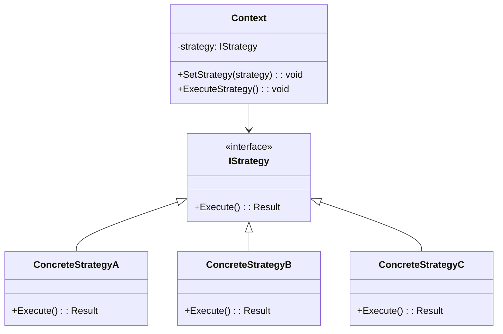

# Strategy Pattern

## 📋 Description

The **Strategy Pattern** defines a family of algorithms, encapsulates each one, and makes them interchangeable. Strategy lets the algorithm vary independently from clients that use it, promoting flexibility and runtime algorithm selection.

## 🎯 Purpose

- **Algorithm flexibility**: Allow runtime selection of algorithms
- **Open/Closed Principle**: Add new algorithms without modifying existing code
- **Eliminate conditionals**: Replace large if/else or switch statements
- **Encapsulate behaviors**: Keep algorithms self-contained and testable

## ✅ When to Use

- **Multiple algorithms**: When you have several ways to perform a task
- **Runtime selection**: When algorithm choice depends on runtime conditions
- **Conditional complexity**: When you have complex conditional logic for different behaviors
- **Policy variations**: Different pricing strategies, validation rules, or business policies
- **Testing scenarios**: When you need to inject different behaviors for testing

## ❌ When NOT to Use

- **Single algorithm**: When there's only one way to solve the problem
- **Simple conditionals**: When a simple if/else statement is sufficient
- **Stable algorithms**: When algorithms rarely change
- **Performance critical**: When strategy dispatch adds unacceptable overhead

## 🏗️ Structure



## 💡 Modern Implementation: E-commerce Pricing Strategies

```csharp
// Strategy interface
public interface IPricingStrategy
{
    Task<PricingResult> CalculatePriceAsync(PricingContext context);
    bool IsApplicable(Customer customer, Product product);
    string StrategyName { get; }
    int Priority { get; }
}

// Pricing context with all necessary data
public class PricingContext
{
    public Customer Customer { get; set; }
    public Product Product { get; set; }
    public int Quantity { get; set; }
    public DateTime PurchaseDate { get; set; }
    public decimal BasePrice { get; set; }
    public string PromoCode { get; set; }
    public CustomerSegment CustomerSegment { get; set; }
    public SeasonalPeriod Season { get; set; }
}

public class PricingResult
{
    public decimal FinalPrice { get; set; }
    public decimal OriginalPrice { get; set; }
    public decimal Discount { get; set; }
    public string DiscountReason { get; set; }
    public bool IsValid { get; set; }
    public string ErrorMessage { get; set; }
    public Dictionary<string, object> Metadata { get; set; } = new();
}

// Concrete strategies
public class RegularPricingStrategy : IPricingStrategy
{
    public string StrategyName => "Regular Pricing";
    public int Priority => 0; // Lowest priority (default)
    
    public Task<PricingResult> CalculatePriceAsync(PricingContext context)
    {
        return Task.FromResult(new PricingResult
        {
            FinalPrice = context.BasePrice * context.Quantity,
            OriginalPrice = context.BasePrice * context.Quantity,
            Discount = 0,
            DiscountReason = "No discount applied",
            IsValid = true
        });
    }
    
    public bool IsApplicable(Customer customer, Product product) => true; // Always applicable
}

public class VipCustomerPricingStrategy : IPricingStrategy
{
    private readonly ILogger<VipCustomerPricingStrategy> _logger;
    private readonly VipPricingConfiguration _config;
    
    public VipCustomerPricingStrategy(
        ILogger<VipCustomerPricingStrategy> logger, 
        VipPricingConfiguration config)
    {
        _logger = logger;
        _config = config;
    }
    
    public string StrategyName => "VIP Customer Pricing";
    public int Priority => 10; // High priority
    
    public async Task<PricingResult> CalculatePriceAsync(PricingContext context)
    {
        _logger.LogInformation("Applying VIP pricing for customer {CustomerId}", 
                              context.Customer.Id);
        
        var discountPercentage = await GetVipDiscountPercentageAsync(context.Customer);
        var baseAmount = context.BasePrice * context.Quantity;
        var discountAmount = baseAmount * discountPercentage;
        
        return new PricingResult
        {
            FinalPrice = baseAmount - discountAmount,
            OriginalPrice = baseAmount,
            Discount = discountAmount,
            DiscountReason = $"VIP Customer Discount ({discountPercentage:P0})",
            IsValid = true,
            Metadata = new Dictionary<string, object>
            {
                ["VipLevel"] = context.Customer.VipLevel,
                ["YearsAsCustomer"] = DateTime.UtcNow.Year - context.Customer.JoinDate.Year
            }
        };
    }
    
    public bool IsApplicable(Customer customer, Product product) => 
        customer.CustomerSegment == CustomerSegment.Vip;
    
    private async Task<decimal> GetVipDiscountPercentageAsync(Customer customer)
    {
        // Complex logic to determine VIP discount based on customer tier, purchase history, etc.
        await Task.Delay(10); // Simulate async work
        
        return customer.VipLevel switch
        {
            VipLevel.Gold => 0.10m,
            VipLevel.Platinum => 0.15m,
            VipLevel.Diamond => 0.20m,
            _ => 0.05m
        };
    }
}

public class BulkOrderPricingStrategy : IPricingStrategy
{
    private readonly IBulkPricingRepository _repository;
    
    public BulkOrderPricingStrategy(IBulkPricingRepository repository)
    {
        _repository = repository;
    }
    
    public string StrategyName => "Bulk Order Pricing";
    public int Priority => 8;
    
    public async Task<PricingResult> CalculatePriceAsync(PricingContext context)
    {
        var bulkTiers = await _repository.GetBulkTiersAsync(context.Product.CategoryId);
        var applicableTier = bulkTiers
            .Where(t => context.Quantity >= t.MinQuantity)
            .OrderByDescending(t => t.MinQuantity)
            .FirstOrDefault();
        
        if (applicableTier == null)
        {
            return new PricingResult
            {
                IsValid = false,
                ErrorMessage = "No bulk pricing tier applicable"
            };
        }
        
        var baseAmount = context.BasePrice * context.Quantity;
        var discountAmount = baseAmount * applicableTier.DiscountPercentage;
        
        return new PricingResult
        {
            FinalPrice = baseAmount - discountAmount,
            OriginalPrice = baseAmount,
            Discount = discountAmount,
            DiscountReason = $"Bulk Order Discount - {applicableTier.Name} ({applicableTier.DiscountPercentage:P0})",
            IsValid = true,
            Metadata = new Dictionary<string, object>
            {
                ["BulkTierName"] = applicableTier.Name,
                ["MinQuantityRequired"] = applicableTier.MinQuantity
            }
        };
    }
    
    public bool IsApplicable(Customer customer, Product product) => true;
}

public class SeasonalPricingStrategy : IPricingStrategy
{
    private readonly ISeasonalConfigRepository _repository;
    private readonly IDateTimeProvider _dateTimeProvider;
    
    public SeasonalPricingStrategy(
        ISeasonalConfigRepository repository, 
        IDateTimeProvider dateTimeProvider)
    {
        _repository = repository;
        _dateTimeProvider = dateTimeProvider;
    }
    
    public string StrategyName => "Seasonal Pricing";
    public int Priority => 5;
    
    public async Task<PricingResult> CalculatePriceAsync(PricingContext context)
    {
        var currentDate = _dateTimeProvider.UtcNow;
        var seasonalConfig = await _repository.GetSeasonalConfigAsync(
            context.Product.CategoryId, 
            currentDate);
        
        if (seasonalConfig == null)
        {
            return new PricingResult
            {
                IsValid = false,
                ErrorMessage = "No seasonal pricing configuration found"
            };
        }
        
        var baseAmount = context.BasePrice * context.Quantity;
        var adjustment = baseAmount * seasonalConfig.PriceMultiplier - baseAmount;
        
        return new PricingResult
        {
            FinalPrice = baseAmount + adjustment,
            OriginalPrice = baseAmount,
            Discount = adjustment < 0 ? Math.Abs(adjustment) : 0,
            DiscountReason = adjustment < 0 
                ? $"Seasonal Discount - {seasonalConfig.SeasonName}" 
                : $"Seasonal Premium - {seasonalConfig.SeasonName}",
            IsValid = true,
            Metadata = new Dictionary<string, object>
            {
                ["SeasonName"] = seasonalConfig.SeasonName,
                ["PriceMultiplier"] = seasonalConfig.PriceMultiplier
            }
        };
    }
    
    public bool IsApplicable(Customer customer, Product product) => true;
}

public class PromoCodePricingStrategy : IPricingStrategy
{
    private readonly IPromoCodeService _promoCodeService;
    
    public PromoCodePricingStrategy(IPromoCodeService promoCodeService)
    {
        _promoCodeService = promoCodeService;
    }
    
    public string StrategyName => "Promo Code Pricing";
    public int Priority => 15; // Highest priority
    
    public async Task<PricingResult> CalculatePriceAsync(PricingContext context)
    {
        if (string.IsNullOrEmpty(context.PromoCode))
        {
            return new PricingResult
            {
                IsValid = false,
                ErrorMessage = "No promo code provided"
            };
        }
        
        var promoValidation = await _promoCodeService.ValidatePromoCodeAsync(
            context.PromoCode, 
            context.Customer.Id, 
            context.Product.Id);
        
        if (!promoValidation.IsValid)
        {
            return new PricingResult
            {
                IsValid = false,
                ErrorMessage = promoValidation.ErrorMessage
            };
        }
        
        var baseAmount = context.BasePrice * context.Quantity;
        var discountAmount = promoValidation.DiscountType == DiscountType.Percentage
            ? baseAmount * promoValidation.DiscountValue
            : Math.Min(promoValidation.DiscountValue, baseAmount);
        
        return new PricingResult
        {
            FinalPrice = baseAmount - discountAmount,
            OriginalPrice = baseAmount,
            Discount = discountAmount,
            DiscountReason = $"Promo Code: {context.PromoCode}",
            IsValid = true,
            Metadata = new Dictionary<string, object>
            {
                ["PromoCodeId"] = promoValidation.PromoCodeId,
                ["DiscountType"] = promoValidation.DiscountType.ToString(),
                ["ExpirationDate"] = promoValidation.ExpirationDate
            }
        };
    }
    
    public bool IsApplicable(Customer customer, Product product) => true;
}
```

## 🎯 Strategy Context and Orchestration

```csharp
public class PricingEngine
{
    private readonly IEnumerable<IPricingStrategy> _strategies;
    private readonly ILogger<PricingEngine> _logger;
    private readonly PricingEngineOptions _options;
    
    public PricingEngine(
        IEnumerable<IPricingStrategy> strategies, 
        ILogger<PricingEngine> logger,
        IOptions<PricingEngineOptions> options)
    {
        _strategies = strategies.OrderByDescending(s => s.Priority);
        _logger = logger;
        _options = options.Value;
    }
    
    public async Task<PricingResult> CalculateBestPriceAsync(PricingContext context)
    {
        _logger.LogInformation("Calculating price for customer {CustomerId}, product {ProductId}", 
                              context.Customer.Id, context.Product.Id);
        
        var applicableStrategies = _strategies
            .Where(s => s.IsApplicable(context.Customer, context.Product))
            .ToList();
        
        if (!applicableStrategies.Any())
        {
            _logger.LogWarning("No applicable pricing strategies found");
            return new PricingResult
            {
                IsValid = false,
                ErrorMessage = "No applicable pricing strategies found"
            };
        }
        
        PricingResult bestResult = null;
        var strategyResults = new List<(string StrategyName, PricingResult Result)>();
        
        foreach (var strategy in applicableStrategies)
        {
            try
            {
                var result = await strategy.CalculatePriceAsync(context);
                strategyResults.Add((strategy.StrategyName, result));
                
                if (result.IsValid && (bestResult == null || result.FinalPrice < bestResult.FinalPrice))
                {
                    bestResult = result;
                    bestResult.Metadata["AppliedStrategy"] = strategy.StrategyName;
                }
            }
            catch (Exception ex)
            {
                _logger.LogError(ex, "Error executing pricing strategy {StrategyName}", strategy.StrategyName);
            }
        }
        
        if (bestResult == null)
        {
            _logger.LogError("All pricing strategies failed or returned invalid results");
            return new PricingResult
            {
                IsValid = false,
                ErrorMessage = "All pricing strategies failed"
            };
        }
        
        // Add audit information
        bestResult.Metadata["EvaluatedStrategies"] = strategyResults
            .Select(s => new { s.StrategyName, Price = s.Result.FinalPrice, Valid = s.Result.IsValid })
            .ToList();
        
        _logger.LogInformation("Best price calculated: {FinalPrice} using strategy {Strategy}", 
                              bestResult.FinalPrice, bestResult.Metadata["AppliedStrategy"]);
        
        return bestResult;
    }
    
    public async Task<List<PricingComparison>> CompareAllStrategiesAsync(PricingContext context)
    {
        var comparisons = new List<PricingComparison>();
        
        var applicableStrategies = _strategies
            .Where(s => s.IsApplicable(context.Customer, context.Product));
        
        foreach (var strategy in applicableStrategies)
        {
            try
            {
                var result = await strategy.CalculatePriceAsync(context);
                comparisons.Add(new PricingComparison
                {
                    StrategyName = strategy.StrategyName,
                    Priority = strategy.Priority,
                    Result = result
                });
            }
            catch (Exception ex)
            {
                _logger.LogError(ex, "Error in strategy comparison for {StrategyName}", strategy.StrategyName);
                comparisons.Add(new PricingComparison
                {
                    StrategyName = strategy.StrategyName,
                    Priority = strategy.Priority,
                    Result = new PricingResult 
                    { 
                        IsValid = false, 
                        ErrorMessage = ex.Message 
                    }
                });
            }
        }
        
        return comparisons.OrderByDescending(c => c.Priority).ToList();
    }
}

public class PricingComparison
{
    public string StrategyName { get; set; }
    public int Priority { get; set; }
    public PricingResult Result { get; set; }
}
```

## 📊 Real-World Example: Data Export Strategies

```csharp
public interface IDataExportStrategy
{
    Task<ExportResult> ExportAsync<T>(IEnumerable<T> data, ExportOptions options);
    string SupportedFormat { get; }
    bool SupportsStreaming { get; }
    long MaxDataSize { get; }
}

public class CsvExportStrategy : IDataExportStrategy
{
    public string SupportedFormat => "CSV";
    public bool SupportsStreaming => true;
    public long MaxDataSize => long.MaxValue;
    
    public async Task<ExportResult> ExportAsync<T>(IEnumerable<T> data, ExportOptions options)
    {
        var csv = new StringBuilder();
        var properties = typeof(T).GetProperties();
        
        // Header
        csv.AppendLine(string.Join(",", properties.Select(p => p.Name)));
        
        // Data rows
        foreach (var item in data)
        {
            var values = properties.Select(p => 
                EscapeCsvValue(p.GetValue(item)?.ToString() ?? ""));
            csv.AppendLine(string.Join(",", values));
        }
        
        return new ExportResult
        {
            Data = Encoding.UTF8.GetBytes(csv.ToString()),
            ContentType = "text/csv",
            FileName = $"export_{DateTime.UtcNow:yyyyMMdd_HHmmss}.csv"
        };
    }
    
    private string EscapeCsvValue(string value)
    {
        if (value.Contains(",") || value.Contains("\"") || value.Contains("\n"))
        {
            return $"\"{value.Replace("\"", "\"\"")}\"";
        }
        return value;
    }
}

public class JsonExportStrategy : IDataExportStrategy
{
    private readonly JsonSerializerOptions _jsonOptions;
    
    public JsonExportStrategy()
    {
        _jsonOptions = new JsonSerializerOptions
        {
            PropertyNamingPolicy = JsonNamingPolicy.CamelCase,
            WriteIndented = true
        };
    }
    
    public string SupportedFormat => "JSON";
    public bool SupportsStreaming => true;
    public long MaxDataSize => 100 * 1024 * 1024; // 100MB
    
    public async Task<ExportResult> ExportAsync<T>(IEnumerable<T> data, ExportOptions options)
    {
        var jsonData = JsonSerializer.Serialize(data, _jsonOptions);
        
        return new ExportResult
        {
            Data = Encoding.UTF8.GetBytes(jsonData),
            ContentType = "application/json",
            FileName = $"export_{DateTime.UtcNow:yyyyMMdd_HHmmss}.json"
        };
    }
}

public class ExcelExportStrategy : IDataExportStrategy
{
    public string SupportedFormat => "Excel";
    public bool SupportsStreaming => false;
    public long MaxDataSize => 10 * 1024 * 1024; // 10MB
    
    public async Task<ExportResult> ExportAsync<T>(IEnumerable<T> data, ExportOptions options)
    {
        using var package = new ExcelPackage();
        var worksheet = package.Workbook.Worksheets.Add("Data");
        
        var properties = typeof(T).GetProperties();
        
        // Headers
        for (int i = 0; i < properties.Length; i++)
        {
            worksheet.Cells[1, i + 1].Value = properties[i].Name;
            worksheet.Cells[1, i + 1].Style.Font.Bold = true;
        }
        
        // Data
        var row = 2;
        foreach (var item in data)
        {
            for (int col = 0; col < properties.Length; col++)
            {
                var value = properties[col].GetValue(item);
                worksheet.Cells[row, col + 1].Value = value;
            }
            row++;
        }
        
        worksheet.Cells.AutoFitColumns();
        
        return new ExportResult
        {
            Data = package.GetAsByteArray(),
            ContentType = "application/vnd.openxmlformats-officedocument.spreadsheetml.sheet",
            FileName = $"export_{DateTime.UtcNow:yyyyMMdd_HHmmss}.xlsx"
        };
    }
}

// Export context
public class DataExportService
{
    private readonly Dictionary<string, IDataExportStrategy> _strategies;
    private readonly ILogger<DataExportService> _logger;
    
    public DataExportService(
        IEnumerable<IDataExportStrategy> strategies, 
        ILogger<DataExportService> logger)
    {
        _strategies = strategies.ToDictionary(s => s.SupportedFormat, s => s);
        _logger = logger;
    }
    
    public async Task<ExportResult> ExportDataAsync<T>(
        IEnumerable<T> data, 
        string format, 
        ExportOptions options = null)
    {
        if (!_strategies.TryGetValue(format, out var strategy))
        {
            throw new NotSupportedException($"Export format '{format}' is not supported");
        }
        
        var dataList = data.ToList();
        var estimatedSize = EstimateDataSize(dataList);
        
        if (estimatedSize > strategy.MaxDataSize)
        {
            throw new InvalidOperationException(
                $"Data size ({estimatedSize:N0} bytes) exceeds maximum for {format} format ({strategy.MaxDataSize:N0} bytes)");
        }
        
        _logger.LogInformation("Exporting {Count} records to {Format}", dataList.Count, format);
        
        var result = await strategy.ExportAsync(dataList, options ?? new ExportOptions());
        
        _logger.LogInformation("Export completed. File size: {Size:N0} bytes", result.Data.Length);
        
        return result;
    }
    
    public IEnumerable<string> GetSupportedFormats() => _strategies.Keys;
    
    public bool IsFormatSupported(string format) => _strategies.ContainsKey(format);
    
    private long EstimateDataSize<T>(IEnumerable<T> data)
    {
        // Simple estimation - in real scenario, you might want more sophisticated calculation
        return data.Count() * 1024; // Assume 1KB per record
    }
}
```

## ⚡ Performance Considerations

- **Strategy caching**: Cache strategy instances if they're expensive to create
- **Lazy evaluation**: Only evaluate strategies when needed
- **Parallel evaluation**: Execute independent strategies in parallel for comparisons
- **Resource limits**: Set limits on strategy execution time and memory usage

```csharp
public class PerformantPricingEngine : PricingEngine
{
    private readonly IMemoryCache _cache;
    private readonly SemaphoreSlim _semaphore;
    
    public PerformantPricingEngine(
        IEnumerable<IPricingStrategy> strategies,
        IMemoryCache cache,
        ILogger<PricingEngine> logger,
        IOptions<PricingEngineOptions> options) : base(strategies, logger, options)
    {
        _cache = cache;
        _semaphore = new SemaphoreSlim(Environment.ProcessorCount, Environment.ProcessorCount);
    }
    
    public async Task<PricingResult> CalculateBestPriceWithCachingAsync(PricingContext context)
    {
        var cacheKey = GenerateCacheKey(context);
        
        if (_cache.TryGetValue(cacheKey, out PricingResult cachedResult))
        {
            return cachedResult;
        }
        
        await _semaphore.WaitAsync();
        try
        {
            var result = await CalculateBestPriceAsync(context);
            
            if (result.IsValid)
            {
                _cache.Set(cacheKey, result, TimeSpan.FromMinutes(5));
            }
            
            return result;
        }
        finally
        {
            _semaphore.Release();
        }
    }
    
    private string GenerateCacheKey(PricingContext context)
    {
        return $"pricing_{context.Customer.Id}_{context.Product.Id}_{context.Quantity}_{context.PromoCode}_{context.PurchaseDate:yyyyMMdd}";
    }
}
```

## 🧪 Testing

```csharp
[Test]
public async Task VipCustomerPricingStrategy_ShouldApplyCorrectDiscount()
{
    // Arrange
    var logger = Mock.Of<ILogger<VipCustomerPricingStrategy>>();
    var config = new VipPricingConfiguration();
    var strategy = new VipCustomerPricingStrategy(logger, config);
    
    var context = new PricingContext
    {
        Customer = new Customer 
        { 
            Id = 1, 
            CustomerSegment = CustomerSegment.Vip, 
            VipLevel = VipLevel.Gold 
        },
        Product = new Product { Id = 1, CategoryId = 1 },
        BasePrice = 100m,
        Quantity = 2
    };
    
    // Act
    var result = await strategy.CalculatePriceAsync(context);
    
    // Assert
    Assert.IsTrue(result.IsValid);
    Assert.AreEqual(200m, result.OriginalPrice);
    Assert.AreEqual(180m, result.FinalPrice); // 10% discount for Gold VIP
    Assert.AreEqual(20m, result.Discount);
    Assert.That(result.DiscountReason, Contains.Substring("VIP Customer Discount"));
}

[Test]
public async Task PricingEngine_ShouldSelectBestStrategy()
{
    // Arrange
    var strategies = new List<IPricingStrategy>
    {
        new RegularPricingStrategy(),
        new Mock<IPricingStrategy>().Object
    };
    
    var mockStrategy = strategies[1] as Mock<IPricingStrategy>;
    mockStrategy.Setup(s => s.Priority).Returns(10);
    mockStrategy.Setup(s => s.IsApplicable(It.IsAny<Customer>(), It.IsAny<Product>())).Returns(true);
    mockStrategy.Setup(s => s.CalculatePriceAsync(It.IsAny<PricingContext>()))
              .ReturnsAsync(new PricingResult { IsValid = true, FinalPrice = 80m });
    
    var engine = new PricingEngine(strategies, Mock.Of<ILogger<PricingEngine>>(), Options.Create(new PricingEngineOptions()));
    
    var context = new PricingContext
    {
        Customer = new Customer(),
        Product = new Product(),
        BasePrice = 100m,
        Quantity = 1
    };
    
    // Act
    var result = await engine.CalculateBestPriceAsync(context);
    
    // Assert
    Assert.IsTrue(result.IsValid);
    Assert.AreEqual(80m, result.FinalPrice); // Should select the mock strategy with lower price
}
```

## 🔗 Related Patterns

- **[State](../State/)**: Both encapsulate behavior, but State changes object behavior based on internal state
- **[Command](../Command/)**: Encapsulates requests as objects
- **[Factory Method](../../CreationalPatterns/FactoryMethod/)**: Creates strategy instances
- **[Decorator](../../StructuralPatterns/Decorator/)**: Can be combined with strategies for layered behavior

## 📚 Additional Resources

- [Microsoft: Strategy Pattern](https://docs.microsoft.com/en-us/dotnet/standard/design-guidelines/strategy-pattern)
- [Gang of Four Design Patterns](https://en.wikipedia.org/wiki/Strategy_pattern)
- [Clean Code: Replace Conditional with Polymorphism](https://refactoring.guru/replace-conditional-with-polymorphism)

---

> 💡 **Tip**: Use Strategy pattern to eliminate complex conditional logic and make algorithms interchangeable. It's particularly effective for business rules, pricing strategies, and validation logic. Consider using dependency injection to manage strategy lifecycles.
