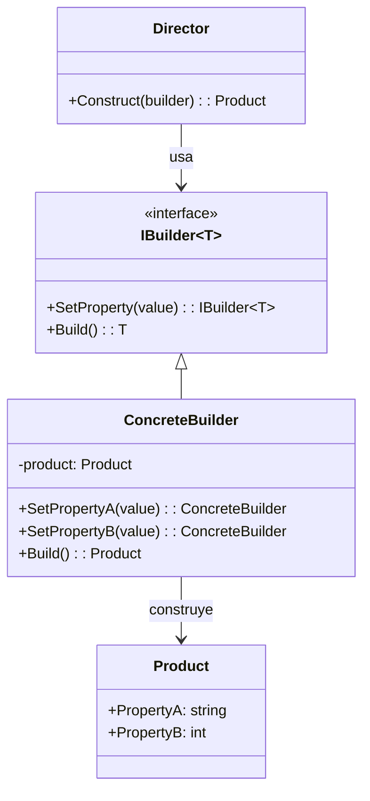

# Patrón Builder (Constructor)

## 📋 Descripción

El **Patrón Builder** separa la construcción de objetos complejos de su representación, permitiendo que el mismo proceso de construcción cree diferentes representaciones. Es particularmente útil para crear objetos con muchos parámetros opcionales.

## 🎯 Propósito

- **Construcción de objetos complejos**: Manejar objetos con muchos parámetros
- **Creación legible**: Proporcionar APIs de creación de objetos fluidas y legibles
- **Objetos inmutables**: Construir objetos inmutables paso a paso
- **Construcción flexible**: Soportar diferentes representaciones del mismo objeto

## ✅ Cuándo Usar

- **Constructores complejos**: Objetos con muchos parámetros opcionales
- **Objetos inmutables**: Cuando necesitas construir objetos inmutables
- **Objetos de configuración**: Conexiones de base de datos, clientes HTTP
- **Constructores de documentos**: Constructores HTML, XML, JSON
- **Constructores de datos de prueba**: Crear objetos de prueba con varias configuraciones

## ❌ Cuándo NO Usar

- **Objetos simples**: Objetos con pocos parámetros
- **Estructura estable**: Cuando la estructura del objeto rara vez cambia
- **Crítico para rendimiento**: Builder agrega overhead
- **Uso único**: Cuando los objetos se crean solo una vez

## 🏗️ Estructura



## 💡 Implementación Moderna (Builder Fluido)

```csharp
public class HttpClientBuilder
{
    private string _baseAddress;
    private TimeSpan _timeout = TimeSpan.FromSeconds(30);
    private readonly Dictionary<string, string> _defaultHeaders = new();
    private readonly List<DelegatingHandler> _handlers = new();
    private bool _allowAutoRedirect = true;
    private int _maxRedirects = 10;
    
    public HttpClientBuilder WithBaseAddress(string baseAddress)
    {
        _baseAddress = baseAddress ?? throw new ArgumentNullException(nameof(baseAddress));
        return this;
    }
    
    public HttpClientBuilder WithTimeout(TimeSpan timeout)
    {
        _timeout = timeout;
        return this;
    }
    
    public HttpClientBuilder WithHeader(string name, string value)
    {
        _defaultHeaders[name] = value;
        return this;
    }
    
    public HttpClientBuilder WithBearerToken(string token)
    {
        return WithHeader("Authorization", $"Bearer {token}");
    }
    
    public HttpClientBuilder WithUserAgent(string userAgent)
    {
        return WithHeader("User-Agent", userAgent);
    }
    
    public HttpClientBuilder WithHandler(DelegatingHandler handler)
    {
        _handlers.Add(handler);
        return this;
    }
    
    public HttpClientBuilder WithRetryPolicy(int maxRetries, TimeSpan delay)
    {
        var retryHandler = new RetryHandler(maxRetries, delay);
        return WithHandler(retryHandler);
    }
    
    public HttpClientBuilder WithLogging(ILogger logger)
    {
        var loggingHandler = new LoggingHandler(logger);
        return WithHandler(loggingHandler);
    }
    
    public HttpClientBuilder WithAutoRedirect(bool allow, int maxRedirects = 10)
    {
        _allowAutoRedirect = allow;
        _maxRedirects = maxRedirects;
        return this;
    }
    
    public HttpClient Build()
    {
        var handler = new HttpClientHandler
        {
            AllowAutoRedirect = _allowAutoRedirect,
            MaxAutomaticRedirections = _maxRedirects
        };
        
        // Encadenar handlers
        DelegatingHandler currentHandler = null;
        for (int i = _handlers.Count - 1; i >= 0; i--)
        {
            var nextHandler = _handlers[i];
            if (currentHandler != null)
            {
                nextHandler.InnerHandler = currentHandler;
            }
            else
            {
                nextHandler.InnerHandler = handler;
            }
            currentHandler = nextHandler;
        }
        
        var httpClient = new HttpClient(currentHandler ?? handler)
        {
            Timeout = _timeout
        };
        
        if (!string.IsNullOrEmpty(_baseAddress))
        {
            httpClient.BaseAddress = new Uri(_baseAddress);
        }
        
        foreach (var header in _defaultHeaders)
        {
            httpClient.DefaultRequestHeaders.Add(header.Key, header.Value);
        }
        
        return httpClient;
    }
}

// Uso
var httpClient = new HttpClientBuilder()
    .WithBaseAddress("https://api.example.com")
    .WithTimeout(TimeSpan.FromSeconds(60))
    .WithBearerToken("tu-token-aqui")
    .WithUserAgent("MyApp/1.0")
    .WithRetryPolicy(maxRetries: 3, delay: TimeSpan.FromSeconds(1))
    .WithLogging(logger)
    .WithAutoRedirect(true, 5)
    .Build();
```

## 📊 Ejemplo del Mundo Real: Constructor de Consultas SQL

```csharp
public class SqlQueryBuilder
{
    private readonly List<string> _selectFields = new();
    private string _fromTable;
    private readonly List<string> _joins = new();
    private readonly List<string> _whereConditions = new();
    private readonly List<string> _groupByFields = new();
    private readonly List<string> _havingConditions = new();
    private readonly List<string> _orderByFields = new();
    private int? _limit;
    private int? _offset;
    
    public SqlQueryBuilder Select(params string[] fields)
    {
        _selectFields.AddRange(fields);
        return this;
    }
    
    public SqlQueryBuilder From(string table)
    {
        _fromTable = table;
        return this;
    }
    
    public SqlQueryBuilder InnerJoin(string table, string condition)
    {
        _joins.Add($"INNER JOIN {table} ON {condition}");
        return this;
    }
    
    public SqlQueryBuilder LeftJoin(string table, string condition)
    {
        _joins.Add($"LEFT JOIN {table} ON {condition}");
        return this;
    }
    
    public SqlQueryBuilder Where(string condition)
    {
        _whereConditions.Add(condition);
        return this;
    }
    
    public SqlQueryBuilder WhereEquals(string field, object value)
    {
        var formattedValue = value is string ? $"'{value}'" : value.ToString();
        return Where($"{field} = {formattedValue}");
    }
    
    public SqlQueryBuilder WhereIn(string field, params object[] values)
    {
        var formattedValues = string.Join(", ", values.Select(v => 
            v is string ? $"'{v}'" : v.ToString()));
        return Where($"{field} IN ({formattedValues})");
    }
    
    public SqlQueryBuilder GroupBy(params string[] fields)
    {
        _groupByFields.AddRange(fields);
        return this;
    }
    
    public SqlQueryBuilder Having(string condition)
    {
        _havingConditions.Add(condition);
        return this;
    }
    
    public SqlQueryBuilder OrderBy(string field, bool descending = false)
    {
        var direction = descending ? "DESC" : "ASC";
        _orderByFields.Add($"{field} {direction}");
        return this;
    }
    
    public SqlQueryBuilder Limit(int count)
    {
        _limit = count;
        return this;
    }
    
    public SqlQueryBuilder Offset(int count)
    {
        _offset = count;
        return this;
    }
    
    public string Build()
    {
        if (string.IsNullOrEmpty(_fromTable))
            throw new InvalidOperationException("La tabla FROM es requerida");
        
        var query = new StringBuilder();
        
        // SELECT
        if (_selectFields.Any())
        {
            query.AppendLine($"SELECT {string.Join(", ", _selectFields)}");
        }
        else
        {
            query.AppendLine("SELECT *");
        }
        
        // FROM
        query.AppendLine($"FROM {_fromTable}");
        
        // JOINs
        foreach (var join in _joins)
        {
            query.AppendLine(join);
        }
        
        // WHERE
        if (_whereConditions.Any())
        {
            query.AppendLine($"WHERE {string.Join(" AND ", _whereConditions)}");
        }
        
        // GROUP BY
        if (_groupByFields.Any())
        {
            query.AppendLine($"GROUP BY {string.Join(", ", _groupByFields)}");
        }
        
        // HAVING
        if (_havingConditions.Any())
        {
            query.AppendLine($"HAVING {string.Join(" AND ", _havingConditions)}");
        }
        
        // ORDER BY
        if (_orderByFields.Any())
        {
            query.AppendLine($"ORDER BY {string.Join(", ", _orderByFields)}");
        }
        
        // LIMIT
        if (_limit.HasValue)
        {
            query.AppendLine($"LIMIT {_limit.Value}");
        }
        
        // OFFSET
        if (_offset.HasValue)
        {
            query.AppendLine($"OFFSET {_offset.Value}");
        }
        
        return query.ToString().Trim();
    }
}

// Uso
var query = new SqlQueryBuilder()
    .Select("u.Name", "u.Email", "p.Title")
    .From("Users u")
    .InnerJoin("Posts p", "p.UserId = u.Id")
    .Where("u.IsActive = 1")
    .WhereEquals("u.Department", "Engineering")
    .WhereIn("p.Status", "Published", "Draft")
    .GroupBy("u.Id", "u.Name", "u.Email")
    .Having("COUNT(p.Id) > 5")
    .OrderBy("u.Name")
    .OrderBy("p.CreatedDate", descending: true)
    .Limit(50)
    .Offset(100)
    .Build();

Console.WriteLine(query);
```

## 🎯 Ejemplo: Constructor de Datos de Prueba

```csharp
public class UserBuilder
{
    private string _firstName = "Juan";
    private string _lastName = "Pérez";
    private string _email;
    private int _age = 25;
    private List<string> _roles = new() { "User" };
    private bool _isActive = true;
    private DateTime _createdDate = DateTime.UtcNow;
    private Address _address;
    
    public UserBuilder WithName(string firstName, string lastName)
    {
        _firstName = firstName;
        _lastName = lastName;
        return this;
    }
    
    public UserBuilder WithEmail(string email)
    {
        _email = email;
        return this;
    }
    
    public UserBuilder WithAge(int age)
    {
        _age = age;
        return this;
    }
    
    public UserBuilder WithRoles(params string[] roles)
    {
        _roles = roles.ToList();
        return this;
    }
    
    public UserBuilder AsAdmin()
    {
        _roles.Add("Admin");
        return this;
    }
    
    public UserBuilder AsInactive()
    {
        _isActive = false;
        return this;
    }
    
    public UserBuilder CreatedOn(DateTime date)
    {
        _createdDate = date;
        return this;
    }
    
    public UserBuilder WithAddress(Action<AddressBuilder> addressConfig)
    {
        var addressBuilder = new AddressBuilder();
        addressConfig(addressBuilder);
        _address = addressBuilder.Build();
        return this;
    }
    
    public User Build()
    {
        return new User
        {
            FirstName = _firstName,
            LastName = _lastName,
            Email = _email ?? $"{_firstName.ToLower()}.{_lastName.ToLower()}@example.com",
            Age = _age,
            Roles = _roles,
            IsActive = _isActive,
            CreatedDate = _createdDate,
            Address = _address
        };
    }
}

// Uso en pruebas
[Test]
public void TestUserCreation()
{
    var admin = new UserBuilder()
        .WithName("Alicia", "González")
        .WithEmail("alicia.gonzalez@empresa.com")
        .WithAge(30)
        .AsAdmin()
        .WithAddress(addr => addr
            .OnStreet("Calle Principal 456")
            .InCity("Madrid")
            .InState("Madrid")
            .WithZipCode("28001"))
        .Build();
    
    Assert.AreEqual("Alicia", admin.FirstName);
    Assert.IsTrue(admin.Roles.Contains("Admin"));
    Assert.AreEqual("Madrid", admin.Address.City);
}
```

## ⚡ Consideraciones de Rendimiento

- **Asignación de objetos**: Los builders crean objetos intermedios
- **Uso de memoria**: Considera object pooling para escenarios de alta frecuencia
- **Costo de validación**: Validar solo en tiempo de construcción, no en cada llamada de método
- **Inmutabilidad**: Los builders inmutables crean nuevas instancias para cada llamada

## 🧪 Testing

```csharp
[Test]
public void HttpClientBuilder_ShouldCreateClientWithCorrectConfiguration()
{
    // Arrange & Act
    var client = new HttpClientBuilder()
        .WithBaseAddress("https://api.test.com")
        .WithTimeout(TimeSpan.FromSeconds(45))
        .WithBearerToken("test-token")
        .Build();
    
    // Assert
    Assert.AreEqual("https://api.test.com/", client.BaseAddress.ToString());
    Assert.AreEqual(TimeSpan.FromSeconds(45), client.Timeout);
    Assert.IsTrue(client.DefaultRequestHeaders.Authorization.ToString().Contains("test-token"));
}

[Test]
public void SqlQueryBuilder_ShouldBuildCorrectQuery()
{
    // Arrange & Act
    var query = new SqlQueryBuilder()
        .Select("Name", "Age")
        .From("Users")
        .Where("Age > 18")
        .OrderBy("Name")
        .Limit(10)
        .Build();
    
    // Assert
    var expectedQuery = @"SELECT Name, Age
FROM Users
WHERE Age > 18
ORDER BY Name ASC
LIMIT 10";
    
    Assert.AreEqual(expectedQuery, query);
}
```

## 🔗 Patrones Relacionados

- **[Abstract Factory](../AbstractFactory/)**: Los builders pueden usar factories para crear componentes
- **[Composite](../../StructuralPatterns/Composite/)**: Los builders a menudo crean estructuras composite
- **[Fluent Interface](../FluentInterface/)**: Los builders modernos usan interfaces fluidas
- **[Prototype](../Prototype/)**: Los builders pueden clonar prototipos para configuraciones base

## 📚 Recursos Adicionales

- [Microsoft: Patrón Builder](https://docs.microsoft.com/en-us/dotnet/standard/design-guidelines/builder-pattern)
- [Diseño de Interfaz Fluida](https://martinfowler.com/bliki/FluentInterface.html)
- [Test Data Builders](https://www.natpryce.com/articles/000714.html)

---

> 💡 **Consejo**: Usa builders para objetos con muchos parámetros opcionales o cuando necesites una API fluida y legible para la construcción de objetos. Considera usar expression builders para escenarios de configuración.
