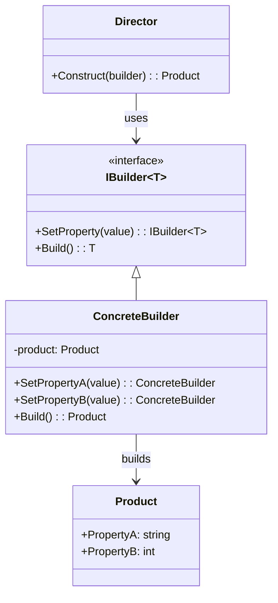

# Builder Pattern

## 📋 Description

The **Builder Pattern** separates the construction of complex objects from their representation, allowing the same construction process to create different representations. It's particularly useful for creating objects with many optional parameters.

## 🎯 Purpose

- **Complex object construction**: Manage objects with many parameters
- **Readable creation**: Provide fluent, readable object creation APIs
- **Immutable objects**: Build immutable objects step by step
- **Flexible construction**: Support different representations of the same object

## ✅ When to Use

- **Complex constructors**: Objects with many optional parameters
- **Immutable objects**: When you need to build immutable objects
- **Configuration objects**: Database connections, HTTP clients
- **Document builders**: HTML, XML, JSON builders
- **Test data builders**: Creating test objects with various configurations

## ❌ When NOT to Use

- **Simple objects**: Objects with few parameters
- **Stable structure**: When object structure rarely changes
- **Performance critical**: Builder adds overhead
- **One-time use**: When objects are created only once

## 🏗️ Structure



## 💡 Modern Implementation (Fluent Builder)

```csharp
public class HttpClientBuilder
{
    private string _baseAddress;
    private TimeSpan _timeout = TimeSpan.FromSeconds(30);
    private readonly Dictionary<string, string> _defaultHeaders = new();
    private readonly List<DelegatingHandler> _handlers = new();
    private bool _allowAutoRedirect = true;
    private int _maxRedirects = 10;
    
    public HttpClientBuilder WithBaseAddress(string baseAddress)
    {
        _baseAddress = baseAddress ?? throw new ArgumentNullException(nameof(baseAddress));
        return this;
    }
    
    public HttpClientBuilder WithTimeout(TimeSpan timeout)
    {
        _timeout = timeout;
        return this;
    }
    
    public HttpClientBuilder WithHeader(string name, string value)
    {
        _defaultHeaders[name] = value;
        return this;
    }
    
    public HttpClientBuilder WithBearerToken(string token)
    {
        return WithHeader("Authorization", $"Bearer {token}");
    }
    
    public HttpClientBuilder WithUserAgent(string userAgent)
    {
        return WithHeader("User-Agent", userAgent);
    }
    
    public HttpClientBuilder WithHandler(DelegatingHandler handler)
    {
        _handlers.Add(handler);
        return this;
    }
    
    public HttpClientBuilder WithRetryPolicy(int maxRetries, TimeSpan delay)
    {
        var retryHandler = new RetryHandler(maxRetries, delay);
        return WithHandler(retryHandler);
    }
    
    public HttpClientBuilder WithLogging(ILogger logger)
    {
        var loggingHandler = new LoggingHandler(logger);
        return WithHandler(loggingHandler);
    }
    
    public HttpClientBuilder WithAutoRedirect(bool allow, int maxRedirects = 10)
    {
        _allowAutoRedirect = allow;
        _maxRedirects = maxRedirects;
        return this;
    }
    
    public HttpClient Build()
    {
        var handler = new HttpClientHandler
        {
            AllowAutoRedirect = _allowAutoRedirect,
            MaxAutomaticRedirections = _maxRedirects
        };
        
        // Chain handlers
        DelegatingHandler currentHandler = null;
        for (int i = _handlers.Count - 1; i >= 0; i--)
        {
            var nextHandler = _handlers[i];
            if (currentHandler != null)
            {
                nextHandler.InnerHandler = currentHandler;
            }
            else
            {
                nextHandler.InnerHandler = handler;
            }
            currentHandler = nextHandler;
        }
        
        var httpClient = new HttpClient(currentHandler ?? handler)
        {
            Timeout = _timeout
        };
        
        if (!string.IsNullOrEmpty(_baseAddress))
        {
            httpClient.BaseAddress = new Uri(_baseAddress);
        }
        
        foreach (var header in _defaultHeaders)
        {
            httpClient.DefaultRequestHeaders.Add(header.Key, header.Value);
        }
        
        return httpClient;
    }
}

// Custom handlers
public class RetryHandler : DelegatingHandler
{
    private readonly int _maxRetries;
    private readonly TimeSpan _delay;
    
    public RetryHandler(int maxRetries, TimeSpan delay)
    {
        _maxRetries = maxRetries;
        _delay = delay;
    }
    
    protected override async Task<HttpResponseMessage> SendAsync(
        HttpRequestMessage request, CancellationToken cancellationToken)
    {
        for (int i = 0; i <= _maxRetries; i++)
        {
            try
            {
                var response = await base.SendAsync(request, cancellationToken);
                if (response.IsSuccessStatusCode || i == _maxRetries)
                {
                    return response;
                }
            }
            catch (HttpRequestException) when (i < _maxRetries)
            {
                // Continue to retry
            }
            
            await Task.Delay(_delay, cancellationToken);
        }
        
        throw new HttpRequestException($"Request failed after {_maxRetries} retries");
    }
}

// Usage
var httpClient = new HttpClientBuilder()
    .WithBaseAddress("https://api.example.com")
    .WithTimeout(TimeSpan.FromSeconds(60))
    .WithBearerToken("your-token-here")
    .WithUserAgent("MyApp/1.0")
    .WithRetryPolicy(maxRetries: 3, delay: TimeSpan.FromSeconds(1))
    .WithLogging(logger)
    .WithAutoRedirect(true, 5)
    .Build();
```

## 📊 Real-World Example: SQL Query Builder

```csharp
public class SqlQueryBuilder
{
    private readonly List<string> _selectFields = new();
    private string _fromTable;
    private readonly List<string> _joins = new();
    private readonly List<string> _whereConditions = new();
    private readonly List<string> _groupByFields = new();
    private readonly List<string> _havingConditions = new();
    private readonly List<string> _orderByFields = new();
    private int? _limit;
    private int? _offset;
    
    public SqlQueryBuilder Select(params string[] fields)
    {
        _selectFields.AddRange(fields);
        return this;
    }
    
    public SqlQueryBuilder From(string table)
    {
        _fromTable = table;
        return this;
    }
    
    public SqlQueryBuilder InnerJoin(string table, string condition)
    {
        _joins.Add($"INNER JOIN {table} ON {condition}");
        return this;
    }
    
    public SqlQueryBuilder LeftJoin(string table, string condition)
    {
        _joins.Add($"LEFT JOIN {table} ON {condition}");
        return this;
    }
    
    public SqlQueryBuilder Where(string condition)
    {
        _whereConditions.Add(condition);
        return this;
    }
    
    public SqlQueryBuilder WhereEquals(string field, object value)
    {
        var formattedValue = value is string ? $"'{value}'" : value.ToString();
        return Where($"{field} = {formattedValue}");
    }
    
    public SqlQueryBuilder WhereIn(string field, params object[] values)
    {
        var formattedValues = string.Join(", ", values.Select(v => 
            v is string ? $"'{v}'" : v.ToString()));
        return Where($"{field} IN ({formattedValues})");
    }
    
    public SqlQueryBuilder GroupBy(params string[] fields)
    {
        _groupByFields.AddRange(fields);
        return this;
    }
    
    public SqlQueryBuilder Having(string condition)
    {
        _havingConditions.Add(condition);
        return this;
    }
    
    public SqlQueryBuilder OrderBy(string field, bool descending = false)
    {
        var direction = descending ? "DESC" : "ASC";
        _orderByFields.Add($"{field} {direction}");
        return this;
    }
    
    public SqlQueryBuilder Limit(int count)
    {
        _limit = count;
        return this;
    }
    
    public SqlQueryBuilder Offset(int count)
    {
        _offset = count;
        return this;
    }
    
    public string Build()
    {
        if (string.IsNullOrEmpty(_fromTable))
            throw new InvalidOperationException("FROM table is required");
        
        var query = new StringBuilder();
        
        // SELECT
        if (_selectFields.Any())
        {
            query.AppendLine($"SELECT {string.Join(", ", _selectFields)}");
        }
        else
        {
            query.AppendLine("SELECT *");
        }
        
        // FROM
        query.AppendLine($"FROM {_fromTable}");
        
        // JOINs
        foreach (var join in _joins)
        {
            query.AppendLine(join);
        }
        
        // WHERE
        if (_whereConditions.Any())
        {
            query.AppendLine($"WHERE {string.Join(" AND ", _whereConditions)}");
        }
        
        // GROUP BY
        if (_groupByFields.Any())
        {
            query.AppendLine($"GROUP BY {string.Join(", ", _groupByFields)}");
        }
        
        // HAVING
        if (_havingConditions.Any())
        {
            query.AppendLine($"HAVING {string.Join(" AND ", _havingConditions)}");
        }
        
        // ORDER BY
        if (_orderByFields.Any())
        {
            query.AppendLine($"ORDER BY {string.Join(", ", _orderByFields)}");
        }
        
        // LIMIT
        if (_limit.HasValue)
        {
            query.AppendLine($"LIMIT {_limit.Value}");
        }
        
        // OFFSET
        if (_offset.HasValue)
        {
            query.AppendLine($"OFFSET {_offset.Value}");
        }
        
        return query.ToString().Trim();
    }
}

// Usage
var query = new SqlQueryBuilder()
    .Select("u.Name", "u.Email", "p.Title")
    .From("Users u")
    .InnerJoin("Posts p", "p.UserId = u.Id")
    .Where("u.IsActive = 1")
    .WhereEquals("u.Department", "Engineering")
    .WhereIn("p.Status", "Published", "Draft")
    .GroupBy("u.Id", "u.Name", "u.Email")
    .Having("COUNT(p.Id) > 5")
    .OrderBy("u.Name")
    .OrderBy("p.CreatedDate", descending: true)
    .Limit(50)
    .Offset(100)
    .Build();

Console.WriteLine(query);
```

## 🎯 Example: Test Data Builder

```csharp
public class UserBuilder
{
    private string _firstName = "John";
    private string _lastName = "Doe";
    private string _email;
    private int _age = 25;
    private List<string> _roles = new() { "User" };
    private bool _isActive = true;
    private DateTime _createdDate = DateTime.UtcNow;
    private Address _address;
    
    public UserBuilder WithName(string firstName, string lastName)
    {
        _firstName = firstName;
        _lastName = lastName;
        return this;
    }
    
    public UserBuilder WithEmail(string email)
    {
        _email = email;
        return this;
    }
    
    public UserBuilder WithAge(int age)
    {
        _age = age;
        return this;
    }
    
    public UserBuilder WithRoles(params string[] roles)
    {
        _roles = roles.ToList();
        return this;
    }
    
    public UserBuilder AsAdmin()
    {
        _roles.Add("Admin");
        return this;
    }
    
    public UserBuilder AsInactive()
    {
        _isActive = false;
        return this;
    }
    
    public UserBuilder CreatedOn(DateTime date)
    {
        _createdDate = date;
        return this;
    }
    
    public UserBuilder WithAddress(Action<AddressBuilder> addressConfig)
    {
        var addressBuilder = new AddressBuilder();
        addressConfig(addressBuilder);
        _address = addressBuilder.Build();
        return this;
    }
    
    public User Build()
    {
        return new User
        {
            FirstName = _firstName,
            LastName = _lastName,
            Email = _email ?? $"{_firstName.ToLower()}.{_lastName.ToLower()}@example.com",
            Age = _age,
            Roles = _roles,
            IsActive = _isActive,
            CreatedDate = _createdDate,
            Address = _address
        };
    }
}

public class AddressBuilder
{
    private string _street = "123 Main St";
    private string _city = "Anytown";
    private string _state = "CA";
    private string _zipCode = "12345";
    private string _country = "USA";
    
    public AddressBuilder OnStreet(string street)
    {
        _street = street;
        return this;
    }
    
    public AddressBuilder InCity(string city)
    {
        _city = city;
        return this;
    }
    
    public AddressBuilder InState(string state)
    {
        _state = state;
        return this;
    }
    
    public AddressBuilder WithZipCode(string zipCode)
    {
        _zipCode = zipCode;
        return this;
    }
    
    public AddressBuilder InCountry(string country)
    {
        _country = country;
        return this;
    }
    
    public Address Build()
    {
        return new Address
        {
            Street = _street,
            City = _city,
            State = _state,
            ZipCode = _zipCode,
            Country = _country
        };
    }
}

// Usage in tests
[Test]
public void TestUserCreation()
{
    var admin = new UserBuilder()
        .WithName("Alice", "Smith")
        .WithEmail("alice.smith@company.com")
        .WithAge(30)
        .AsAdmin()
        .WithAddress(addr => addr
            .OnStreet("456 Oak Ave")
            .InCity("San Francisco")
            .InState("CA")
            .WithZipCode("94105"))
        .Build();
    
    Assert.AreEqual("Alice", admin.FirstName);
    Assert.IsTrue(admin.Roles.Contains("Admin"));
    Assert.AreEqual("San Francisco", admin.Address.City);
}
```

## 🔧 Pattern Variations

### 1. **Director Pattern (Classic GoF)**

```csharp
public class ReportDirector
{
    public Report BuildStandardReport(IReportBuilder builder, ReportData data)
    {
        return builder
            .AddHeader("Monthly Report")
            .AddSubheader($"Generated on {DateTime.Now:yyyy-MM-dd}")
            .AddSection("Summary", data.Summary)
            .AddSection("Details", data.Details)
            .AddFooter("Confidential")
            .Build();
    }
    
    public Report BuildExecutiveReport(IReportBuilder builder, ReportData data)
    {
        return builder
            .AddHeader("Executive Summary")
            .AddSection("Key Metrics", data.KeyMetrics)
            .AddChart(data.ChartData)
            .AddFooter("Executive Level")
            .Build();
    }
}
```

### 2. **Functional Builder**

```csharp
public static class ConfigurationBuilder
{
    public static Configuration Build(Action<ConfigurationOptions> configure)
    {
        var options = new ConfigurationOptions();
        configure(options);
        return options.ToConfiguration();
    }
}

public class ConfigurationOptions
{
    public string ConnectionString { get; set; }
    public int Timeout { get; set; } = 30;
    public bool EnableLogging { get; set; } = false;
    
    public Configuration ToConfiguration()
    {
        return new Configuration(ConnectionString, Timeout, EnableLogging);
    }
}

// Usage
var config = ConfigurationBuilder.Build(options =>
{
    options.ConnectionString = "Server=localhost;Database=MyApp";
    options.Timeout = 60;
    options.EnableLogging = true;
});
```

## ⚡ Performance Considerations

- **Object allocation**: Builders create intermediate objects
- **Memory usage**: Consider object pooling for high-frequency scenarios
- **Validation cost**: Validate only at build time, not during each method call
- **Immutability**: Immutable builders create new instances for each call

## 🧪 Testing

```csharp
[Test]
public void HttpClientBuilder_ShouldCreateClientWithCorrectConfiguration()
{
    // Arrange & Act
    var client = new HttpClientBuilder()
        .WithBaseAddress("https://api.test.com")
        .WithTimeout(TimeSpan.FromSeconds(45))
        .WithBearerToken("test-token")
        .Build();
    
    // Assert
    Assert.AreEqual("https://api.test.com/", client.BaseAddress.ToString());
    Assert.AreEqual(TimeSpan.FromSeconds(45), client.Timeout);
    Assert.IsTrue(client.DefaultRequestHeaders.Authorization.ToString().Contains("test-token"));
}

[Test]
public void SqlQueryBuilder_ShouldBuildCorrectQuery()
{
    // Arrange & Act
    var query = new SqlQueryBuilder()
        .Select("Name", "Age")
        .From("Users")
        .Where("Age > 18")
        .OrderBy("Name")
        .Limit(10)
        .Build();
    
    // Assert
    var expectedQuery = @"SELECT Name, Age
FROM Users
WHERE Age > 18
ORDER BY Name ASC
LIMIT 10";
    
    Assert.AreEqual(expectedQuery, query);
}
```

## 📊 Metrics and Monitoring

```csharp
public class MetricsBuilder
{
    private readonly IMetrics _metrics;
    private readonly Dictionary<string, object> _tags = new();
    private readonly Stopwatch _stopwatch = new();
    
    public MetricsBuilder(IMetrics metrics)
    {
        _metrics = metrics;
        _stopwatch.Start();
    }
    
    public MetricsBuilder WithTag(string key, object value)
    {
        _tags[key] = value;
        return this;
    }
    
    public MetricsBuilder WithOperation(string operation)
    {
        return WithTag("operation", operation);
    }
    
    public MetricsBuilder WithUser(string userId)
    {
        return WithTag("user_id", userId);
    }
    
    public void RecordSuccess()
    {
        _stopwatch.Stop();
        var counter = _metrics.Counter("operation.completed");
        var timer = _metrics.Timer("operation.duration");
        
        foreach (var tag in _tags)
        {
            counter = counter.WithTag(tag.Key, tag.Value.ToString());
            timer = timer.WithTag(tag.Key, tag.Value.ToString());
        }
        
        counter.WithTag("status", "success").Increment();
        timer.Record(_stopwatch.Elapsed);
    }
}
```

## 🔗 Related Patterns

- **[Abstract Factory](../AbstractFactory/)**: Builders can use factories to create components
- **[Composite](../../StructuralPatterns/Composite/)**: Builders often create composite structures
- **[Fluent Interface](../FluentInterface/)**: Modern builders use fluent interfaces
- **[Prototype](../Prototype/)**: Builders may clone prototypes for base configurations

## 📚 Additional Resources

- [Microsoft: Builder Pattern](https://docs.microsoft.com/en-us/dotnet/standard/design-guidelines/builder-pattern)
- [Fluent Interface Design](https://martinfowler.com/bliki/FluentInterface.html)
- [Test Data Builders](https://www.natpryce.com/articles/000714.html)

---

> 💡 **Tip**: Use builders for objects with many optional parameters or when you need a fluent, readable API for object construction. Consider using expression builders for configuration scenarios.
