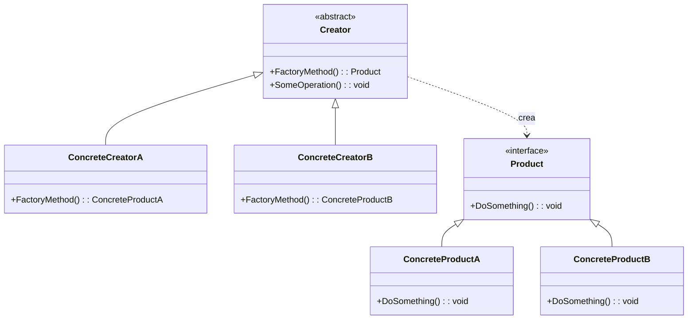

# Patrón Factory Method (Método Fábrica)

## 📋 Descripción

El **Patrón Factory Method** es un patrón de diseño creacional que proporciona una interfaz para crear objetos en una superclase, pero permite que las subclases alteren el tipo de objetos que se crearán. Elimina la necesidad de vincular clases específicas de aplicación en tu código.

## 🎯 Propósito

- **Desacoplar la creación de objetos**: Separar la creación de objetos de su uso
- **Soportar extensibilidad**: Agregar nuevos productos sin modificar código existente
- **Encapsular lógica de instanciación**: Ocultar detalles complejos de creación de objetos
- **Seguir el Principio Abierto/Cerrado**: Abierto para extensión, cerrado para modificación

## ✅ Cuándo Usar

- **Tipos de producto desconocidos**: Cuando no puedes anticipar las clases de objetos a crear
- **Desarrollo de frameworks**: Construir frameworks que necesitan trabajar con clases definidas por el usuario
- **Arquitecturas de plugins**: Soportar diferentes implementaciones cargadas en tiempo de ejecución
- **Inyección de dependencias**: Cuando quieres inyectar diferentes implementaciones
- **Escenarios de testing**: Crear objetos mock para pruebas unitarias

## ❌ Cuándo NO Usar

- **Creación simple de objetos**: Cuando la instanciación no requiere lógica compleja
- **Tipos de producto fijos**: Cuando no necesitas variar la clase del producto
- **Crítico para rendimiento**: Cuando la abstracción de fábrica agrega overhead innecesario
- **Implementación única**: Cuando solo hay un producto concreto

## 🏗️ Estructura



## 💡 Implementación Moderna

```csharp
// Interfaz Producto
public interface IProcesadorPago
{
    Task<ResultadoPago> ProcesarPagoAsync(SolicitudPago solicitud);
    bool SoportaMetodoPago(MetodoPago metodo);
    decimal ObtenerTarifaProcesamiento(decimal monto);
}

// Productos Concretos
public class ProcesadorTarjetaCredito : IProcesadorPago
{
    private readonly ILogger<ProcesadorTarjetaCredito> _logger;
    private readonly IValidadorTarjetaCredito _validador;
    
    public ProcesadorTarjetaCredito(ILogger<ProcesadorTarjetaCredito> logger, 
                                 IValidadorTarjetaCredito validador)
    {
        _logger = logger;
        _validador = validador;
    }
    
    public async Task<ResultadoPago> ProcesarPagoAsync(SolicitudPago solicitud)
    {
        _logger.LogInformation("Procesando pago con tarjeta de crédito por {Monto}", 
                              solicitud.Monto);
        
        if (!_validador.ValidarTarjeta(solicitud.InfoTarjetaCredito))
        {
            return new ResultadoPago 
            { 
                EsExitoso = false, 
                MensajeError = "Información de tarjeta de crédito inválida" 
            };
        }
        
        // Simular procesamiento de pago
        await Task.Delay(100);
        
        return new ResultadoPago 
        { 
            EsExitoso = true, 
            IdTransaccion = Guid.NewGuid().ToString(),
            MontoProcesado = solicitud.Monto - ObtenerTarifaProcesamiento(solicitud.Monto)
        };
    }
    
    public bool SoportaMetodoPago(MetodoPago metodo) => 
        metodo == MetodoPago.TarjetaCredito;
    
    public decimal ObtenerTarifaProcesamiento(decimal monto) => monto * 0.029m; // 2.9%
}

public class ProcesadorPayPal : IProcesadorPago
{
    private readonly ILogger<ProcesadorPayPal> _logger;
    private readonly IServicioPayPal _servicioPaypal;
    
    public ProcesadorPayPal(ILogger<ProcesadorPayPal> logger, IServicioPayPal servicioPaypal)
    {
        _logger = logger;
        _servicioPaypal = servicioPaypal;
    }
    
    public async Task<ResultadoPago> ProcesarPagoAsync(SolicitudPago solicitud)
    {
        _logger.LogInformation("Procesando pago PayPal por {Monto}", solicitud.Monto);
        
        var resultado = await _servicioPaypal.CobrarAsync(solicitud.EmailPayPal, solicitud.Monto);
        
        return new ResultadoPago
        {
            EsExitoso = resultado.Exitoso,
            IdTransaccion = resultado.IdTransaccion,
            MensajeError = resultado.MensajeError,
            MontoProcesado = solicitud.Monto - ObtenerTarifaProcesamiento(solicitud.Monto)
        };
    }
    
    public bool SoportaMetodoPago(MetodoPago metodo) => 
        metodo == MetodoPago.PayPal;
    
    public decimal ObtenerTarifaProcesamiento(decimal monto) => 2.99m; // Tarifa fija
}

public class ProcesadorCripto : IProcesadorPago
{
    private readonly ILogger<ProcesadorCripto> _logger;
    private readonly IServicioBlockchain _servicioBlockchain;
    
    public ProcesadorCripto(ILogger<ProcesadorCripto> logger, 
                           IServicioBlockchain servicioBlockchain)
    {
        _logger = logger;
        _servicioBlockchain = servicioBlockchain;
    }
    
    public async Task<ResultadoPago> ProcesarPagoAsync(SolicitudPago solicitud)
    {
        _logger.LogInformation("Procesando pago cripto por {Monto} {Moneda}", 
                              solicitud.Monto, solicitud.CriptoMoneda);
        
        var transaccion = await _servicioBlockchain.CrearTransaccionAsync(
            solicitud.DireccionBilletera, 
            solicitud.Monto, 
            solicitud.CriptoMoneda);
        
        return new ResultadoPago
        {
            EsExitoso = transaccion.EstaConfirmada,
            IdTransaccion = transaccion.Hash,
            MontoProcesado = solicitud.Monto,
            InfoAdicional = new Dictionary<string, object>
            {
                ["AlturBloque"] = transaccion.AlturaBloque,
                ["Confirmaciones"] = transaccion.Confirmaciones
            }
        };
    }
    
    public bool SoportaMetodoPago(MetodoPago metodo) => 
        metodo == MetodoPago.Criptomoneda;
    
    public decimal ObtenerTarifaProcesamiento(decimal monto) => 0; // Sin tarifa de procesamiento
}
```

## 🏭 Implementación de Fábrica

```csharp
// Creator Abstracto
public abstract class FabricaProcesadorPago
{
    // Método Fábrica
    public abstract IProcesadorPago CrearProcesador();
    
    // Método template usando el método fábrica
    public async Task<ResultadoPago> ProcesarPago(SolicitudPago solicitud)
    {
        var procesador = CrearProcesador();
        
        if (!procesador.SoportaMetodoPago(solicitud.MetodoPago))
        {
            throw new NotSupportedException(
                $"Método de pago {solicitud.MetodoPago} no es soportado");
        }
        
        // Agregar logging, validación, etc.
        return await procesador.ProcesarPagoAsync(solicitud);
    }
}

// Creators Concretos
public class FabricaProcesadorTarjetaCredito : FabricaProcesadorPago
{
    private readonly IServiceProvider _serviceProvider;
    
    public FabricaProcesadorTarjetaCredito(IServiceProvider serviceProvider)
    {
        _serviceProvider = serviceProvider;
    }
    
    public override IProcesadorPago CrearProcesador() =>
        _serviceProvider.GetRequiredService<ProcesadorTarjetaCredito>();
}

public class FabricaProcesadorPayPal : FabricaProcesadorPago
{
    private readonly IServiceProvider _serviceProvider;
    
    public FabricaProcesadorPayPal(IServiceProvider serviceProvider)
    {
        _serviceProvider = serviceProvider;
    }
    
    public override IProcesadorPago CrearProcesador() =>
        _serviceProvider.GetRequiredService<ProcesadorPayPal>();
}

public class FabricaProcesadorCripto : FabricaProcesadorPago
{
    private readonly IServiceProvider _serviceProvider;
    
    public FabricaProcesadorCripto(IServiceProvider serviceProvider)
    {
        _serviceProvider = serviceProvider;
    }
    
    public override IProcesadorPago CrearProcesador() =>
        _serviceProvider.GetRequiredService<ProcesadorCripto>();
}
```

## 🚀 Avanzado: Fábrica Genérica con Registro

```csharp
public class RegistroProcesadoresPago
{
    private readonly Dictionary<MetodoPago, Func<IProcesadorPago>> _fabricas = new();
    private readonly IServiceProvider _serviceProvider;
    
    public RegistroProcesadoresPago(IServiceProvider serviceProvider)
    {
        _serviceProvider = serviceProvider;
        RegistrarFabricasPorDefecto();
    }
    
    private void RegistrarFabricasPorDefecto()
    {
        Registrar(MetodoPago.TarjetaCredito, () => 
            _serviceProvider.GetRequiredService<ProcesadorTarjetaCredito>());
        Registrar(MetodoPago.PayPal, () => 
            _serviceProvider.GetRequiredService<ProcesadorPayPal>());
        Registrar(MetodoPago.Criptomoneda, () => 
            _serviceProvider.GetRequiredService<ProcesadorCripto>());
    }
    
    public void Registrar(MetodoPago metodo, Func<IProcesadorPago> fabrica)
    {
        _fabricas[metodo] = fabrica;
    }
    
    public IProcesadorPago Crear(MetodoPago metodo)
    {
        if (_fabricas.TryGetValue(metodo, out var fabrica))
        {
            return fabrica();
        }
        
        throw new NotSupportedException($"Método de pago {metodo} no es soportado");
    }
    
    public bool EsSoportado(MetodoPago metodo) => _fabricas.ContainsKey(metodo);
    
    public IEnumerable<MetodoPago> ObtenerMetodosSoportados() => _fabricas.Keys;
}

// Uso con DI
public class ServicioPago
{
    private readonly RegistroProcesadoresPago _registro;
    private readonly ILogger<ServicioPago> _logger;
    
    public ServicioPago(RegistroProcesadoresPago registro, ILogger<ServicioPago> logger)
    {
        _registro = registro;
        _logger = logger;
    }
    
    public async Task<ResultadoPago> ProcesarPagoAsync(SolicitudPago solicitud)
    {
        try
        {
            if (!_registro.EsSoportado(solicitud.MetodoPago))
            {
                return new ResultadoPago
                {
                    EsExitoso = false,
                    MensajeError = $"Método de pago {solicitud.MetodoPago} no es soportado"
                };
            }
            
            var procesador = _registro.Crear(solicitud.MetodoPago);
            return await procesador.ProcesarPagoAsync(solicitud);
        }
        catch (Exception ex)
        {
            _logger.LogError(ex, "Error procesando pago");
            return new ResultadoPago
            {
                EsExitoso = false,
                MensajeError = "Ocurrió un error al procesar el pago"
            };
        }
    }
}
```

## 📊 Ejemplo del Mundo Real: Fábrica de Exportadores de Documentos

```csharp
public interface IExportadorDocumento
{
    Task<byte[]> ExportarAsync<T>(IEnumerable<T> datos);
    string ObtenerTipoContenido();
    string ObtenerExtensionArchivo();
}

public class ExportadorPdf : IExportadorDocumento
{
    public async Task<byte[]> ExportarAsync<T>(IEnumerable<T> datos)
    {
        // Lógica de generación PDF usando iTextSharp o similar
        await Task.Delay(100); // Simular trabajo asíncrono
        return Encoding.UTF8.GetBytes($"Contenido PDF para {datos.Count()} elementos");
    }
    
    public string ObtenerTipoContenido() => "application/pdf";
    public string ObtenerExtensionArchivo() => ".pdf";
}

public class ExportadorExcel : IExportadorDocumento
{
    public async Task<byte[]> ExportarAsync<T>(IEnumerable<T> datos)
    {
        // Generación Excel usando EPPlus o similar
        await Task.Delay(100);
        return Encoding.UTF8.GetBytes($"Contenido Excel para {datos.Count()} elementos");
    }
    
    public string ObtenerTipoContenido() => "application/vnd.openxmlformats-officedocument.spreadsheetml.sheet";
    public string ObtenerExtensionArchivo() => ".xlsx";
}

public class ExportadorCsv : IExportadorDocumento
{
    public async Task<byte[]> ExportarAsync<T>(IEnumerable<T> datos)
    {
        var csv = new StringBuilder();
        // Lógica de generación CSV
        foreach (var elemento in datos)
        {
            csv.AppendLine(elemento.ToString());
        }
        
        return Encoding.UTF8.GetBytes(csv.ToString());
    }
    
    public string ObtenerTipoContenido() => "text/csv";
    public string ObtenerExtensionArchivo() => ".csv";
}

// Fábrica
public static class FabricaExportadorDocumento
{
    public static IExportadorDocumento Crear(FormatoExportacion formato) => formato switch
    {
        FormatoExportacion.Pdf => new ExportadorPdf(),
        FormatoExportacion.Excel => new ExportadorExcel(),
        FormatoExportacion.Csv => new ExportadorCsv(),
        _ => throw new ArgumentException($"Formato de exportación no soportado: {formato}")
    };
}

public enum FormatoExportacion { Pdf, Excel, Csv }
```

## ⚡ Consideraciones de Rendimiento

- **Object pooling**: Reutilizar objetos costosos de crear
- **Inicialización lazy**: Crear objetos solo cuando se necesiten
- **Caché**: Cachear instancias de fábrica frecuentemente usadas
- **Gestión de memoria**: Considerar el tiempo de vida y disposición de objetos

```csharp
public class FabricaProcesadorPagoConPool : FabricaProcesadorPago
{
    private readonly ConcurrentQueue<IProcesadorPago> _pool = new();
    private readonly Func<IProcesadorPago> _funcCrear;
    
    public FabricaProcesadorPagoConPool(Func<IProcesadorPago> funcCrear)
    {
        _funcCrear = funcCrear;
    }
    
    public override IProcesadorPago CrearProcesador()
    {
        if (_pool.TryDequeue(out var procesador))
        {
            return procesador;
        }
        
        return _funcCrear();
    }
    
    public void DevolverProcesador(IProcesadorPago procesador)
    {
        // Resetear estado del procesador
        _pool.Enqueue(procesador);
    }
}
```

## 🧪 Testing

```csharp
[Test]
public async Task ServicioPago_DeberiaProcesamPagoTarjetaCredito()
{
    // Arrange
    var mockValidador = new Mock<IValidadorTarjetaCredito>();
    mockValidador.Setup(v => v.ValidarTarjeta(It.IsAny<InfoTarjetaCredito>()))
             .Returns(true);
    
    var procesador = new ProcesadorTarjetaCredito(Mock.Of<ILogger<ProcesadorTarjetaCredito>>(), 
                                                mockValidador.Object);
    
    var solicitud = new SolicitudPago
    {
        MetodoPago = MetodoPago.TarjetaCredito,
        Monto = 100.00m,
        InfoTarjetaCredito = new InfoTarjetaCredito { Numero = "4111111111111111" }
    };
    
    // Act
    var resultado = await procesador.ProcesarPagoAsync(solicitud);
    
    // Assert
    Assert.IsTrue(resultado.EsExitoso);
    Assert.IsNotNull(resultado.IdTransaccion);
    Assert.AreEqual(97.10m, resultado.MontoProcesado); // 100 - 2.9% tarifa
}

[Test]
public void FabricaExportadorDocumento_DeberiaCrearExportadorCorrecto()
{
    // Arrange & Act
    var exportadorPdf = FabricaExportadorDocumento.Crear(FormatoExportacion.Pdf);
    var exportadorCsv = FabricaExportadorDocumento.Crear(FormatoExportacion.Csv);
    
    // Assert
    Assert.IsInstanceOf<ExportadorPdf>(exportadorPdf);
    Assert.IsInstanceOf<ExportadorCsv>(exportadorCsv);
    Assert.AreEqual("application/pdf", exportadorPdf.ObtenerTipoContenido());
    Assert.AreEqual(".csv", exportadorCsv.ObtenerExtensionArchivo());
}
```

## 🔗 Patrones Relacionados

- **[Abstract Factory](../AbstractFactory/)**: Crea familias de objetos relacionados
- **[Builder](../Builder/)**: Construye objetos complejos paso a paso
- **[Prototype](../Prototype/)**: Crea objetos clonando instancias existentes
- **[Dependency Injection](../../ArchitecturalPatterns/DependencyInjection/)**: Inyecta dependencias de fábrica

## 📚 Recursos Adicionales

- [Microsoft: Patrón Factory Method](https://docs.microsoft.com/en-us/dotnet/standard/design-guidelines/factory-method)
- [Inyección de Dependencias en .NET](https://docs.microsoft.com/en-us/dotnet/core/extensions/dependency-injection)
- [Patrones de Diseño Gang of Four](https://es.wikipedia.org/wiki/Patr%C3%B3n_de_dise%C3%B1o)

---

> 💡 **Consejo**: Usa Factory Method cuando necesites delegar la creación de objetos a subclases. Para escenarios simples, considera usar métodos fábrica estáticos o inyección de dependencias en su lugar.
}
```

## Ejemplo práctico


```csharp
var request = new SolicitudTransporte { Tipo = "mar" };
ITransporte transporte = TransportFactory.CrearTransporte(request);
transporte.Entregar(); // Salida: Entregar por mar en un contenedor

request = new SolicitudTransporte { Tipo = "tierra" };
transporte = TransportFactory.CrearTransporte(request);
transporte.Entregar(); // Salida: Entregar por tierra en una caja
```

## Ventajas
- Promueve la reutilización y flexibilidad del código
- Favorece el Principio Abierto/Cerrado

## Desventajas
- Puede introducir clases y complejidad extra

## Patrones relacionados
- Abstract Factory
- Prototype
