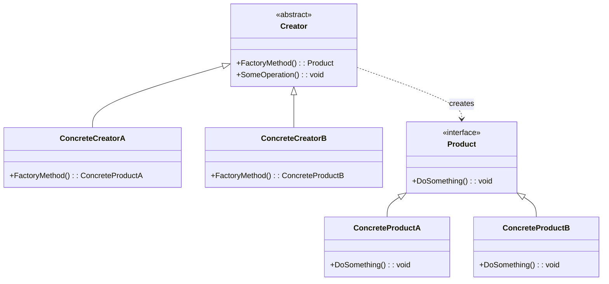

# Factory Method Pattern

## 📋 Description

The **Factory Method Pattern** is a creational design pattern that provides an interface for creating objects in a superclass, but allows subclasses to alter the type of objects that will be created. It eliminates the need to bind application-specific classes into your code.

## 🎯 Purpose

- **Decouple object creation**: Separate object creation from usage
- **Support extensibility**: Add new products without modifying existing code
- **Encapsulate instantiation logic**: Hide complex object creation details
- **Follow Open/Closed Principle**: Open for extension, closed for modification

## ✅ When to Use

- **Unknown product types**: When you can't anticipate the classes of objects to create
- **Framework development**: Building frameworks that need to work with user-defined classes
- **Plugin architectures**: Supporting different implementations loaded at runtime
- **Dependency injection**: When you want to inject different implementations
- **Testing scenarios**: Creating mock objects for unit testing

## ❌ When NOT to Use

- **Simple object creation**: When instantiation doesn't require complex logic
- **Fixed product types**: When you don't need to vary the product class
- **Performance critical**: When the factory abstraction adds unnecessary overhead
- **Single implementation**: When there's only one concrete product

## 🏗️ Structure



## 💡 Modern Implementation

```csharp
// Product interface
public interface IPaymentProcessor
{
    Task<PaymentResult> ProcessPaymentAsync(PaymentRequest request);
    bool SupportsPaymentMethod(PaymentMethod method);
    decimal GetProcessingFee(decimal amount);
}

// Concrete Products
public class CreditCardProcessor : IPaymentProcessor
{
    private readonly ILogger<CreditCardProcessor> _logger;
    private readonly ICreditCardValidator _validator;
    
    public CreditCardProcessor(ILogger<CreditCardProcessor> logger, 
                             ICreditCardValidator validator)
    {
        _logger = logger;
        _validator = validator;
    }
    
    public async Task<PaymentResult> ProcessPaymentAsync(PaymentRequest request)
    {
        _logger.LogInformation("Processing credit card payment for {Amount}", request.Amount);
        
        if (!_validator.ValidateCard(request.CreditCardInfo))
        {
            return new PaymentResult 
            { 
                IsSuccess = false, 
                ErrorMessage = "Invalid credit card information" 
            };
        }
        
        // Simulate payment processing
        await Task.Delay(100);
        
        return new PaymentResult 
        { 
            IsSuccess = true, 
            TransactionId = Guid.NewGuid().ToString(),
            ProcessedAmount = request.Amount - GetProcessingFee(request.Amount)
        };
    }
    
    public bool SupportsPaymentMethod(PaymentMethod method) => 
        method == PaymentMethod.CreditCard;
    
    public decimal GetProcessingFee(decimal amount) => amount * 0.029m; // 2.9%
}

public class PayPalProcessor : IPaymentProcessor
{
    private readonly ILogger<PayPalProcessor> _logger;
    private readonly IPayPalService _paypalService;
    
    public PayPalProcessor(ILogger<PayPalProcessor> logger, IPayPalService paypalService)
    {
        _logger = logger;
        _paypalService = paypalService;
    }
    
    public async Task<PaymentResult> ProcessPaymentAsync(PaymentRequest request)
    {
        _logger.LogInformation("Processing PayPal payment for {Amount}", request.Amount);
        
        var result = await _paypalService.ChargeAsync(request.PayPalEmail, request.Amount);
        
        return new PaymentResult
        {
            IsSuccess = result.Success,
            TransactionId = result.TransactionId,
            ErrorMessage = result.ErrorMessage,
            ProcessedAmount = request.Amount - GetProcessingFee(request.Amount)
        };
    }
    
    public bool SupportsPaymentMethod(PaymentMethod method) => 
        method == PaymentMethod.PayPal;
    
    public decimal GetProcessingFee(decimal amount) => 2.99m; // Fixed fee
}

public class CryptoProcessor : IPaymentProcessor
{
    private readonly ILogger<CryptoProcessor> _logger;
    private readonly IBlockchainService _blockchainService;
    
    public CryptoProcessor(ILogger<CryptoProcessor> logger, 
                          IBlockchainService blockchainService)
    {
        _logger = logger;
        _blockchainService = blockchainService;
    }
    
    public async Task<PaymentResult> ProcessPaymentAsync(PaymentRequest request)
    {
        _logger.LogInformation("Processing crypto payment for {Amount} {Currency}", 
                              request.Amount, request.CryptoCurrency);
        
        var transaction = await _blockchainService.CreateTransactionAsync(
            request.WalletAddress, 
            request.Amount, 
            request.CryptoCurrency);
        
        return new PaymentResult
        {
            IsSuccess = transaction.IsConfirmed,
            TransactionId = transaction.Hash,
            ProcessedAmount = request.Amount,
            AdditionalInfo = new Dictionary<string, object>
            {
                ["BlockHeight"] = transaction.BlockHeight,
                ["Confirmations"] = transaction.Confirmations
            }
        };
    }
    
    public bool SupportsPaymentMethod(PaymentMethod method) => 
        method == PaymentMethod.Cryptocurrency;
    
    public decimal GetProcessingFee(decimal amount) => 0; // No processing fee
}
```

## 🏭 Factory Implementation

```csharp
// Abstract Creator
public abstract class PaymentProcessorFactory
{
    // Factory Method
    public abstract IPaymentProcessor CreateProcessor();
    
    // Template method using the factory method
    public async Task<PaymentResult> ProcessPayment(PaymentRequest request)
    {
        var processor = CreateProcessor();
        
        if (!processor.SupportsPaymentMethod(request.PaymentMethod))
        {
            throw new NotSupportedException(
                $"Payment method {request.PaymentMethod} is not supported");
        }
        
        // Add logging, validation, etc.
        return await processor.ProcessPaymentAsync(request);
    }
}

// Concrete Creators
public class CreditCardProcessorFactory : PaymentProcessorFactory
{
    private readonly IServiceProvider _serviceProvider;
    
    public CreditCardProcessorFactory(IServiceProvider serviceProvider)
    {
        _serviceProvider = serviceProvider;
    }
    
    public override IPaymentProcessor CreateProcessor() =>
        _serviceProvider.GetRequiredService<CreditCardProcessor>();
}

public class PayPalProcessorFactory : PaymentProcessorFactory
{
    private readonly IServiceProvider _serviceProvider;
    
    public PayPalProcessorFactory(IServiceProvider serviceProvider)
    {
        _serviceProvider = serviceProvider;
    }
    
    public override IPaymentProcessor CreateProcessor() =>
        _serviceProvider.GetRequiredService<PayPalProcessor>();
}

public class CryptoProcessorFactory : PaymentProcessorFactory
{
    private readonly IServiceProvider _serviceProvider;
    
    public CryptoProcessorFactory(IServiceProvider serviceProvider)
    {
        _serviceProvider = serviceProvider;
    }
    
    public override IPaymentProcessor CreateProcessor() =>
        _serviceProvider.GetRequiredService<CryptoProcessor>();
}
```

## 🚀 Advanced: Generic Factory with Registration

```csharp
public class PaymentProcessorRegistry
{
    private readonly Dictionary<PaymentMethod, Func<IPaymentProcessor>> _factories = new();
    private readonly IServiceProvider _serviceProvider;
    
    public PaymentProcessorRegistry(IServiceProvider serviceProvider)
    {
        _serviceProvider = serviceProvider;
        RegisterDefaultFactories();
    }
    
    private void RegisterDefaultFactories()
    {
        Register(PaymentMethod.CreditCard, () => 
            _serviceProvider.GetRequiredService<CreditCardProcessor>());
        Register(PaymentMethod.PayPal, () => 
            _serviceProvider.GetRequiredService<PayPalProcessor>());
        Register(PaymentMethod.Cryptocurrency, () => 
            _serviceProvider.GetRequiredService<CryptoProcessor>());
    }
    
    public void Register(PaymentMethod method, Func<IPaymentProcessor> factory)
    {
        _factories[method] = factory;
    }
    
    public IPaymentProcessor Create(PaymentMethod method)
    {
        if (_factories.TryGetValue(method, out var factory))
        {
            return factory();
        }
        
        throw new NotSupportedException($"Payment method {method} is not supported");
    }
    
    public bool IsSupported(PaymentMethod method) => _factories.ContainsKey(method);
    
    public IEnumerable<PaymentMethod> GetSupportedMethods() => _factories.Keys;
}

// Usage with DI
public class PaymentService
{
    private readonly PaymentProcessorRegistry _registry;
    private readonly ILogger<PaymentService> _logger;
    
    public PaymentService(PaymentProcessorRegistry registry, ILogger<PaymentService> logger)
    {
        _registry = registry;
        _logger = logger;
    }
    
    public async Task<PaymentResult> ProcessPaymentAsync(PaymentRequest request)
    {
        try
        {
            if (!_registry.IsSupported(request.PaymentMethod))
            {
                return new PaymentResult
                {
                    IsSuccess = false,
                    ErrorMessage = $"Payment method {request.PaymentMethod} is not supported"
                };
            }
            
            var processor = _registry.Create(request.PaymentMethod);
            return await processor.ProcessPaymentAsync(request);
        }
        catch (Exception ex)
        {
            _logger.LogError(ex, "Error processing payment");
            return new PaymentResult
            {
                IsSuccess = false,
                ErrorMessage = "An error occurred while processing the payment"
            };
        }
    }
}
```

## 📊 Real-World Example: Document Exporter Factory

```csharp
public interface IDocumentExporter
{
    Task<byte[]> ExportAsync<T>(IEnumerable<T> data);
    string GetContentType();
    string GetFileExtension();
}

public class PdfExporter : IDocumentExporter
{
    public async Task<byte[]> ExportAsync<T>(IEnumerable<T> data)
    {
        // PDF generation logic using iTextSharp or similar
        await Task.Delay(100); // Simulate async work
        return Encoding.UTF8.GetBytes($"PDF content for {data.Count()} items");
    }
    
    public string GetContentType() => "application/pdf";
    public string GetFileExtension() => ".pdf";
}

public class ExcelExporter : IDocumentExporter
{
    public async Task<byte[]> ExportAsync<T>(IEnumerable<T> data)
    {
        // Excel generation using EPPlus or similar
        await Task.Delay(100);
        return Encoding.UTF8.GetBytes($"Excel content for {data.Count()} items");
    }
    
    public string GetContentType() => "application/vnd.openxmlformats-officedocument.spreadsheetml.sheet";
    public string GetFileExtension() => ".xlsx";
}

public class CsvExporter : IDocumentExporter
{
    public async Task<byte[]> ExportAsync<T>(IEnumerable<T> data)
    {
        var csv = new StringBuilder();
        // CSV generation logic
        foreach (var item in data)
        {
            csv.AppendLine(item.ToString());
        }
        
        return Encoding.UTF8.GetBytes(csv.ToString());
    }
    
    public string GetContentType() => "text/csv";
    public string GetFileExtension() => ".csv";
}

// Factory
public static class DocumentExporterFactory
{
    public static IDocumentExporter Create(ExportFormat format) => format switch
    {
        ExportFormat.Pdf => new PdfExporter(),
        ExportFormat.Excel => new ExcelExporter(),
        ExportFormat.Csv => new CsvExporter(),
        _ => throw new ArgumentException($"Unsupported export format: {format}")
    };
}

public enum ExportFormat { Pdf, Excel, Csv }
```

## ⚡ Performance Considerations

- **Object pooling**: Reuse expensive-to-create objects
- **Lazy initialization**: Create objects only when needed
- **Caching**: Cache frequently used factory instances
- **Memory management**: Consider object lifetime and disposal

```csharp
public class PooledPaymentProcessorFactory : PaymentProcessorFactory
{
    private readonly ConcurrentQueue<IPaymentProcessor> _pool = new();
    private readonly Func<IPaymentProcessor> _createFunc;
    
    public PooledPaymentProcessorFactory(Func<IPaymentProcessor> createFunc)
    {
        _createFunc = createFunc;
    }
    
    public override IPaymentProcessor CreateProcessor()
    {
        if (_pool.TryDequeue(out var processor))
        {
            return processor;
        }
        
        return _createFunc();
    }
    
    public void ReturnProcessor(IPaymentProcessor processor)
    {
        // Reset processor state
        _pool.Enqueue(processor);
    }
}
```

## 🧪 Testing

```csharp
[Test]
public async Task PaymentService_ShouldProcessCreditCardPayment()
{
    // Arrange
    var mockValidator = new Mock<ICreditCardValidator>();
    mockValidator.Setup(v => v.ValidateCard(It.IsAny<CreditCardInfo>()))
             .Returns(true);
    
    var processor = new CreditCardProcessor(Mock.Of<ILogger<CreditCardProcessor>>(), 
                                          mockValidator.Object);
    
    var request = new PaymentRequest
    {
        PaymentMethod = PaymentMethod.CreditCard,
        Amount = 100.00m,
        CreditCardInfo = new CreditCardInfo { Number = "4111111111111111" }
    };
    
    // Act
    var result = await processor.ProcessPaymentAsync(request);
    
    // Assert
    Assert.IsTrue(result.IsSuccess);
    Assert.IsNotNull(result.TransactionId);
    Assert.AreEqual(97.10m, result.ProcessedAmount); // 100 - 2.9% fee
}

[Test]
public void DocumentExporterFactory_ShouldCreateCorrectExporter()
{
    // Arrange & Act
    var pdfExporter = DocumentExporterFactory.Create(ExportFormat.Pdf);
    var csvExporter = DocumentExporterFactory.Create(ExportFormat.Csv);
    
    // Assert
    Assert.IsInstanceOf<PdfExporter>(pdfExporter);
    Assert.IsInstanceOf<CsvExporter>(csvExporter);
    Assert.AreEqual("application/pdf", pdfExporter.GetContentType());
    Assert.AreEqual(".csv", csvExporter.GetFileExtension());
}
```

## 🔗 Related Patterns

- **[Abstract Factory](../AbstractFactory/)**: Creates families of related objects
- **[Builder](../Builder/)**: Constructs complex objects step by step
- **[Prototype](../Prototype/)**: Creates objects by cloning existing instances
- **[Dependency Injection](../../ArchitecturalPatterns/DependencyInjection/)**: Injects factory dependencies

## 📚 Additional Resources

- [Microsoft: Factory Method Pattern](https://docs.microsoft.com/en-us/dotnet/standard/design-guidelines/factory-method)
- [Dependency Injection in .NET](https://docs.microsoft.com/en-us/dotnet/core/extensions/dependency-injection)
- [Gang of Four Design Patterns](https://en.wikipedia.org/wiki/Design_Patterns)

---

> 💡 **Tip**: Use Factory Method when you need to delegate object creation to subclasses. For simple scenarios, consider using static factory methods or dependency injection instead.

## Disadvantages
- Can introduce extra classes and complexity

## Related patterns
- Abstract Factory
- Prototype
