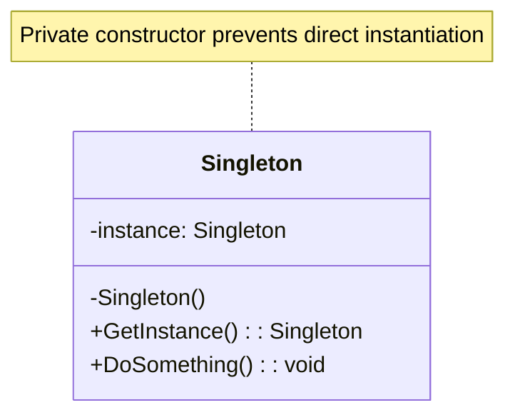

# Singleton Pattern

## 📋 Description

The **Singleton Pattern** ensures that a class has only one instance while providing a global access point to that instance. It's one of the most commonly used and sometimes controversial design patterns.

## 🎯 Purpose

- **Single instance**: Guarantee only one instance exists throughout the application
- **Global access**: Provide a global access point to that instance
- **Lazy initialization**: Create the instance only when needed
- **Thread safety**: Ensure safe creation in multi-threaded environments

## ✅ When to Use

- **Configuration management**: Application settings and configuration
- **Logging services**: Centralized logging throughout the application
- **Database connections**: Connection pool management
- **Caching services**: Global cache management
- **Hardware interfaces**: Printer spoolers, device drivers

## ❌ When NOT to Use

- **Testing difficulties**: Hard to mock and unit test
- **Hidden dependencies**: Makes dependencies less obvious
- **Tight coupling**: Creates implicit global state
- **Scalability issues**: Can become a bottleneck
- **Violation of SRP**: Often does too many things

## 🏗️ Structure



## 💡 Implementation Variations

### 1. **Thread-Safe Lazy Initialization (Recommended)**

```csharp
public sealed class Singleton
{
    private static readonly Lazy<Singleton> _lazy = new(() => new Singleton());
    
    private Singleton() 
    {
        // Private constructor prevents external instantiation
    }
    
    public static Singleton Instance => _lazy.Value;
    
    public void DoSomething()
    {
        Console.WriteLine("Singleton instance is working...");
    }
}

// Usage
var instance1 = Singleton.Instance;
var instance2 = Singleton.Instance;
Console.WriteLine(ReferenceEquals(instance1, instance2)); // True
```

### 2. **Double-Checked Locking**

```csharp
public sealed class ThreadSafeSingleton
{
    private static ThreadSafeSingleton _instance;
    private static readonly object _lock = new object();
    
    private ThreadSafeSingleton() { }
    
    public static ThreadSafeSingleton Instance
    {
        get
        {
            if (_instance == null)
            {
                lock (_lock)
                {
                    if (_instance == null)
                        _instance = new ThreadSafeSingleton();
                }
            }
            return _instance;
        }
    }
}
```

### 3. **Static Constructor (Thread-Safe)**

```csharp
public sealed class StaticSingleton
{
    private static readonly StaticSingleton _instance = new StaticSingleton();
    
    // Explicit static constructor prevents lazy loading
    static StaticSingleton() { }
    
    private StaticSingleton() { }
    
    public static StaticSingleton Instance => _instance;
}
```

## 📊 Real-World Example: Configuration Manager

```csharp
public sealed class ConfigurationManager
{
    private static readonly Lazy<ConfigurationManager> _lazy = new(() => new ConfigurationManager());
    private readonly Dictionary<string, string> _settings;
    private readonly string _configFilePath;
    
    private ConfigurationManager()
    {
        _configFilePath = "appsettings.json";
        _settings = LoadConfiguration();
    }
    
    public static ConfigurationManager Instance => _lazy.Value;
    
    public string GetSetting(string key)
    {
        return _settings.TryGetValue(key, out var value) ? value : string.Empty;
    }
    
    public void SetSetting(string key, string value)
    {
        _settings[key] = value;
        SaveConfiguration();
    }
    
    public T GetSetting<T>(string key)
    {
        if (_settings.TryGetValue(key, out var value))
        {
            return JsonSerializer.Deserialize<T>(value);
        }
        return default(T);
    }
    
    private Dictionary<string, string> LoadConfiguration()
    {
        try
        {
            if (File.Exists(_configFilePath))
            {
                var json = File.ReadAllText(_configFilePath);
                return JsonSerializer.Deserialize<Dictionary<string, string>>(json) ?? new();
            }
        }
        catch (Exception ex)
        {
            Console.WriteLine($"Error loading configuration: {ex.Message}");
        }
        
        return new Dictionary<string, string>();
    }
    
    private void SaveConfiguration()
    {
        try
        {
            var json = JsonSerializer.Serialize(_settings, new JsonSerializerOptions { WriteIndented = true });
            File.WriteAllText(_configFilePath, json);
        }
        catch (Exception ex)
        {
            Console.WriteLine($"Error saving configuration: {ex.Message}");
        }
    }
}

// Usage
var config = ConfigurationManager.Instance;
config.SetSetting("DatabaseUrl", "Server=localhost;Database=MyApp");
var dbUrl = config.GetSetting("DatabaseUrl");
```

## 🎯 Example: Logger Service

```csharp
public sealed class Logger
{
    private static readonly Lazy<Logger> _lazy = new(() => new Logger());
    private readonly string _logFilePath;
    private readonly object _fileLock = new object();
    
    private Logger()
    {
        _logFilePath = Path.Combine(AppDomain.CurrentDomain.BaseDirectory, "app.log");
    }
    
    public static Logger Instance => _lazy.Value;
    
    public void LogInfo(string message)
    {
        WriteLog("INFO", message);
    }
    
    public void LogError(string message, Exception exception = null)
    {
        var fullMessage = exception != null ? $"{message} - {exception}" : message;
        WriteLog("ERROR", fullMessage);
    }
    
    public void LogWarning(string message)
    {
        WriteLog("WARNING", message);
    }
    
    private void WriteLog(string level, string message)
    {
        var logEntry = $"[{DateTime.Now:yyyy-MM-dd HH:mm:ss}] [{level}] {message}";
        
        lock (_fileLock)
        {
            try
            {
                File.AppendAllText(_logFilePath, logEntry + Environment.NewLine);
            }
            catch (Exception ex)
            {
                Console.WriteLine($"Failed to write to log file: {ex.Message}");
            }
        }
        
        // Also log to console
        Console.WriteLine(logEntry);
    }
}

// Usage across the application
Logger.Instance.LogInfo("Application started");
Logger.Instance.LogError("Database connection failed", new SQLException("Connection timeout"));
```

## 🔧 Modern Alternatives

### 1. **Dependency Injection Container**

```csharp
// Instead of Singleton pattern, use DI container
services.AddSingleton<IConfigurationService, ConfigurationService>();
services.AddSingleton<ILogger, Logger>();

public class OrderService
{
    private readonly ILogger _logger;
    private readonly IConfigurationService _config;
    
    public OrderService(ILogger logger, IConfigurationService config)
    {
        _logger = logger;
        _config = config;
    }
}
```

### 2. **Static Class (for stateless operations)**

```csharp
public static class MathUtils
{
    public static double CalculateDistance(Point p1, Point p2)
    {
        return Math.Sqrt(Math.Pow(p2.X - p1.X, 2) + Math.Pow(p2.Y - p1.Y, 2));
    }
    
    public static bool IsPrime(int number)
    {
        if (number < 2) return false;
        for (int i = 2; i <= Math.Sqrt(number); i++)
        {
            if (number % i == 0) return false;
        }
        return true;
    }
}
```

## ⚡ Performance Considerations

- **Memory usage**: Singleton instances live for the application lifetime
- **Thread contention**: Multiple threads accessing the same instance
- **Initialization cost**: Expensive initialization should be lazy
- **Garbage collection**: Cannot be collected until application ends

## 🧪 Testing Challenges and Solutions

```csharp
// Problem: Hard to test due to global state
public class OrderService
{
    public void ProcessOrder(Order order)
    {
        Logger.Instance.LogInfo($"Processing order {order.Id}");
        // Hard to verify logging in tests
    }
}

// Solution: Use dependency injection
public class OrderService
{
    private readonly ILogger _logger;
    
    public OrderService(ILogger logger)
    {
        _logger = logger;
    }
    
    public void ProcessOrder(Order order)
    {
        _logger.LogInfo($"Processing order {order.Id}");
        // Easy to mock logger in tests
    }
}

[Test]
public void ProcessOrder_ShouldLogOrderId()
{
    // Arrange
    var mockLogger = new Mock<ILogger>();
    var orderService = new OrderService(mockLogger.Object);
    var order = new Order { Id = 123 };
    
    // Act
    orderService.ProcessOrder(order);
    
    // Assert
    mockLogger.Verify(l => l.LogInfo("Processing order 123"), Times.Once);
}
```

## 📊 Metrics and Monitoring

```csharp
public sealed class PerformanceCounter
{
    private static readonly Lazy<PerformanceCounter> _lazy = new(() => new PerformanceCounter());
    private readonly Dictionary<string, long> _counters = new();
    private readonly object _lock = new object();
    
    public static PerformanceCounter Instance => _lazy.Value;
    
    public void Increment(string counterName)
    {
        lock (_lock)
        {
            _counters[counterName] = _counters.GetValueOrDefault(counterName, 0) + 1;
        }
    }
    
    public long GetCount(string counterName)
    {
        lock (_lock)
        {
            return _counters.GetValueOrDefault(counterName, 0);
        }
    }
    
    public Dictionary<string, long> GetAllCounters()
    {
        lock (_lock)
        {
            return new Dictionary<string, long>(_counters);
        }
    }
}
```

## 🔗 Related Patterns

- **[Factory Method](../FactoryMethod/)**: Can be used to create Singleton instances
- **[Abstract Factory](../AbstractFactory/)**: Often implemented as Singletons
- **[Builder](../Builder/)**: Builder instances are sometimes Singletons
- **[Facade](../../StructuralPatterns/Facade/)**: Facades are commonly implemented as Singletons

## 📚 Additional Resources

- [Microsoft: Singleton Pattern](https://docs.microsoft.com/en-us/previous-versions/msp-n-p/ff650316(v=pandp.10))
- [Dependency Injection vs Singleton](https://martinfowler.com/articles/injection.html)
- [Why Singletons are Controversial](https://stackoverflow.com/questions/137975/what-is-so-bad-about-singletons)

---

> ⚠️ **Warning**: While Singleton can be useful, consider using Dependency Injection containers instead for better testability and maintainability in modern applications.
