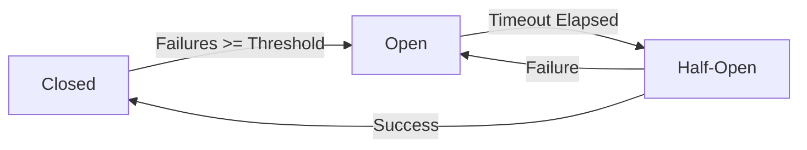

# Circuit Breaker Pattern - Patrón Cortocircuito

## 📋 Descripción

El **Patrón Circuit Breaker** es un patrón de resiliencia que previene que una aplicación trate repetidamente de ejecutar una operación que probablemente falle, actuando como un interruptor eléctrico que "corta" el flujo cuando detecta problemas.

## 🎯 Propósito

- **Prevenir fallos en cascada**: Evita que los errores se propaguen por todo el sistema
- **Fail-fast**: Falla rápidamente cuando un servicio está caído
- **Recuperación automática**: Permite que el sistema se recupere cuando el servicio vuelve a estar disponible
- **Protección de recursos**: Evita el agotamiento de recursos como conexiones y threads

## ✅ Cuándo Usarlo

- **Servicios externos**: APIs, bases de datos, microservicios
- **Operaciones costosas**: Llamadas que consumen muchos recursos
- **Servicios inestables**: Dependencias con historial de fallos
- **Sistemas distribuidos**: Arquitecturas de microservicios

## ❌ Cuándo NO Usarlo

- **Operaciones locales**: Lógica que no depende de servicios externos
- **Servicios críticos**: Donde el fallo no es una opción
- **Operaciones únicas**: Llamadas que no se repiten frecuentemente
- **Errores de validación**: Problemas con los datos de entrada

## 🏗️ Estados del Circuit Breaker



### Estados:

1. **🟢 Closed (Cerrado)**: Operación normal, todas las llamadas pasan
2. **🔴 Open (Abierto)**: Circuit abierto, todas las llamadas fallan inmediatamente
3. **🟡 Half-Open (Semi-abierto)**: Permite algunas llamadas de prueba

## 💡 Implementación

```csharp
public class CircuitBreaker
{
    private CircuitBreakerState _state = CircuitBreakerState.Closed;
    private int _failureCount = 0;
    private DateTime _nextAttempt = DateTime.MinValue;
    
    public async Task<T> ExecuteAsync<T>(Func<Task<T>> operation)
    {
        if (_state == CircuitBreakerState.Open)
        {
            if (DateTime.UtcNow < _nextAttempt)
                throw new CircuitBreakerOpenException();
            
            _state = CircuitBreakerState.HalfOpen;
        }
        
        try
        {
            var result = await operation();
            OnSuccess();
            return result;
        }
        catch (Exception ex)
        {
            OnFailure();
            throw;
        }
    }
}
```

## 📊 Ejemplo de Uso

```csharp
// Configuración del Circuit Breaker
var circuitBreaker = new CircuitBreaker(
    failureThreshold: 5,           // Abrir después de 5 fallos
    recoveryTimeout: TimeSpan.FromMinutes(1), // Intentar recuperación cada minuto
    successThreshold: 3            // 3 éxitos para cerrar
);

// Uso en servicio de pagos
public async Task<PaymentResult> ProcessPaymentAsync(PaymentRequest request)
{
    try
    {
        return await _circuitBreaker.ExecuteAsync(async () =>
        {
            // Llamada al servicio de pagos externo
            return await _paymentService.ProcessAsync(request);
        });
    }
    catch (CircuitBreakerOpenException)
    {
        // Servicio de pagos no disponible, usar método alternativo
        return new PaymentResult { Status = PaymentStatus.ServiceUnavailable };
    }
}
```

## 🔧 Configuraciones Avanzadas

### 1. **Threshold Basado en Porcentaje**

```csharp
// Abrir si > 50% de las últimas 20 llamadas fallan
var circuitBreaker = new CircuitBreaker(
    failureThreshold: 0.5f,  // 50%
    minimumCalls: 20,        // Mínimo 20 llamadas
    timeWindow: TimeSpan.FromMinutes(5)
);
```

### 2. **Circuit Breaker con Métricas**

```csharp
public class MetricsCircuitBreaker : CircuitBreaker
{
    protected override void OnStateChange(CircuitBreakerState newState)
    {
        _metrics.Counter("circuit_breaker_state_changes")
                .WithTag("state", newState.ToString())
                .Increment();
    }
}
```

### 3. **Fallback Integration**

```csharp
public async Task<string> GetDataAsync()
{
    try
    {
        return await _circuitBreaker.ExecuteAsync(() => 
            _primaryService.GetDataAsync());
    }
    catch (CircuitBreakerOpenException)
    {
        // Fallback a caché o servicio secundario
        return await _cacheService.GetCachedDataAsync();
    }
}
```

## ⚡ Consideraciones de Rendimiento

- **Estado compartido**: En aplicaciones multi-thread, usar locks o estructuras thread-safe
- **Persistencia**: Mantener estado entre reinicios de aplicación
- **Monitoreo**: Exponer métricas del estado del circuit breaker
- **Timeouts**: Configurar timeouts apropiados para las operaciones

## 🧪 Testing

```csharp
[Test]
public async Task CircuitBreaker_ShouldOpenAfterFailureThreshold()
{
    // Arrange
    var circuitBreaker = new CircuitBreaker(failureThreshold: 3);
    var mockService = new Mock<IExternalService>();
    mockService.Setup(x => x.GetDataAsync())
           .ThrowsAsync(new HttpRequestException());

    // Act - Generar fallos hasta alcanzar el threshold
    for (int i = 0; i < 3; i++)
    {
        await Assert.ThrowsAsync<HttpRequestException>(() =>
            circuitBreaker.ExecuteAsync(() => mockService.Object.GetDataAsync()));
    }

    // Assert - El circuit debe estar abierto
    await Assert.ThrowsAsync<CircuitBreakerOpenException>(() =>
        circuitBreaker.ExecuteAsync(() => mockService.Object.GetDataAsync()));
}
```

## 📈 Métricas Importantes

- **Failure Rate**: Porcentaje de fallos en ventana de tiempo
- **State Duration**: Tiempo en cada estado
- **Request Volume**: Número de requests por tiempo
- **Recovery Time**: Tiempo para recuperación completa

## 🔗 Patrones Relacionados

- **[Retry](../Retry/)**: Se ejecuta antes del Circuit Breaker
- **[Timeout](../Timeout/)**: Define cuándo considerar una operación como fallida
- **[Bulkhead](../Bulkhead/)**: Aísla resources para evitar fallos en cascada
- **[Fallback](../Fallback/)**: Proporciona respuesta alternativa cuando el circuit está abierto

## 📚 Recursos Adicionales

- [Microsoft: Circuit Breaker Pattern](https://docs.microsoft.com/en-us/azure/architecture/patterns/circuit-breaker)
- [Martin Fowler: CircuitBreaker](https://martinfowler.com/bliki/CircuitBreaker.html)
- [Netflix Hystrix](https://github.com/Netflix/Hystrix)
- [Polly: .NET Resilience Library](https://github.com/App-vNext/Polly)

---

> 💡 **Tip**: Combina Circuit Breaker con monitoreo y alertas para detectar problemas en servicios externos antes de que afecten a los usuarios.
