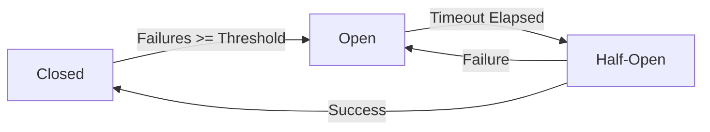

# Circuit Breaker Pattern

## 📋 Description

The **Circuit Breaker Pattern** is a resilience pattern that prevents an application from repeatedly trying to execute an operation that is likely to fail, acting like an electrical circuit breaker that "cuts" the flow when it detects problems.

## 🎯 Purpose

- **Prevent cascading failures**: Stops errors from propagating throughout the system
- **Fail-fast**: Fails quickly when a service is down
- **Automatic recovery**: Allows the system to recover when the service becomes available again
- **Resource protection**: Prevents exhaustion of resources like connections and threads

## ✅ When to Use

- **External services**: APIs, databases, microservices
- **Expensive operations**: Calls that consume many resources
- **Unstable services**: Dependencies with a history of failures
- **Distributed systems**: Microservice architectures

## ❌ When NOT to Use

- **Local operations**: Logic that doesn't depend on external services
- **Critical services**: Where failure is not an option
- **One-time operations**: Calls that are not repeated frequently
- **Validation errors**: Issues with input data

## 🏗️ Circuit Breaker States



### States

1. **🟢 Closed**: Normal operation, all calls pass through
2. **🔴 Open**: Circuit open, all calls fail immediately
3. **🟡 Half-Open**: Allows some test calls

## 💡 Implementation

```csharp
public class CircuitBreaker
{
    private CircuitBreakerState _state = CircuitBreakerState.Closed;
    private int _failureCount = 0;
    private DateTime _nextAttempt = DateTime.MinValue;
    
    public async Task<T> ExecuteAsync<T>(Func<Task<T>> operation)
    {
        if (_state == CircuitBreakerState.Open)
        {
            if (DateTime.UtcNow < _nextAttempt)
                throw new CircuitBreakerOpenException();
            
            _state = CircuitBreakerState.HalfOpen;
        }
        
        try
        {
            var result = await operation();
            OnSuccess();
            return result;
        }
        catch (Exception ex)
        {
            OnFailure();
            throw;
        }
    }
}
```

## 📊 Usage Example

```csharp
// Circuit Breaker configuration
var circuitBreaker = new CircuitBreaker(
    failureThreshold: 5,           // Open after 5 failures
    recoveryTimeout: TimeSpan.FromMinutes(1), // Try recovery every minute
    successThreshold: 3            // 3 successes to close
);

// Usage in payment service
public async Task<PaymentResult> ProcessPaymentAsync(PaymentRequest request)
{
    try
    {
        return await _circuitBreaker.ExecuteAsync(async () =>
        {
            // Call to external payment service
            return await _paymentService.ProcessAsync(request);
        });
    }
    catch (CircuitBreakerOpenException)
    {
        // Payment service unavailable, use alternative method
        return new PaymentResult { Status = PaymentStatus.ServiceUnavailable };
    }
}
```

## 🔧 Advanced Configurations

### 1. **Percentage-Based Threshold**

```csharp
// Open if > 50% of last 20 calls fail
var circuitBreaker = new CircuitBreaker(
    failureThreshold: 0.5f,  // 50%
    minimumCalls: 20,        // Minimum 20 calls
    timeWindow: TimeSpan.FromMinutes(5)
);
```

### 2. **Circuit Breaker with Metrics**

```csharp
public class MetricsCircuitBreaker : CircuitBreaker
{
    protected override void OnStateChange(CircuitBreakerState newState)
    {
        _metrics.Counter("circuit_breaker_state_changes")
                .WithTag("state", newState.ToString())
                .Increment();
    }
}
```

### 3. **Fallback Integration**

```csharp
public async Task<string> GetDataAsync()
{
    try
    {
        return await _circuitBreaker.ExecuteAsync(() => 
            _primaryService.GetDataAsync());
    }
    catch (CircuitBreakerOpenException)
    {
        // Fallback to cache or secondary service
        return await _cacheService.GetCachedDataAsync();
    }
}
```

## ⚡ Performance Considerations

- **Shared state**: In multi-threaded applications, use locks or thread-safe structures
- **Persistence**: Maintain state between application restarts
- **Monitoring**: Expose circuit breaker state metrics
- **Timeouts**: Configure appropriate timeouts for operations

## 🧪 Testing

```csharp
[Test]
public async Task CircuitBreaker_ShouldOpenAfterFailureThreshold()
{
    // Arrange
    var circuitBreaker = new CircuitBreaker(failureThreshold: 3);
    var mockService = new Mock<IExternalService>();
    mockService.Setup(x => x.GetDataAsync())
           .ThrowsAsync(new HttpRequestException());

    // Act - Generate failures until threshold is reached
    for (int i = 0; i < 3; i++)
    {
        await Assert.ThrowsAsync<HttpRequestException>(() =>
            circuitBreaker.ExecuteAsync(() => mockService.Object.GetDataAsync()));
    }

    // Assert - Circuit should be open
    await Assert.ThrowsAsync<CircuitBreakerOpenException>(() =>
        circuitBreaker.ExecuteAsync(() => mockService.Object.GetDataAsync()));
}
```

## 📈 Important Metrics

- **Failure Rate**: Percentage of failures in time window
- **State Duration**: Time spent in each state
- **Request Volume**: Number of requests per time
- **Recovery Time**: Time for complete recovery

## 🔗 Related Patterns

- **[Retry](../Retry/)**: Executes before the Circuit Breaker
- **[Timeout](../Timeout/)**: Defines when to consider an operation as failed
- **[Bulkhead](../Bulkhead/)**: Isolates resources to prevent cascading failures
- **[Fallback](../Fallback/)**: Provides alternative response when circuit is open

## 📚 Additional Resources

- [Microsoft: Circuit Breaker Pattern](https://docs.microsoft.com/en-us/azure/architecture/patterns/circuit-breaker)
- [Martin Fowler: CircuitBreaker](https://martinfowler.com/bliki/CircuitBreaker.html)
- [Netflix Hystrix](https://github.com/Netflix/Hystrix)
- [Polly: .NET Resilience Library](https://github.com/App-vNext/Polly)

---

> 💡 **Tip**: Combine Circuit Breaker with monitoring and alerts to detect issues in external services before they affect users.
