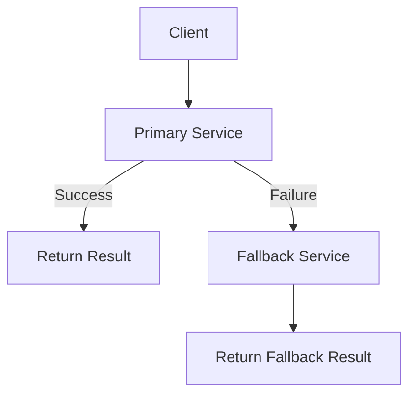

# Fallback Pattern - Patrón de Respaldo

## 📋 Descripción

El **Patrón Fallback** proporciona un mecanismo alternativo cuando la operación principal falla, asegurando que el sistema pueda continuar funcionando con funcionalidad reducida en lugar de fallar completamente.

## 🎯 Propósito

- **Degradación elegante**: Mantener funcionalidad básica cuando fallan servicios
- **Continuidad del servicio**: Evitar interrupciones completas del sistema
- **Experiencia del usuario**: Proporcionar respuesta útil aunque limitada
- **Resilencia**: Aumentar la tolerancia a fallos del sistema

## ✅ Cuándo Usarlo

- **Servicios externos**: Cuando APIs o servicios pueden no estar disponibles
- **Datos en cache**: Servir datos obsoletos cuando la fuente principal falla
- **Múltiples proveedores**: Cambiar a proveedor secundario automáticamente
- **Funcionalidad opcional**: Deshabilitar características no críticas

## ❌ Cuándo NO Usarlo

- **Operaciones críticas**: Donde el fallback podría causar inconsistencias
- **Datos sensibles**: Cuando el fallback no puede garantizar la misma seguridad
- **Transacciones**: Operaciones que deben ser atómicas
- **Tiempo real**: Cuando la latencia del fallback es inaceptable

## 🏗️ Estructura



## 💡 Implementación Básica

```csharp
public class FallbackService<T>
{
    private readonly Func<Task<T>> _primaryOperation;
    private readonly Func<Task<T>> _fallbackOperation;
    
    public FallbackService(
        Func<Task<T>> primaryOperation,
        Func<Task<T>> fallbackOperation)
    {
        _primaryOperation = primaryOperation;
        _fallbackOperation = fallbackOperation;
    }
    
    public async Task<T> ExecuteAsync()
    {
        try
        {
            return await _primaryOperation();
        }
        catch (Exception ex)
        {
            // Log the primary failure
            Console.WriteLine($"Primary operation failed: {ex.Message}");
            
            try
            {
                return await _fallbackOperation();
            }
            catch (Exception fallbackEx)
            {
                // Log fallback failure and rethrow original exception
                Console.WriteLine($"Fallback also failed: {fallbackEx.Message}");
                throw new AggregateException(ex, fallbackEx);
            }
        }
    }
}
```

## 📊 Ejemplo de Uso: Servicio de Configuración

```csharp
public class ConfigurationService
{
    private readonly HttpClient _httpClient;
    private readonly IMemoryCache _cache;
    private readonly string _configUrl;
    
    public ConfigurationService(HttpClient httpClient, IMemoryCache cache)
    {
        _httpClient = httpClient;
        _cache = cache;
        _configUrl = "https://config-service.company.com/api/config";
    }
    
    public async Task<AppConfig> GetConfigurationAsync()
    {
        var fallbackService = new FallbackService<AppConfig>(
            primaryOperation: GetConfigFromRemoteService,
            fallbackOperation: GetConfigFromCache
        );
        
        return await fallbackService.ExecuteAsync();
    }
    
    private async Task<AppConfig> GetConfigFromRemoteService()
    {
        var response = await _httpClient.GetAsync(_configUrl);
        response.EnsureSuccessStatusCode();
        
        var json = await response.Content.ReadAsStringAsync();
        var config = JsonSerializer.Deserialize<AppConfig>(json);
        
        // Cache successful response
        _cache.Set("app_config", config, TimeSpan.FromMinutes(10));
        
        return config;
    }
    
    private async Task<AppConfig> GetConfigFromCache()
    {
        if (_cache.TryGetValue("app_config", out AppConfig cachedConfig))
        {
            return cachedConfig;
        }
        
        // Last resort: default configuration
        return new AppConfig
        {
            DatabaseConnectionString = "Data Source=localhost;Initial Catalog=DefaultDB",
            FeatureFlags = new Dictionary<string, bool>
            {
                ["NewFeature"] = false,
                ["AdvancedMode"] = false
            },
            MaxRetries = 3,
            TimeoutSeconds = 30
        };
    }
}
```

## 🔧 Variaciones del Patrón

### 1. **Fallback en Cadena**

```csharp
public class ChainedFallbackService<T>
{
    private readonly List<Func<Task<T>>> _operations;
    
    public ChainedFallbackService(params Func<Task<T>>[] operations)
    {
        _operations = new List<Func<Task<T>>>(operations);
    }
    
    public async Task<T> ExecuteAsync()
    {
        var exceptions = new List<Exception>();
        
        foreach (var operation in _operations)
        {
            try
            {
                return await operation();
            }
            catch (Exception ex)
            {
                exceptions.Add(ex);
            }
        }
        
        throw new AggregateException(
            "All fallback operations failed", exceptions);
    }
}

// Uso
var weatherService = new ChainedFallbackService<WeatherData>(
    () => _primaryWeatherApi.GetWeatherAsync(),
    () => _secondaryWeatherApi.GetWeatherAsync(),
    () => _cachedWeatherService.GetLastKnownWeatherAsync(),
    () => Task.FromResult(GetDefaultWeatherData())
);
```

### 2. **Fallback con Circuit Breaker**

```csharp
public class FallbackWithCircuitBreaker<T>
{
    private readonly CircuitBreaker _circuitBreaker;
    private readonly Func<Task<T>> _primaryOperation;
    private readonly Func<Task<T>> _fallbackOperation;
    
    public async Task<T> ExecuteAsync()
    {
        try
        {
            return await _circuitBreaker.ExecuteAsync(_primaryOperation);
        }
        catch (CircuitBreakerOpenException)
        {
            // Circuit is open, go directly to fallback
            return await _fallbackOperation();
        }
    }
}
```

### 3. **Fallback Condicional**

```csharp
public class ConditionalFallbackService<T>
{
    private readonly Func<Task<T>> _primaryOperation;
    private readonly Dictionary<Type, Func<Task<T>>> _fallbackStrategies;
    
    public ConditionalFallbackService(Func<Task<T>> primaryOperation)
    {
        _primaryOperation = primaryOperation;
        _fallbackStrategies = new Dictionary<Type, Func<Task<T>>>();
    }
    
    public ConditionalFallbackService<T> OnException<TException>(Func<Task<T>> fallback)
        where TException : Exception
    {
        _fallbackStrategies[typeof(TException)] = fallback;
        return this;
    }
    
    public async Task<T> ExecuteAsync()
    {
        try
        {
            return await _primaryOperation();
        }
        catch (Exception ex)
        {
            var exceptionType = ex.GetType();
            
            // Buscar fallback específico para este tipo de excepción
            if (_fallbackStrategies.TryGetValue(exceptionType, out var fallback))
            {
                return await fallback();
            }
            
            // Buscar fallback para tipos base
            foreach (var (type, strategy) in _fallbackStrategies)
            {
                if (type.IsAssignableFrom(exceptionType))
                {
                    return await strategy();
                }
            }
            
            throw; // No hay fallback para esta excepción
        }
    }
}
```

## 🎯 Ejemplo: Servicio de Pagos

```csharp
public class PaymentService
{
    private readonly IPaymentProvider _primaryProvider;
    private readonly IPaymentProvider _fallbackProvider;
    private readonly IPaymentLogger _logger;
    
    public async Task<PaymentResult> ProcessPaymentAsync(PaymentRequest request)
    {
        var fallbackService = new FallbackService<PaymentResult>(
            primaryOperation: () => ProcessWithPrimary(request),
            fallbackOperation: () => ProcessWithFallback(request)
        );
        
        var result = await fallbackService.ExecuteAsync();
        
        // Log si se usó fallback
        if (result.UsedFallback)
        {
            await _logger.LogFallbackUsedAsync(request.TransactionId, result.Provider);
        }
        
        return result;
    }
    
    private async Task<PaymentResult> ProcessWithPrimary(PaymentRequest request)
    {
        var result = await _primaryProvider.ProcessAsync(request);
        return new PaymentResult
        {
            Success = result.Success,
            TransactionId = result.TransactionId,
            Provider = "Primary",
            UsedFallback = false
        };
    }
    
    private async Task<PaymentResult> ProcessWithFallback(PaymentRequest request)
    {
        var result = await _fallbackProvider.ProcessAsync(request);
        return new PaymentResult
        {
            Success = result.Success,
            TransactionId = result.TransactionId,
            Provider = "Fallback",
            UsedFallback = true
        };
    }
}
```

## ⚡ Consideraciones de Rendimiento

- **Latencia**: El fallback puede añadir latencia si el primario es lento
- **Recursos**: Mantener conexiones a múltiples servicios consume recursos
- **Consistencia**: Asegurar que el fallback proporciona datos consistentes
- **Monitoring**: Rastrear uso de fallbacks para identificar problemas

## 🧪 Testing

```csharp
[Test]
public async Task Fallback_ShouldUsePrimaryWhenAvailable()
{
    // Arrange
    var primaryCalled = false;
    var fallbackCalled = false;
    
    var fallbackService = new FallbackService<string>(
        primaryOperation: async () =>
        {
            primaryCalled = true;
            return "Primary Result";
        },
        fallbackOperation: async () =>
        {
            fallbackCalled = true;
            return "Fallback Result";
        }
    );
    
    // Act
    var result = await fallbackService.ExecuteAsync();
    
    // Assert
    Assert.AreEqual("Primary Result", result);
    Assert.IsTrue(primaryCalled);
    Assert.IsFalse(fallbackCalled);
}

[Test]
public async Task Fallback_ShouldUseFallbackWhenPrimaryFails()
{
    // Arrange
    var fallbackService = new FallbackService<string>(
        primaryOperation: () => throw new HttpRequestException("Service unavailable"),
        fallbackOperation: async () => "Fallback Result"
    );
    
    // Act
    var result = await fallbackService.ExecuteAsync();
    
    // Assert
    Assert.AreEqual("Fallback Result", result);
}
```

## 📊 Métricas y Monitoreo

```csharp
public class FallbackMetrics
{
    private readonly IMetrics _metrics;
    
    public void RecordPrimarySuccess(string serviceName)
    {
        _metrics.Counter("fallback.primary_success")
               .WithTag("service", serviceName)
               .Increment();
    }
    
    public void RecordFallbackUsed(string serviceName, string reason)
    {
        _metrics.Counter("fallback.used")
               .WithTag("service", serviceName)
               .WithTag("reason", reason)
               .Increment();
    }
    
    public void RecordFallbackLatency(string serviceName, TimeSpan duration)
    {
        _metrics.Timer("fallback.latency")
               .WithTag("service", serviceName)
               .Record(duration);
    }
}
```

## 🔗 Patrones Relacionados

- **[Circuit Breaker](../CircuitBreaker/)**: Puede activar fallbacks cuando está abierto
- **[Retry](../Retry/)**: Se ejecuta antes del fallback
- **[Timeout](../Timeout/)**: Determina cuándo activar el fallback
- **[Cache-Aside](../../ArchitecturalPatterns/Cache/)**: Tipo específico de fallback

## 📚 Recursos Adicionales

- [Microsoft: Fallback Pattern](https://docs.microsoft.com/en-us/azure/architecture/patterns/fallback)
- [AWS: Fallback Strategies](https://aws.amazon.com/builders-library/avoiding-fallback-in-distributed-systems/)
- [Polly: .NET Resilience Library](https://github.com/App-vNext/Polly)

---

> 💡 **Tip**: Diseña fallbacks que proporcionen funcionalidad degradada pero útil, no solo mensajes de error. Los usuarios prefieren funcionalidad limitada a no tener funcionalidad en absoluto.
