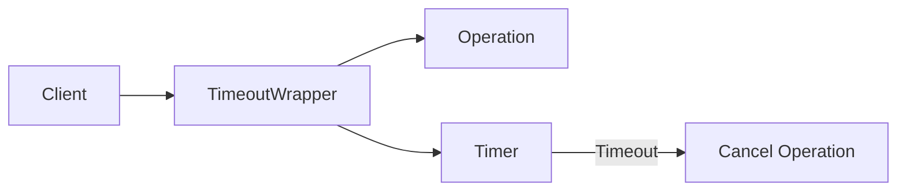

# Timeout Pattern

## 📋 Description

The **Timeout Pattern** establishes a maximum time limit to complete an operation, preventing slow or hanging operations from blocking the system indefinitely.

## 🎯 Purpose

- **Prevent blocking**: Stops operations from hanging indefinitely
- **Limited resources**: Releases threads and connections within a determined time
- **User experience**: Provides response within reasonable time
- **SLA**: Guarantees response times within service agreements

## ✅ When to Use

- **External service calls**: APIs, databases, web services
- **Network operations**: HTTP requests, socket connections
- **I/O operations**: File reading, disk access
- **Heavy processing**: Algorithms that may take a long time

## ❌ When NOT to Use

- **Fast operations**: Simple calculations that are always quick
- **Critical processes**: Where interruption may cause inconsistencies
- **Atomic operations**: Transactions that must complete or fail completely

## 🏗️ Structure



## 💡 Basic Implementation

```csharp
public class TimeoutWrapper
{
    public async Task<T> ExecuteWithTimeoutAsync<T>(
        Func<CancellationToken, Task<T>> operation,
        TimeSpan timeout)
    {
        using var cts = new CancellationTokenSource(timeout);
        
        try
        {
            return await operation(cts.Token);
        }
        catch (OperationCanceledException) when (cts.Token.IsCancellationRequested)
        {
            throw new TimeoutException($"Operation timed out after {timeout}");
        }
    }
}
```

## 📊 Usage Example

```csharp
public class HttpClientWithTimeout
{
    private readonly HttpClient _httpClient;
    private readonly TimeoutWrapper _timeoutWrapper;
    
    public HttpClientWithTimeout()
    {
        _httpClient = new HttpClient();
        _timeoutWrapper = new TimeoutWrapper();
    }
    
    public async Task<string> GetDataAsync(string url, TimeSpan timeout)
    {
        return await _timeoutWrapper.ExecuteWithTimeoutAsync(
            async (cancellationToken) =>
            {
                var response = await _httpClient.GetAsync(url, cancellationToken);
                response.EnsureSuccessStatusCode();
                return await response.Content.ReadAsStringAsync();
            },
            timeout
        );
    }
}

// Usage
var client = new HttpClientWithTimeout();
try
{
    var data = await client.GetDataAsync(
        "https://api.example.com/data", 
        TimeSpan.FromSeconds(5)
    );
    Console.WriteLine($"Data received: {data}");
}
catch (TimeoutException ex)
{
    Console.WriteLine($"Request timed out: {ex.Message}");
}
```

## 🔧 Pattern Variations

### 1. **Configurable Timeout**

```csharp
public class ConfigurableTimeoutService
{
    private readonly TimeSpan _defaultTimeout;
    private readonly Dictionary<string, TimeSpan> _operationTimeouts;
    
    public ConfigurableTimeoutService(IConfiguration config)
    {
        _defaultTimeout = TimeSpan.FromSeconds(
            config.GetValue<int>("DefaultTimeoutSeconds", 30));
        
        _operationTimeouts = config
            .GetSection("OperationTimeouts")
            .Get<Dictionary<string, TimeSpan>>() ?? new();
    }
    
    public async Task<T> ExecuteAsync<T>(
        string operationName,
        Func<CancellationToken, Task<T>> operation)
    {
        var timeout = _operationTimeouts.TryGetValue(operationName, out var customTimeout)
            ? customTimeout
            : _defaultTimeout;
            
        using var cts = new CancellationTokenSource(timeout);
        return await operation(cts.Token);
    }
}
```

### 2. **Timeout with Fallback**

```csharp
public class TimeoutWithFallback<T>
{
    private readonly Func<Task<T>> _fallbackOperation;
    
    public TimeoutWithFallback(Func<Task<T>> fallbackOperation)
    {
        _fallbackOperation = fallbackOperation;
    }
    
    public async Task<T> ExecuteAsync(
        Func<CancellationToken, Task<T>> primaryOperation,
        TimeSpan timeout)
    {
        using var cts = new CancellationTokenSource(timeout);
        
        try
        {
            return await primaryOperation(cts.Token);
        }
        catch (OperationCanceledException) when (cts.Token.IsCancellationRequested)
        {
            // Execute fallback on timeout
            return await _fallbackOperation();
        }
    }
}
```

### 3. **Progressive Timeout**

```csharp
public class ProgressiveTimeout
{
    public async Task<T> ExecuteWithProgressiveTimeoutAsync<T>(
        Func<CancellationToken, Task<T>> operation,
        TimeSpan initialTimeout,
        int maxAttempts = 3,
        double timeoutMultiplier = 1.5)
    {
        var currentTimeout = initialTimeout;
        
        for (int attempt = 1; attempt <= maxAttempts; attempt++)
        {
            using var cts = new CancellationTokenSource(currentTimeout);
            
            try
            {
                return await operation(cts.Token);
            }
            catch (OperationCanceledException) when (cts.Token.IsCancellationRequested)
            {
                if (attempt == maxAttempts)
                    throw new TimeoutException($"All {maxAttempts} attempts timed out");
                
                // Increase timeout for next attempt
                currentTimeout = TimeSpan.FromMilliseconds(
                    currentTimeout.TotalMilliseconds * timeoutMultiplier);
            }
        }
        
        throw new InvalidOperationException("Unexpected end of retry loop");
    }
}
```

## 🎯 Example: Database Service

```csharp
public class DatabaseService
{
    private readonly IDbConnection _connection;
    private readonly TimeoutWrapper _timeoutWrapper;
    
    public DatabaseService(IDbConnection connection)
    {
        _connection = connection;
        _timeoutWrapper = new TimeoutWrapper();
    }
    
    public async Task<List<Customer>> GetCustomersAsync(
        int pageSize = 50, 
        TimeSpan? timeout = null)
    {
        var operationTimeout = timeout ?? TimeSpan.FromSeconds(10);
        
        return await _timeoutWrapper.ExecuteWithTimeoutAsync(
            async (cancellationToken) =>
            {
                var command = _connection.CreateCommand();
                command.CommandText = "SELECT * FROM Customers LIMIT @pageSize";
                command.Parameters.Add(new SqlParameter("@pageSize", pageSize));
                
                using var reader = await command.ExecuteReaderAsync(cancellationToken);
                var customers = new List<Customer>();
                
                while (await reader.ReadAsync(cancellationToken))
                {
                    customers.Add(new Customer
                    {
                        Id = reader.GetInt32("Id"),
                        Name = reader.GetString("Name"),
                        Email = reader.GetString("Email")
                    });
                }
                
                return customers;
            },
            operationTimeout
        );
    }
}
```

## ⚡ Performance Considerations

- **Granularity**: Define appropriate timeouts for each operation type
- **Cleanup**: Ensure resource release when canceling
- **Monitoring**: Record timeouts to adjust configurations
- **Cascading**: Avoid very short timeouts that cause cascading failures

## 🧪 Testing

```csharp
[Test]
public async Task Timeout_ShouldCancelLongRunningOperation()
{
    // Arrange
    var timeoutWrapper = new TimeoutWrapper();
    var timeout = TimeSpan.FromMilliseconds(100);
    
    // Act & Assert
    var exception = await Assert.ThrowsAsync<TimeoutException>(() =>
        timeoutWrapper.ExecuteWithTimeoutAsync(
            async (ct) =>
            {
                await Task.Delay(TimeSpan.FromSeconds(1), ct);
                return "Should not complete";
            },
            timeout
        )
    );
    
    Assert.Contains("timed out after", exception.Message);
}

[Test]
public async Task Timeout_ShouldCompleteWithinTimeLimit()
{
    // Arrange
    var timeoutWrapper = new TimeoutWrapper();
    var timeout = TimeSpan.FromSeconds(1);
    
    // Act
    var result = await timeoutWrapper.ExecuteWithTimeoutAsync(
        async (ct) =>
        {
            await Task.Delay(TimeSpan.FromMilliseconds(50), ct);
            return "Completed";
        },
        timeout
    );
    
    // Assert
    Assert.AreEqual("Completed", result);
}
```

## 📊 Metrics and Monitoring

```csharp
public class TimeoutMetrics
{
    private readonly IMetrics _metrics;
    
    public async Task<T> ExecuteWithMetricsAsync<T>(
        string operationName,
        Func<CancellationToken, Task<T>> operation,
        TimeSpan timeout)
    {
        var stopwatch = Stopwatch.StartNew();
        
        try
        {
            using var cts = new CancellationTokenSource(timeout);
            var result = await operation(cts.Token);
            
            _metrics.Timer($"operation.duration.{operationName}")
                   .Record(stopwatch.Elapsed);
            
            return result;
        }
        catch (OperationCanceledException)
        {
            _metrics.Counter($"operation.timeout.{operationName}")
                   .Increment();
            throw;
        }
    }
}
```

## 🔗 Related Patterns

- **[Retry](../Retry/)**: Retry can use timeout for each attempt
- **[Circuit Breaker](../CircuitBreaker/)**: Timeout helps detect slow services
- **[Bulkhead](../Bulkhead/)**: Isolates resources that may have different timeouts

## 📚 Additional Resources

- [Microsoft: Timeout in HttpClient](https://docs.microsoft.com/en-us/dotnet/api/system.net.http.httpclient.timeout)
- [Task Cancellation](https://docs.microsoft.com/en-us/dotnet/standard/threading/cancellation-in-managed-threads)
- [CancellationToken Best Practices](https://devblogs.microsoft.com/premier-developer/recommended-patterns-for-cancellationtoken/)

---

> 💡 **Tip**: Always propagate CancellationToken in async methods to enable cooperative cancellation and effective timeouts.
