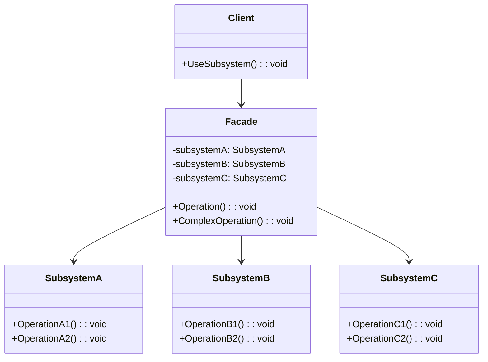

# Patrón Facade (Fachada)

## 📋 Descripción

El **Patrón Facade** proporciona una interfaz unificada y simplificada a un conjunto de interfaces en un subsistema. Define una interfaz de más alto nivel que hace que el subsistema sea más fácil de usar al ocultar la complejidad de los componentes subyacentes.

## 🎯 Propósito

- **Simplificar sistemas complejos**: Proporcionar una interfaz simple a subsistemas complejos
- **Reducir acoplamiento**: Desacoplar clientes de componentes complejos del subsistema
- **Mejorar usabilidad**: Hacer que las librerías y frameworks sean más fáciles de usar
- **Ocultar detalles de implementación**: Proteger a los clientes de la complejidad del subsistema

## ✅ Cuándo Usar

- **Subsistemas complejos**: Cuando tienes un conjunto complejo de clases que son difíciles de usar
- **Simplificación de APIs**: Proporcionar una interfaz simple a una librería compleja
- **Integración de sistemas legacy**: Envolver sistemas legacy con interfaces modernas
- **Orquestación de servicios**: Coordinar múltiples servicios detrás de una sola interfaz
- **Escenarios de testing**: Crear interfaces simplificadas para probar sistemas complejos

## ❌ Cuándo NO Usar

- **Sistemas simples**: Cuando el subsistema ya es simple y fácil de usar
- **Acceso directo necesario**: Cuando los clientes necesitan control detallado sobre los componentes del subsistema
- **Crítico para rendimiento**: Cuando la fachada agrega overhead innecesario
- **Responsabilidad única**: Cuando la fachada tendría demasiadas responsabilidades

## 🏗️ Estructura



## 💡 Implementación Moderna: Procesamiento de Pedidos E-commerce

```csharp
// Componentes del subsistema
public interface IServicioInventario
{
    Task<bool> VerificarStockAsync(int productoId, int cantidad);
    Task<bool> ReservarArticulosAsync(int productoId, int cantidad);
    Task LiberarReservaAsync(int productoId, int cantidad);
}

public interface IServicioPago
{
    Task<ResultadoPago> ProcesarPagoAsync(SolicitudPago solicitud);
    Task<bool> ReembolsarPagoAsync(string idTransaccion, decimal monto);
}

public interface IServicioEnvio
{
    Task<CotizacionEnvio> ObtenerCotizacionEnvioAsync(SolicitudEnvio solicitud);
    Task<string> CrearEnvioAsync(SolicitudEnvio solicitud);
    Task<InfoSeguimiento> ObtenerInfoSeguimientoAsync(string idEnvio);
}

public interface IServicioNotificacion
{
    Task EnviarConfirmacionPedidoAsync(string email, DetallesPedido pedido);
    Task EnviarNotificacionEnvioAsync(string email, string numeroSeguimiento);
    Task EnviarCancelacionPedidoAsync(string email, string idPedido);
}

public interface IServicioCliente
{
    Task<Cliente> ObtenerClienteAsync(int idCliente);
    Task<bool> ValidarClienteAsync(int idCliente);
    Task ActualizarHistorialPedidosClienteAsync(int idCliente, string idPedido);
}

// Implementaciones concretas del subsistema
public class ServicioInventario : IServicioInventario
{
    private readonly ILogger<ServicioInventario> _logger;
    private readonly IRepositorioInventario _repositorio;
    
    public ServicioInventario(ILogger<ServicioInventario> logger, IRepositorioInventario repositorio)
    {
        _logger = logger;
        _repositorio = repositorio;
    }
    
    public async Task<bool> VerificarStockAsync(int productoId, int cantidad)
    {
        _logger.LogInformation("Verificando stock para producto {ProductoId}, cantidad {Cantidad}", 
                              productoId, cantidad);
        
        var stockDisponible = await _repositorio.ObtenerStockDisponibleAsync(productoId);
        return stockDisponible >= cantidad;
    }
    
    public async Task<bool> ReservarArticulosAsync(int productoId, int cantidad)
    {
        _logger.LogInformation("Reservando {Cantidad} artículos para producto {ProductoId}", 
                              cantidad, productoId);
        
        return await _repositorio.ReservarStockAsync(productoId, cantidad);
    }
    
    public async Task LiberarReservaAsync(int productoId, int cantidad)
    {
        _logger.LogInformation("Liberando reserva para producto {ProductoId}, cantidad {Cantidad}", 
                              productoId, cantidad);
        
        await _repositorio.LiberarReservaAsync(productoId, cantidad);
    }
}

public class ServicioPago : IServicioPago
{
    private readonly ILogger<ServicioPago> _logger;
    private readonly IPasarelaPago _pasarela;
    
    public ServicioPago(ILogger<ServicioPago> logger, IPasarelaPago pasarela)
    {
        _logger = logger;
        _pasarela = pasarela;
    }
    
    public async Task<ResultadoPago> ProcesarPagoAsync(SolicitudPago solicitud)
    {
        _logger.LogInformation("Procesando pago por monto {Monto}", solicitud.Monto);
        
        try
        {
            var resultado = await _pasarela.CobrarAsync(solicitud);
            
            _logger.LogInformation("Pago procesado. Éxito: {Exito}, IdTransaccion: {IdTransaccion}", 
                                  resultado.EsExitoso, resultado.IdTransaccion);
            
            return resultado;
        }
        catch (Exception ex)
        {
            _logger.LogError(ex, "Falló el procesamiento del pago");
            return new ResultadoPago { EsExitoso = false, MensajeError = ex.Message };
        }
    }
    
    public async Task<bool> ReembolsarPagoAsync(string idTransaccion, decimal monto)
    {
        _logger.LogInformation("Procesando reembolso para transacción {IdTransaccion}, monto {Monto}", 
                              idTransaccion, monto);
        
        return await _pasarela.ReembolsarAsync(idTransaccion, monto);
    }
}

// Implementaciones adicionales del subsistema estarían aquí...
```

## 🎯 Implementación de Facade

```csharp
public class FachadeProcesamentoPedidos
{
    private readonly IServicioInventario _servicioInventario;
    private readonly IServicioPago _servicioPago;
    private readonly IServicioEnvio _servicioEnvio;
    private readonly IServicioNotificacion _servicioNotificacion;
    private readonly IServicioCliente _servicioCliente;
    private readonly ILogger<FachadeProcesamentoPedidos> _logger;
    
    public FachadeProcesamentoPedidos(
        IServicioInventario servicioInventario,
        IServicioPago servicioPago,
        IServicioEnvio servicioEnvio,
        IServicioNotificacion servicioNotificacion,
        IServicioCliente servicioCliente,
        ILogger<FachadeProcesamentoPedidos> logger)
    {
        _servicioInventario = servicioInventario;
        _servicioPago = servicioPago;
        _servicioEnvio = servicioEnvio;
        _servicioNotificacion = servicioNotificacion;
        _servicioCliente = servicioCliente;
        _logger = logger;
    }
    
    public async Task<ResultadoPedido> ProcesarPedidoAsync(SolicitudPedido solicitud)
    {
        var idPedido = Guid.NewGuid().ToString();
        _logger.LogInformation("Iniciando procesamiento de pedido para pedido {IdPedido}", idPedido);
        
        try
        {
            // Paso 1: Validar cliente
            var cliente = await _servicioCliente.ObtenerClienteAsync(solicitud.IdCliente);
            if (cliente == null)
            {
                return new ResultadoPedido 
                { 
                    EsExitoso = false, 
                    MensajeError = "Cliente no encontrado" 
                };
            }
            
            if (!await _servicioCliente.ValidarClienteAsync(solicitud.IdCliente))
            {
                return new ResultadoPedido 
                { 
                    EsExitoso = false, 
                    MensajeError = "Falló la validación del cliente" 
                };
            }
            
            // Paso 2: Verificar inventario y reservar artículos
            var reservas = new List<(int ProductoId, int Cantidad)>();
            
            foreach (var articulo in solicitud.Articulos)
            {
                if (!await _servicioInventario.VerificarStockAsync(articulo.ProductoId, articulo.Cantidad))
                {
                    // Liberar reservas previas
                    await LiberarReservasAsync(reservas);
                    
                    return new ResultadoPedido 
                    { 
                        EsExitoso = false, 
                        MensajeError = $"Stock insuficiente para producto {articulo.ProductoId}" 
                    };
                }
                
                if (!await _servicioInventario.ReservarArticulosAsync(articulo.ProductoId, articulo.Cantidad))
                {
                    // Liberar reservas previas
                    await LiberarReservasAsync(reservas);
                    
                    return new ResultadoPedido 
                    { 
                        EsExitoso = false, 
                        MensajeError = $"No se pudieron reservar artículos para producto {articulo.ProductoId}" 
                    };
                }
                
                reservas.Add((articulo.ProductoId, articulo.Cantidad));
            }
            
            // Paso 3: Obtener cotización de envío
            var cotizacionEnvio = await _servicioEnvio.ObtenerCotizacionEnvioAsync(new SolicitudEnvio
            {
                Articulos = solicitud.Articulos,
                DireccionEntrega = solicitud.DireccionEnvio,
                MetodoEnvio = solicitud.MetodoEnvio
            });
            
            // Paso 4: Procesar pago
            var solicitudPago = new SolicitudPago
            {
                Monto = solicitud.MontoTotal + cotizacionEnvio.Costo,
                MetodoPago = solicitud.MetodoPago,
                InfoCliente = cliente,
                IdPedido = idPedido
            };
            
            var resultadoPago = await _servicioPago.ProcesarPagoAsync(solicitudPago);
            
            if (!resultadoPago.EsExitoso)
            {
                // Liberar reservas
                await LiberarReservasAsync(reservas);
                
                return new ResultadoPedido 
                { 
                    EsExitoso = false, 
                    MensajeError = $"Falló el pago: {resultadoPago.MensajeError}" 
                };
            }
            
            // Paso 5: Crear envío
            var idEnvio = await _servicioEnvio.CrearEnvioAsync(new SolicitudEnvio
            {
                IdPedido = idPedido,
                Articulos = solicitud.Articulos,
                DireccionEnvio = solicitud.DireccionEnvio,
                MetodoEnvio = solicitud.MetodoEnvio
            });
            
            // Paso 6: Actualizar historial de pedidos del cliente
            await _servicioCliente.ActualizarHistorialPedidosClienteAsync(solicitud.IdCliente, idPedido);
            
            // Paso 7: Enviar notificación de confirmación
            var detallesPedido = new DetallesPedido
            {
                IdPedido = idPedido,
                Articulos = solicitud.Articulos,
                MontoTotal = solicitudPago.Monto,
                DireccionEnvio = solicitud.DireccionEnvio,
                NumeroSeguimiento = idEnvio
            };
            
            await _servicioNotificacion.EnviarConfirmacionPedidoAsync(cliente.Email, detallesPedido);
            
            _logger.LogInformation("Pedido {IdPedido} procesado exitosamente", idPedido);
            
            return new ResultadoPedido
            {
                EsExitoso = true,
                IdPedido = idPedido,
                IdTransaccion = resultadoPago.IdTransaccion,
                NumeroSeguimiento = idEnvio,
                MontoTotal = solicitudPago.Monto
            };
        }
        catch (Exception ex)
        {
            _logger.LogError(ex, "Error procesando pedido {IdPedido}", idPedido);
            
            // Intentar limpiar cualquier estado parcial
            await ManejarErrorProcesamentoPedidoAsync(idPedido, solicitud);
            
            return new ResultadoPedido 
            { 
                EsExitoso = false, 
                MensajeError = "Ocurrió un error inesperado al procesar el pedido" 
            };
        }
    }
    
    public async Task<ResultadoCancelacionPedido> CancelarPedidoAsync(string idPedido)
    {
        _logger.LogInformation("Iniciando cancelación de pedido para pedido {IdPedido}", idPedido);
        
        try
        {
            // Esto involucraría múltiples llamadas al subsistema:
            // 1. Verificar si el pedido se puede cancelar
            // 2. Detener envío si aún no se ha enviado
            // 3. Procesar reembolso
            // 4. Liberar reservas de inventario
            // 5. Enviar notificación de cancelación
            
            // Implementación simplificada para el ejemplo
            return new ResultadoCancelacionPedido { EsExitoso = true };
        }
        catch (Exception ex)
        {
            _logger.LogError(ex, "Error cancelando pedido {IdPedido}", idPedido);
            return new ResultadoCancelacionPedido 
            { 
                EsExitoso = false, 
                MensajeError = "Falló la cancelación del pedido" 
            };
        }
    }
    
    public async Task<InfoEstadoPedido> ObtenerEstadoPedidoAsync(string idPedido)
    {
        _logger.LogInformation("Obteniendo estado del pedido para pedido {IdPedido}", idPedido);
        
        try
        {
            // Coordinar con múltiples subsistemas para obtener el estado completo del pedido
            // Esto típicamente involucraría llamadas a base de datos de pedidos, servicio de envío, etc.
            
            var infoSeguimiento = await _servicioEnvio.ObtenerInfoSeguimientoAsync(idPedido);
            
            return new InfoEstadoPedido
            {
                IdPedido = idPedido,
                Estado = infoSeguimiento.Estado,
                NumeroSeguimiento = infoSeguimiento.NumeroSeguimiento,
                EntregaEstimada = infoSeguimiento.EntregaEstimada
            };
        }
        catch (Exception ex)
        {
            _logger.LogError(ex, "Error obteniendo estado del pedido para {IdPedido}", idPedido);
            throw;
        }
    }
    
    private async Task LiberarReservasAsync(List<(int ProductoId, int Cantidad)> reservas)
    {
        foreach (var (productoId, cantidad) in reservas)
        {
            try
            {
                await _servicioInventario.LiberarReservaAsync(productoId, cantidad);
            }
            catch (Exception ex)
            {
                _logger.LogError(ex, "Falló la liberación de reserva para producto {ProductoId}", productoId);
            }
        }
    }
    
    private async Task ManejarErrorProcesamentoPedidoAsync(string idPedido, SolicitudPedido solicitud)
    {
        try
        {
            // Intentar limpiar cualquier estado parcial
            // Esto podría incluir liberar reservas, reembolsar pagos, etc.
            _logger.LogInformation("Limpiando pedido fallido {IdPedido}", idPedido);
        }
        catch (Exception ex)
        {
            _logger.LogError(ex, "Error durante limpieza de pedido para {IdPedido}", idPedido);
        }
    }
}
```

## 📊 Ejemplo del Mundo Real: Facade de Procesamiento de Medios

```csharp
// Subsistema para procesamiento de video
public interface IProcesadorVideo
{
    Task<string> ConvertirVideoAsync(string rutaEntrada, FormatoVideo formato);
    Task<byte[]> ExtraerMiniaturaAsync(string rutaVideo, TimeSpan timestamp);
    Task<MetadataVideo> ObtenerMetadataVideoAsync(string rutaVideo);
}

// Subsistema para procesamiento de audio
public interface IProcesadorAudio
{
    Task<string> ExtraerAudioAsync(string rutaVideo);
    Task<string> ConvertirAudioAsync(string rutaEntrada, FormatoAudio formato);
    Task<MetadataAudio> ObtenerMetadataAudioAsync(string rutaAudio);
}

// Subsistema para almacenamiento
public interface IAlmacenamientoMedios
{
    Task<string> SubirAsync(byte[] contenido, string nombreArchivo);
    Task<byte[]> DescargarAsync(string idArchivo);
    Task<bool> EliminarAsync(string idArchivo);
}

// Subsistema para análisis de contenido
public interface IAnalizadorContenido
{
    Task<CalificacionContenido> AnalizarContenidoAsync(string rutaMedio);
    Task<List<string>> ExtraerEtiquetasAsync(string rutaMedio);
    Task<bool> DetectarDerechosAutorAsync(string rutaMedio);
}

// Facade para procesamiento de medios
public class FachadeProcesadorMedios
{
    private readonly IProcesadorVideo _procesadorVideo;
    private readonly IProcesadorAudio _procesadorAudio;
    private readonly IAlmacenamientoMedios _almacenamiento;
    private readonly IAnalizadorContenido _analizador;
    private readonly ILogger<FachadeProcesadorMedios> _logger;
    
    public FachadeProcesadorMedios(
        IProcesadorVideo procesadorVideo,
        IProcesadorAudio procesadorAudio,
        IAlmacenamientoMedios almacenamiento,
        IAnalizadorContenido analizador,
        ILogger<FachadeProcesadorMedios> logger)
    {
        _procesadorVideo = procesadorVideo;
        _procesadorAudio = procesadorAudio;
        _almacenamiento = almacenamiento;
        _analizador = analizador;
        _logger = logger;
    }
    
    public async Task<ResultadoProcesadorMedios> ProcesarVideoAsync(
        byte[] contenidoVideo, 
        string nombreArchivo, 
        OpcionesProcesadorVideo opciones)
    {
        var rutaVideoTemporal = Path.GetTempFileName();
        var archivosprocesados = new List<string>();
        
        try
        {
            _logger.LogInformation("Iniciando procesamiento de video para {NombreArchivo}", nombreArchivo);
            
            // Guardar video subido temporalmente
            await File.WriteAllBytesAsync(rutaVideoTemporal, contenidoVideo);
            
            // Paso 1: Analizar contenido
            var calificacionContenido = await _analizador.AnalizarContenidoAsync(rutaVideoTemporal);
            var etiquetas = await _analizador.ExtraerEtiquetasAsync(rutaVideoTemporal);
            var tieneDerechosAutor = await _analizador.DetectarDerechosAutorAsync(rutaVideoTemporal);
            
            if (tieneDerechosAutor)
            {
                return new ResultadoProcesadorMedios
                {
                    EsExitoso = false,
                    MensajeError = "Contenido con derechos de autor detectado"
                };
            }
            
            // Paso 2: Extraer metadata
            var metadataVideo = await _procesadorVideo.ObtenerMetadataVideoAsync(rutaVideoTemporal);
            
            // Paso 3: Generar miniatura
            var miniatura = await _procesadorVideo.ExtraerMiniaturaAsync(
                rutaVideoTemporal, 
                TimeSpan.FromSeconds(metadataVideo.Duracion.TotalSeconds / 2));
            
            var urlMiniatura = await _almacenamiento.SubirAsync(miniatura, $"{nombreArchivo}_miniatura.jpg");
            archivosprocesados.Add(urlMiniatura);
            
            // Paso 4: Convertir video a diferentes formatos si se solicita
            var urlsVideo = new Dictionary<FormatoVideo, string>();
            
            foreach (var formato in opciones.FormatosSalida)
            {
                var rutaConvertida = await _procesadorVideo.ConvertirVideoAsync(rutaVideoTemporal, formato);
                var contenidoConvertido = await File.ReadAllBytesAsync(rutaConvertida);
                var urlVideo = await _almacenamiento.SubirAsync(contenidoConvertido, $"{nombreArchivo}_{formato}");
                
                urlsVideo[formato] = urlVideo;
                archivosprocesados.Add(urlVideo);
                
                File.Delete(rutaConvertida);
            }
            
            // Paso 5: Extraer y procesar audio si se solicita
            string urlAudio = null;
            if (opciones.ExtraerAudio)
            {
                var rutaAudio = await _procesadorAudio.ExtraerAudioAsync(rutaVideoTemporal);
                var contenidoAudio = await File.ReadAllBytesAsync(rutaAudio);
                urlAudio = await _almacenamiento.SubirAsync(contenidoAudio, $"{nombreArchivo}.mp3");
                archivosprocesados.Add(urlAudio);
                
                File.Delete(rutaAudio);
            }
            
            _logger.LogInformation("Procesamiento de video completado para {NombreArchivo}", nombreArchivo);
            
            return new ResultadoProcesadorMedios
            {
                EsExitoso = true,
                UrlMiniatura = urlMiniatura,
                UrlsVideo = urlsVideo,
                UrlAudio = urlAudio,
                Metadata = new MetadataMediosProcesados
                {
                    Duracion = metadataVideo.Duracion,
                    Resolucion = metadataVideo.Resolucion,
                    CalificacionContenido = calificacionContenido,
                    Etiquetas = etiquetas
                }
            };
        }
        catch (Exception ex)
        {
            _logger.LogError(ex, "Error procesando video {NombreArchivo}", nombreArchivo);
            
            // Limpiar archivos subidos
            foreach (var urlArchivo in archivosprocesados)
            {
                try
                {
                    await _almacenamiento.EliminarAsync(urlArchivo);
                }
                catch (Exception exLimpieza)
                {
                    _logger.LogWarning(exLimpieza, "Falló la limpieza del archivo {UrlArchivo}", urlArchivo);
                }
            }
            
            return new ResultadoProcesadorMedios
            {
                EsExitoso = false,
                MensajeError = "Falló el procesamiento del video"
            };
        }
        finally
        {
            // Limpiar archivo temporal
            if (File.Exists(rutaVideoTemporal))
            {
                File.Delete(rutaVideoTemporal);
            }
        }
    }
}
```

## ⚡ Consideraciones de Rendimiento

- **Operaciones asíncronas**: Usar async/await para operaciones I/O
- **Procesamiento paralelo**: Ejecutar operaciones independientes del subsistema en paralelo
- **Caché**: Cachear resultados de subsistemas frecuentemente accedidos
- **Circuit breaker**: Implementar patrón circuit breaker para servicios externos

```csharp
public class FachadeProcesadorPedidosOptimizada : FachadeProcesamentoPedidos
{
    private readonly IMemoryCache _cache;
    private readonly SemaphoreSlim _semaforo;
    
    public FachadeProcesadorPedidosOptimizada(
        IMemoryCache cache,
        /* otras dependencias */)
    {
        _cache = cache;
        _semaforo = new SemaphoreSlim(10, 10); // Limitar operaciones concurrentes
    }
    
    public async Task<ResultadoPedido> ProcesarPedidoConOptimizacionesAsync(SolicitudPedido solicitud)
    {
        await _semaforo.WaitAsync();
        
        try
        {
            // Usar procesamiento paralelo para operaciones independientes
            var tareaCliente = ObtenerOCachearClienteAsync(solicitud.IdCliente);
            var tareasInventario = solicitud.Articulos.Select(articulo => 
                VerificarStockAsync(articulo.ProductoId, articulo.Cantidad)).ToArray();
            
            await Task.WhenAll(tareaCliente);
            await Task.WhenAll(tareasInventario);
            
            // Continuar con procesamiento de pedido...
            return new ResultadoPedido { EsExitoso = true };
        }
        finally
        {
            _semaforo.Release();
        }
    }
    
    private async Task<Cliente> ObtenerOCachearClienteAsync(int idCliente)
    {
        var claveCache = $"cliente_{idCliente}";
        
        if (_cache.TryGetValue(claveCache, out Cliente clienteCacheado))
        {
            return clienteCacheado;
        }
        
        var cliente = await _servicioCliente.ObtenerClienteAsync(idCliente);
        _cache.Set(claveCache, cliente, TimeSpan.FromMinutes(5));
        
        return cliente;
    }
}
```

## 🧪 Testing

```csharp
[Test]
public async Task ProcesarPedidoAsync_PedidoValido_DeberiaSerExitoso()
{
    // Arrange
    var mockInventario = new Mock<IServicioInventario>();
    var mockPago = new Mock<IServicioPago>();
    var mockEnvio = new Mock<IServicioEnvio>();
    var mockNotificacion = new Mock<IServicioNotificacion>();
    var mockCliente = new Mock<IServicioCliente>();
    
    mockCliente.Setup(c => c.ObtenerClienteAsync(It.IsAny<int>()))
              .ReturnsAsync(new Cliente { Id = 1, Email = "test@example.com" });
    
    mockCliente.Setup(c => c.ValidarClienteAsync(It.IsAny<int>()))
              .ReturnsAsync(true);
    
    mockInventario.Setup(i => i.VerificarStockAsync(It.IsAny<int>(), It.IsAny<int>()))
               .ReturnsAsync(true);
    
    mockInventario.Setup(i => i.ReservarArticulosAsync(It.IsAny<int>(), It.IsAny<int>()))
               .ReturnsAsync(true);
    
    mockPago.Setup(p => p.ProcesarPagoAsync(It.IsAny<SolicitudPago>()))
              .ReturnsAsync(new ResultadoPago { EsExitoso = true, IdTransaccion = "TX123" });
    
    mockEnvio.Setup(s => s.ObtenerCotizacionEnvioAsync(It.IsAny<SolicitudEnvio>()))
               .ReturnsAsync(new CotizacionEnvio { Costo = 10.00m });
    
    mockEnvio.Setup(s => s.CrearEnvioAsync(It.IsAny<SolicitudEnvio>()))
               .ReturnsAsync("SHIP123");
    
    var fachada = new FachadeProcesamentoPedidos(
        mockInventario.Object,
        mockPago.Object,
        mockEnvio.Object,
        mockNotificacion.Object,
        mockCliente.Object,
        Mock.Of<ILogger<FachadeProcesamentoPedidos>>());
    
    var solicitudPedido = new SolicitudPedido
    {
        IdCliente = 1,
        Articulos = new List<ArticuloPedido> { new() { ProductoId = 1, Cantidad = 2 } },
        MontoTotal = 100.00m
    };
    
    // Act
    var resultado = await fachada.ProcesarPedidoAsync(solicitudPedido);
    
    // Assert
    Assert.IsTrue(resultado.EsExitoso);
    Assert.IsNotNull(resultado.IdPedido);
    Assert.AreEqual("TX123", resultado.IdTransaccion);
    Assert.AreEqual("SHIP123", resultado.NumeroSeguimiento);
    
    // Verificar que todos los subsistemas fueron llamados
    mockCliente.Verify(c => c.ObtenerClienteAsync(1), Times.Once);
    mockInventario.Verify(i => i.VerificarStockAsync(1, 2), Times.Once);
    mockPago.Verify(p => p.ProcesarPagoAsync(It.IsAny<SolicitudPago>()), Times.Once);
    mockNotificacion.Verify(n => n.EnviarConfirmacionPedidoAsync(It.IsAny<string>(), It.IsAny<DetallesPedido>()), Times.Once);
}
```

## 🔗 Patrones Relacionados

- **[Adapter](../Adapter/)**: Adapta interfaces de clases existentes
- **[Mediator](../../BehavioralPatterns/Mediator/)**: Define cómo los objetos interactúan entre sí
- **[Abstract Factory](../../CreationalPatterns/AbstractFactory/)**: Crea familias de objetos relacionados
- **[Decorator](../Decorator/)**: Agrega comportamiento a objetos dinámicamente

## 📚 Recursos Adicionales

- [Microsoft: Patrón Facade](https://docs.microsoft.com/en-us/azure/architecture/patterns/facade)
- [Patrones de Diseño Gang of Four](https://es.wikipedia.org/wiki/Patr%C3%B3n_de_fachada)
- [Principios de Arquitectura Limpia](https://blog.cleancoder.com/uncle-bob/2012/08/13/the-clean-architecture.html)

---

> 💡 **Consejo**: Usa Facade para proporcionar una interfaz simple a subsistemas complejos. Es particularmente útil para integración de sistemas legacy y simplificación de APIs. Considera usarlo con inyección de dependencias para mejor testabilidad.
