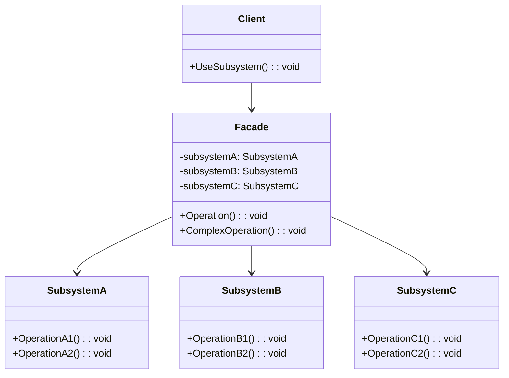

# Facade Pattern

## 📋 Description

The **Facade Pattern** provides a unified, simplified interface to a set of interfaces in a subsystem. It defines a higher-level interface that makes the subsystem easier to use by hiding the complexity of the underlying components.

## 🎯 Purpose

- **Simplify complex systems**: Provide a simple interface to complex subsystems
- **Reduce coupling**: Decouple clients from complex subsystem components
- **Improve usability**: Make libraries and frameworks easier to use
- **Hide implementation details**: Shield clients from subsystem complexity

## ✅ When to Use

- **Complex subsystems**: When you have a complex set of classes that are difficult to use
- **API simplification**: Providing a simple interface to a complex library
- **Legacy system integration**: Wrapping legacy systems with modern interfaces
- **Service orchestration**: Coordinating multiple services behind a single interface
- **Testing scenarios**: Creating simplified interfaces for testing complex systems

## ❌ When NOT to Use

- **Simple systems**: When the subsystem is already simple and easy to use
- **Direct access needed**: When clients need fine-grained control over subsystem components
- **Performance critical**: When the facade adds unnecessary overhead
- **Single responsibility**: When the facade would have too many responsibilities

## 🏗️ Structure



## 💡 Modern Implementation: E-commerce Order Processing

```csharp
// Subsystem components
public interface IInventoryService
{
    Task<bool> CheckStockAsync(int productId, int quantity);
    Task<bool> ReserveItemsAsync(int productId, int quantity);
    Task ReleaseReservationAsync(int productId, int quantity);
}

public interface IPaymentService
{
    Task<PaymentResult> ProcessPaymentAsync(PaymentRequest request);
    Task<bool> RefundPaymentAsync(string transactionId, decimal amount);
}

public interface IShippingService
{
    Task<ShippingQuote> GetShippingQuoteAsync(ShippingRequest request);
    Task<string> CreateShipmentAsync(ShipmentRequest request);
    Task<TrackingInfo> GetTrackingInfoAsync(string shipmentId);
}

public interface INotificationService
{
    Task SendOrderConfirmationAsync(string email, OrderDetails order);
    Task SendShippingNotificationAsync(string email, string trackingNumber);
    Task SendOrderCancellationAsync(string email, string orderId);
}

public interface ICustomerService
{
    Task<Customer> GetCustomerAsync(int customerId);
    Task<bool> ValidateCustomerAsync(int customerId);
    Task UpdateCustomerOrderHistoryAsync(int customerId, string orderId);
}

// Concrete subsystem implementations
public class InventoryService : IInventoryService
{
    private readonly ILogger<InventoryService> _logger;
    private readonly IInventoryRepository _repository;
    
    public InventoryService(ILogger<InventoryService> logger, IInventoryRepository repository)
    {
        _logger = logger;
        _repository = repository;
    }
    
    public async Task<bool> CheckStockAsync(int productId, int quantity)
    {
        _logger.LogInformation("Checking stock for product {ProductId}, quantity {Quantity}", 
                              productId, quantity);
        
        var availableStock = await _repository.GetAvailableStockAsync(productId);
        return availableStock >= quantity;
    }
    
    public async Task<bool> ReserveItemsAsync(int productId, int quantity)
    {
        _logger.LogInformation("Reserving {Quantity} items for product {ProductId}", 
                              quantity, productId);
        
        return await _repository.ReserveStockAsync(productId, quantity);
    }
    
    public async Task ReleaseReservationAsync(int productId, int quantity)
    {
        _logger.LogInformation("Releasing reservation for product {ProductId}, quantity {Quantity}", 
                              productId, quantity);
        
        await _repository.ReleaseReservationAsync(productId, quantity);
    }
}

public class PaymentService : IPaymentService
{
    private readonly ILogger<PaymentService> _logger;
    private readonly IPaymentGateway _gateway;
    
    public PaymentService(ILogger<PaymentService> logger, IPaymentGateway gateway)
    {
        _logger = logger;
        _gateway = gateway;
    }
    
    public async Task<PaymentResult> ProcessPaymentAsync(PaymentRequest request)
    {
        _logger.LogInformation("Processing payment for amount {Amount}", request.Amount);
        
        try
        {
            var result = await _gateway.ChargeAsync(request);
            
            _logger.LogInformation("Payment processed. Success: {Success}, TransactionId: {TransactionId}", 
                                  result.IsSuccess, result.TransactionId);
            
            return result;
        }
        catch (Exception ex)
        {
            _logger.LogError(ex, "Payment processing failed");
            return new PaymentResult { IsSuccess = false, ErrorMessage = ex.Message };
        }
    }
    
    public async Task<bool> RefundPaymentAsync(string transactionId, decimal amount)
    {
        _logger.LogInformation("Processing refund for transaction {TransactionId}, amount {Amount}", 
                              transactionId, amount);
        
        return await _gateway.RefundAsync(transactionId, amount);
    }
}

// Additional subsystem implementations would be here...
```

## 🎯 Facade Implementation

```csharp
public class OrderProcessingFacade
{
    private readonly IInventoryService _inventoryService;
    private readonly IPaymentService _paymentService;
    private readonly IShippingService _shippingService;
    private readonly INotificationService _notificationService;
    private readonly ICustomerService _customerService;
    private readonly ILogger<OrderProcessingFacade> _logger;
    
    public OrderProcessingFacade(
        IInventoryService inventoryService,
        IPaymentService paymentService,
        IShippingService shippingService,
        INotificationService notificationService,
        ICustomerService customerService,
        ILogger<OrderProcessingFacade> logger)
    {
        _inventoryService = inventoryService;
        _paymentService = paymentService;
        _shippingService = shippingService;
        _notificationService = notificationService;
        _customerService = customerService;
        _logger = logger;
    }
    
    public async Task<OrderResult> ProcessOrderAsync(OrderRequest request)
    {
        var orderId = Guid.NewGuid().ToString();
        _logger.LogInformation("Starting order processing for order {OrderId}", orderId);
        
        try
        {
            // Step 1: Validate customer
            var customer = await _customerService.GetCustomerAsync(request.CustomerId);
            if (customer == null)
            {
                return new OrderResult 
                { 
                    IsSuccess = false, 
                    ErrorMessage = "Customer not found" 
                };
            }
            
            if (!await _customerService.ValidateCustomerAsync(request.CustomerId))
            {
                return new OrderResult 
                { 
                    IsSuccess = false, 
                    ErrorMessage = "Customer validation failed" 
                };
            }
            
            // Step 2: Check inventory and reserve items
            var reservations = new List<(int ProductId, int Quantity)>();
            
            foreach (var item in request.Items)
            {
                if (!await _inventoryService.CheckStockAsync(item.ProductId, item.Quantity))
                {
                    // Release any previous reservations
                    await ReleaseReservationsAsync(reservations);
                    
                    return new OrderResult 
                    { 
                        IsSuccess = false, 
                        ErrorMessage = $"Insufficient stock for product {item.ProductId}" 
                    };
                }
                
                if (!await _inventoryService.ReserveItemsAsync(item.ProductId, item.Quantity))
                {
                    // Release any previous reservations
                    await ReleaseReservationsAsync(reservations);
                    
                    return new OrderResult 
                    { 
                        IsSuccess = false, 
                        ErrorMessage = $"Could not reserve items for product {item.ProductId}" 
                    };
                }
                
                reservations.Add((item.ProductId, item.Quantity));
            }
            
            // Step 3: Get shipping quote
            var shippingQuote = await _shippingService.GetShippingQuoteAsync(new ShippingRequest
            {
                Items = request.Items,
                DeliveryAddress = request.ShippingAddress,
                ShippingMethod = request.ShippingMethod
            });
            
            // Step 4: Process payment
            var paymentRequest = new PaymentRequest
            {
                Amount = request.TotalAmount + shippingQuote.Cost,
                PaymentMethod = request.PaymentMethod,
                CustomerInfo = customer,
                OrderId = orderId
            };
            
            var paymentResult = await _paymentService.ProcessPaymentAsync(paymentRequest);
            
            if (!paymentResult.IsSuccess)
            {
                // Release reservations
                await ReleaseReservationsAsync(reservations);
                
                return new OrderResult 
                { 
                    IsSuccess = false, 
                    ErrorMessage = $"Payment failed: {paymentResult.ErrorMessage}" 
                };
            }
            
            // Step 5: Create shipment
            var shipmentId = await _shippingService.CreateShipmentAsync(new ShipmentRequest
            {
                OrderId = orderId,
                Items = request.Items,
                ShippingAddress = request.ShippingAddress,
                ShippingMethod = request.ShippingMethod
            });
            
            // Step 6: Update customer order history
            await _customerService.UpdateCustomerOrderHistoryAsync(request.CustomerId, orderId);
            
            // Step 7: Send confirmation notification
            var orderDetails = new OrderDetails
            {
                OrderId = orderId,
                Items = request.Items,
                TotalAmount = paymentRequest.Amount,
                ShippingAddress = request.ShippingAddress,
                TrackingNumber = shipmentId
            };
            
            await _notificationService.SendOrderConfirmationAsync(customer.Email, orderDetails);
            
            _logger.LogInformation("Order {OrderId} processed successfully", orderId);
            
            return new OrderResult
            {
                IsSuccess = true,
                OrderId = orderId,
                TransactionId = paymentResult.TransactionId,
                TrackingNumber = shipmentId,
                TotalAmount = paymentRequest.Amount
            };
        }
        catch (Exception ex)
        {
            _logger.LogError(ex, "Error processing order {OrderId}", orderId);
            
            // Attempt to clean up any partial state
            await HandleOrderProcessingErrorAsync(orderId, request);
            
            return new OrderResult 
            { 
                IsSuccess = false, 
                ErrorMessage = "An unexpected error occurred while processing the order" 
            };
        }
    }
    
    public async Task<OrderCancellationResult> CancelOrderAsync(string orderId)
    {
        _logger.LogInformation("Starting order cancellation for order {OrderId}", orderId);
        
        try
        {
            // This would involve multiple subsystem calls:
            // 1. Check if order can be cancelled
            // 2. Stop shipment if not yet shipped
            // 3. Process refund
            // 4. Release inventory reservations
            // 5. Send cancellation notification
            
            // Simplified implementation for example
            return new OrderCancellationResult { IsSuccess = true };
        }
        catch (Exception ex)
        {
            _logger.LogError(ex, "Error cancelling order {OrderId}", orderId);
            return new OrderCancellationResult 
            { 
                IsSuccess = false, 
                ErrorMessage = "Failed to cancel order" 
            };
        }
    }
    
    public async Task<OrderStatusInfo> GetOrderStatusAsync(string orderId)
    {
        _logger.LogInformation("Getting order status for order {OrderId}", orderId);
        
        try
        {
            // Coordinate with multiple subsystems to get complete order status
            // This would typically involve calls to order database, shipping service, etc.
            
            var trackingInfo = await _shippingService.GetTrackingInfoAsync(orderId);
            
            return new OrderStatusInfo
            {
                OrderId = orderId,
                Status = trackingInfo.Status,
                TrackingNumber = trackingInfo.TrackingNumber,
                EstimatedDelivery = trackingInfo.EstimatedDelivery
            };
        }
        catch (Exception ex)
        {
            _logger.LogError(ex, "Error getting order status for {OrderId}", orderId);
            throw;
        }
    }
    
    private async Task ReleaseReservationsAsync(List<(int ProductId, int Quantity)> reservations)
    {
        foreach (var (productId, quantity) in reservations)
        {
            try
            {
                await _inventoryService.ReleaseReservationAsync(productId, quantity);
            }
            catch (Exception ex)
            {
                _logger.LogError(ex, "Failed to release reservation for product {ProductId}", productId);
            }
        }
    }
    
    private async Task HandleOrderProcessingErrorAsync(string orderId, OrderRequest request)
    {
        try
        {
            // Attempt to clean up any partial state
            // This could include releasing reservations, refunding payments, etc.
            _logger.LogInformation("Cleaning up failed order {OrderId}", orderId);
        }
        catch (Exception ex)
        {
            _logger.LogError(ex, "Error during order cleanup for {OrderId}", orderId);
        }
    }
}
```

## 📊 Real-World Example: Media Processing Facade

```csharp
// Subsystem for video processing
public interface IVideoProcessor
{
    Task<string> ConvertVideoAsync(string inputPath, VideoFormat format);
    Task<byte[]> ExtractThumbnailAsync(string videoPath, TimeSpan timestamp);
    Task<VideoMetadata> GetVideoMetadataAsync(string videoPath);
}

// Subsystem for audio processing
public interface IAudioProcessor
{
    Task<string> ExtractAudioAsync(string videoPath);
    Task<string> ConvertAudioAsync(string inputPath, AudioFormat format);
    Task<AudioMetadata> GetAudioMetadataAsync(string audioPath);
}

// Subsystem for storage
public interface IMediaStorage
{
    Task<string> UploadAsync(byte[] content, string fileName);
    Task<byte[]> DownloadAsync(string fileId);
    Task<bool> DeleteAsync(string fileId);
}

// Subsystem for content analysis
public interface IContentAnalyzer
{
    Task<ContentRating> AnalyzeContentAsync(string mediaPath);
    Task<List<string>> ExtractTagsAsync(string mediaPath);
    Task<bool> DetectCopyrightAsync(string mediaPath);
}

// Facade for media processing
public class MediaProcessingFacade
{
    private readonly IVideoProcessor _videoProcessor;
    private readonly IAudioProcessor _audioProcessor;
    private readonly IMediaStorage _storage;
    private readonly IContentAnalyzer _analyzer;
    private readonly ILogger<MediaProcessingFacade> _logger;
    
    public MediaProcessingFacade(
        IVideoProcessor videoProcessor,
        IAudioProcessor audioProcessor,
        IMediaStorage storage,
        IContentAnalyzer analyzer,
        ILogger<MediaProcessingFacade> logger)
    {
        _videoProcessor = videoProcessor;
        _audioProcessor = audioProcessor;
        _storage = storage;
        _analyzer = analyzer;
        _logger = logger;
    }
    
    public async Task<MediaProcessingResult> ProcessVideoAsync(
        byte[] videoContent, 
        string fileName, 
        VideoProcessingOptions options)
    {
        var tempVideoPath = Path.GetTempFileName();
        var processedFiles = new List<string>();
        
        try
        {
            _logger.LogInformation("Starting video processing for {FileName}", fileName);
            
            // Save uploaded video temporarily
            await File.WriteAllBytesAsync(tempVideoPath, videoContent);
            
            // Step 1: Analyze content
            var contentRating = await _analyzer.AnalyzeContentAsync(tempVideoPath);
            var tags = await _analyzer.ExtractTagsAsync(tempVideoPath);
            var hasCopyright = await _analyzer.DetectCopyrightAsync(tempVideoPath);
            
            if (hasCopyright)
            {
                return new MediaProcessingResult
                {
                    IsSuccess = false,
                    ErrorMessage = "Copyright content detected"
                };
            }
            
            // Step 2: Extract metadata
            var videoMetadata = await _videoProcessor.GetVideoMetadataAsync(tempVideoPath);
            
            // Step 3: Generate thumbnail
            var thumbnail = await _videoProcessor.ExtractThumbnailAsync(
                tempVideoPath, 
                TimeSpan.FromSeconds(videoMetadata.Duration.TotalSeconds / 2));
            
            var thumbnailUrl = await _storage.UploadAsync(thumbnail, $"{fileName}_thumbnail.jpg");
            processedFiles.Add(thumbnailUrl);
            
            // Step 4: Convert video to different formats if requested
            var videoUrls = new Dictionary<VideoFormat, string>();
            
            foreach (var format in options.OutputFormats)
            {
                var convertedPath = await _videoProcessor.ConvertVideoAsync(tempVideoPath, format);
                var convertedContent = await File.ReadAllBytesAsync(convertedPath);
                var videoUrl = await _storage.UploadAsync(convertedContent, $"{fileName}_{format}");
                
                videoUrls[format] = videoUrl;
                processedFiles.Add(videoUrl);
                
                File.Delete(convertedPath);
            }
            
            // Step 5: Extract and process audio if requested
            string audioUrl = null;
            if (options.ExtractAudio)
            {
                var audioPath = await _audioProcessor.ExtractAudioAsync(tempVideoPath);
                var audioContent = await File.ReadAllBytesAsync(audioPath);
                audioUrl = await _storage.UploadAsync(audioContent, $"{fileName}.mp3");
                processedFiles.Add(audioUrl);
                
                File.Delete(audioPath);
            }
            
            _logger.LogInformation("Video processing completed for {FileName}", fileName);
            
            return new MediaProcessingResult
            {
                IsSuccess = true,
                ThumbnailUrl = thumbnailUrl,
                VideoUrls = videoUrls,
                AudioUrl = audioUrl,
                Metadata = new ProcessedMediaMetadata
                {
                    Duration = videoMetadata.Duration,
                    Resolution = videoMetadata.Resolution,
                    ContentRating = contentRating,
                    Tags = tags
                }
            };
        }
        catch (Exception ex)
        {
            _logger.LogError(ex, "Error processing video {FileName}", fileName);
            
            // Clean up any uploaded files
            foreach (var fileUrl in processedFiles)
            {
                try
                {
                    await _storage.DeleteAsync(fileUrl);
                }
                catch (Exception cleanupEx)
                {
                    _logger.LogWarning(cleanupEx, "Failed to clean up file {FileUrl}", fileUrl);
                }
            }
            
            return new MediaProcessingResult
            {
                IsSuccess = false,
                ErrorMessage = "Video processing failed"
            };
        }
        finally
        {
            // Clean up temporary file
            if (File.Exists(tempVideoPath))
            {
                File.Delete(tempVideoPath);
            }
        }
    }
}
```

## ⚡ Performance Considerations

- **Async operations**: Use async/await for I/O operations
- **Parallel processing**: Execute independent subsystem operations in parallel
- **Caching**: Cache frequently accessed subsystem results
- **Circuit breaker**: Implement circuit breaker pattern for external services

```csharp
public class OptimizedOrderProcessingFacade : OrderProcessingFacade
{
    private readonly IMemoryCache _cache;
    private readonly SemaphoreSlim _semaphore;
    
    public OptimizedOrderProcessingFacade(
        IMemoryCache cache,
        /* other dependencies */)
    {
        _cache = cache;
        _semaphore = new SemaphoreSlim(10, 10); // Limit concurrent operations
    }
    
    public async Task<OrderResult> ProcessOrderWithOptimizationsAsync(OrderRequest request)
    {
        await _semaphore.WaitAsync();
        
        try
        {
            // Use parallel processing for independent operations
            var customerTask = GetOrCacheCustomerAsync(request.CustomerId);
            var inventoryTasks = request.Items.Select(item => 
                CheckStockAsync(item.ProductId, item.Quantity)).ToArray();
            
            await Task.WhenAll(customerTask);
            await Task.WhenAll(inventoryTasks);
            
            // Continue with order processing...
            return new OrderResult { IsSuccess = true };
        }
        finally
        {
            _semaphore.Release();
        }
    }
    
    private async Task<Customer> GetOrCacheCustomerAsync(int customerId)
    {
        var cacheKey = $"customer_{customerId}";
        
        if (_cache.TryGetValue(cacheKey, out Customer cachedCustomer))
        {
            return cachedCustomer;
        }
        
        var customer = await _customerService.GetCustomerAsync(customerId);
        _cache.Set(cacheKey, customer, TimeSpan.FromMinutes(5));
        
        return customer;
    }
}
```

## 🧪 Testing

```csharp
[Test]
public async Task ProcessOrderAsync_ValidOrder_ShouldSucceed()
{
    // Arrange
    var mockInventory = new Mock<IInventoryService>();
    var mockPayment = new Mock<IPaymentService>();
    var mockShipping = new Mock<IShippingService>();
    var mockNotification = new Mock<INotificationService>();
    var mockCustomer = new Mock<ICustomerService>();
    
    mockCustomer.Setup(c => c.GetCustomerAsync(It.IsAny<int>()))
              .ReturnsAsync(new Customer { Id = 1, Email = "test@example.com" });
    
    mockCustomer.Setup(c => c.ValidateCustomerAsync(It.IsAny<int>()))
              .ReturnsAsync(true);
    
    mockInventory.Setup(i => i.CheckStockAsync(It.IsAny<int>(), It.IsAny<int>()))
               .ReturnsAsync(true);
    
    mockInventory.Setup(i => i.ReserveItemsAsync(It.IsAny<int>(), It.IsAny<int>()))
               .ReturnsAsync(true);
    
    mockPayment.Setup(p => p.ProcessPaymentAsync(It.IsAny<PaymentRequest>()))
              .ReturnsAsync(new PaymentResult { IsSuccess = true, TransactionId = "TX123" });
    
    mockShipping.Setup(s => s.GetShippingQuoteAsync(It.IsAny<ShippingRequest>()))
               .ReturnsAsync(new ShippingQuote { Cost = 10.00m });
    
    mockShipping.Setup(s => s.CreateShipmentAsync(It.IsAny<ShipmentRequest>()))
               .ReturnsAsync("SHIP123");
    
    var facade = new OrderProcessingFacade(
        mockInventory.Object,
        mockPayment.Object,
        mockShipping.Object,
        mockNotification.Object,
        mockCustomer.Object,
        Mock.Of<ILogger<OrderProcessingFacade>>());
    
    var orderRequest = new OrderRequest
    {
        CustomerId = 1,
        Items = new List<OrderItem> { new() { ProductId = 1, Quantity = 2 } },
        TotalAmount = 100.00m
    };
    
    // Act
    var result = await facade.ProcessOrderAsync(orderRequest);
    
    // Assert
    Assert.IsTrue(result.IsSuccess);
    Assert.IsNotNull(result.OrderId);
    Assert.AreEqual("TX123", result.TransactionId);
    Assert.AreEqual("SHIP123", result.TrackingNumber);
    
    // Verify all subsystems were called
    mockCustomer.Verify(c => c.GetCustomerAsync(1), Times.Once);
    mockInventory.Verify(i => i.CheckStockAsync(1, 2), Times.Once);
    mockPayment.Verify(p => p.ProcessPaymentAsync(It.IsAny<PaymentRequest>()), Times.Once);
    mockNotification.Verify(n => n.SendOrderConfirmationAsync(It.IsAny<string>(), It.IsAny<OrderDetails>()), Times.Once);
}
```

## 🔗 Related Patterns

- **[Adapter](../Adapter/)**: Adapts interfaces of existing classes
- **[Mediator](../../BehavioralPatterns/Mediator/)**: Defines how objects interact with each other
- **[Abstract Factory](../../CreationalPatterns/AbstractFactory/)**: Creates families of related objects
- **[Decorator](../Decorator/)**: Adds behavior to objects dynamically

## 📚 Additional Resources

- [Microsoft: Facade Pattern](https://docs.microsoft.com/en-us/azure/architecture/patterns/facade)
- [Gang of Four Design Patterns](https://en.wikipedia.org/wiki/Facade_pattern)
- [Clean Architecture Principles](https://blog.cleancoder.com/uncle-bob/2012/08/13/the-clean-architecture.html)

---

> 💡 **Tip**: Use Facade to provide a simple interface to complex subsystems. It's particularly useful for legacy system integration and API simplification. Consider using it with dependency injection for better testability.
